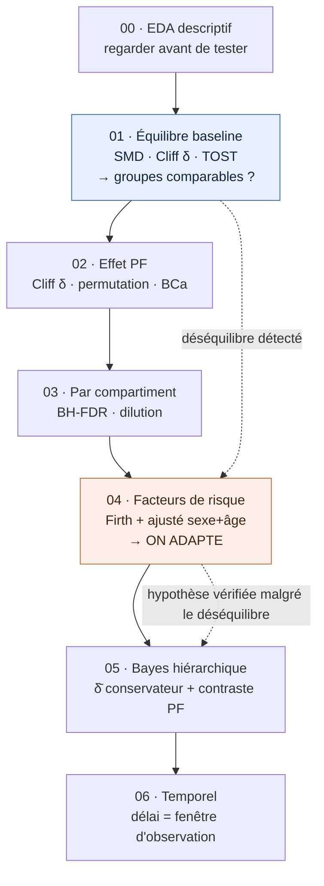

# Methodology Walkthrough (`notebooks/info.md`) Implementation Plan

> **For agentic workers:** REQUIRED SUB-SKILL: Use superpowers:subagent-driven-development (recommended) or superpowers:executing-plans to implement this plan task-by-task. Steps use checkbox (`- [ ]`) syntax for tracking.

**Goal:** Replace the garbled `notebooks/info.md` transcript with a clean, French, GitHub-renderable step-by-step methodology walkthrough of the cyclops-vs-meniscus pipeline (notebooks 00–06), each section using a fixed 7-point template with worked numeric examples, consistent with `paper/manuscript.md` and `results/results.json`.

**Architecture:** Fragment-then-assemble. Each section is authored as an independent Markdown fragment under a gitignored build dir (`build/methodo/`), so the seven notebook sections parallelise across subagents with zero file contention. A deterministic assembly task concatenates header + fragments + closing into the single `notebooks/info.md`, then an audit task verifies numbers/render/figures, then one commit lands the result (including the `info.ipynb` → `info.md` swap).

**Tech Stack:** Markdown (GitHub-flavored), Mermaid, GitHub MathJax (`$$…$$`), GitHub callouts, Python 3.13 (audit scripts), git.

**Spec:** `docs/superpowers/specs/2026-06-01-methodology-doc-design.md` — read it before any task; §5 is the canonical-numbers source of truth.

---

## Section authoring contract (shared — every section task obeys this)

All seven notebook section fragments (Tasks 4–10) and the header/closing follow these rules. Restated specifics live in each task; this is the common contract.

**Language/tone:** French, tutoiement (« tu »), pedagogical, concrete analogies. Keep it concrete ("sur tes données…").

**7-point template — each notebook section is exactly these `####` sub-parts, in order:**
1. `#### 1 · But — ce qu'on veut fixer / vérifier`
2. `#### 2 · Pourquoi cette méthode et pas une autre`
3. `#### 3 · Comment on le calcule sur nos données` — a `$$…$$` formula **and** a worked numeric example on the real 49/20 data.
4. `#### 4 · Résultat` — canonical numbers (from spec §5).
5. `#### 5 · Interprétation`
6. `#### 6 · Ce que ça déclenche ensuite` — the *fil rouge* link forward.
7. `#### 7 · Notebook à consulter` — `notebooks/0X_*.ipynb`, figure(s), `results.json` keys.

**Section heading:** `### NN · <Titre>` with a GitHub anchor-friendly title.

**Formatting:**
- Math in `$$…$$` (display) or `$…$` (inline) — GitHub MathJax.
- Callouts: `> [!NOTE]` for worked-example boxes, `> [!WARNING]` for pitfalls, `> [!TIP]` for reading rules.
- Figures embedded with **relative paths from `notebooks/`**: ``.
- Mermaid labels quoted; edge labels ASCII-simple.
- **Numbers:** ONLY those in spec §5. Never write the stale `50 cyclops / 19 méniscus`, crude OR `16,3`, or baseline PF SMD `−0,040`. Use `49/20`, `17.2`, `−0.009`.

**Grounding (max effort):** before writing, the subagent reads (a) the spec, (b) its own notebook `notebooks/0X_*.ipynb`, (c) the figure(s) it will embed, (d) the matching manuscript section in `paper/manuscript.md`. Prose must be accurate to those.

**Output:** write the fragment to its exact `build/methodo/NN_*.md` path. Do not touch `notebooks/info.md` (assembly owns it). Do not commit (fragments are gitignored; review happens on disk).

---

## File structure

- Create (gitignored, intermediate): `build/methodo/00_header.md`, `build/methodo/10_eda.md`, `build/methodo/11_baseline.md`, `build/methodo/12_effect.md`, `build/methodo/13_compartments.md`, `build/methodo/14_riskfactors.md`, `build/methodo/15_bayes.md`, `build/methodo/16_temporal.md`, `build/methodo/99_closing.md`
- Create (committed tooling): `scripts/audit_methodo.py`
- Modify: `.gitignore` (add `build/`)
- Replace: `notebooks/info.md` (final assembled doc)
- Delete: `notebooks/info.ipynb`

---

### Task 1: Guardrails — gitignore, figure check, audit script

**Files:**
- Modify: `.gitignore`
- Create: `scripts/audit_methodo.py`

- [ ] **Step 1: Add the build dir to `.gitignore`**

Append to `.gitignore`:

```
# Intermediate methodology-doc build fragments
build/
```

- [ ] **Step 2: Verify every figure the doc embeds exists**

Run:

```bash
cd "E:\Projet_Solo\lino_stats" && for f in fig1_baseline_balance figS1_slopegraph_pf fig2_pf_progression fig3_per_compartment fig4_topographic_specificity fig9_firth_or_forest fig5_m3_forest fig6_m3_diagnostics fig7_h4_delay; do test -f "figures/$f.png" && echo "OK $f" || echo "MISSING $f"; done
```

Expected: all `OK` (no `MISSING`).

- [ ] **Step 3: Write the audit script**

Create `scripts/audit_methodo.py`:

```python
"""Audit notebooks/info.md: render balance, stale numbers, figure paths, garble."""
import re, sys, json, pathlib

ROOT = pathlib.Path(__file__).resolve().parents[1]
DOC = ROOT / "notebooks" / "info.md"
text = DOC.read_text(encoding="utf-8")
errors = []

# 1. Code-fence balance (must be even)
if text.count("```") % 2 != 0:
    errors.append(f"Unbalanced ``` fences: {text.count('```')}")

# 2. Mermaid blocks open == close
if text.count("```mermaid") * 2 > text.count("```"):
    errors.append("More ```mermaid opens than fence pairs allow")

# 3. Display-math balance (even count of $$)
if text.count("$$") % 2 != 0:
    errors.append(f"Unbalanced $$ math: {text.count('$$')}")

# 4. Stale numbers must NOT appear
STALE = ["50 cyclop", "19 mén", "19 men", "16,3", "16.3", "-0,040", "-0.040", "−0,040", "lino_stats import"]
for s in STALE:
    if s in text:
        errors.append(f"Stale/forbidden token present: {s!r}")

# 5. Canonical numbers MUST appear (sample of must-haves)
MUST = ["49", "20", "0.5347", "17.2", "13.5", "7.77", "0.233", "2.28", "240", "528", "0.997"]
for m in MUST:
    if m not in text:
        errors.append(f"Missing canonical number: {m!r}")

# 6. Embedded figure paths resolve
for rel in re.findall(r"!\[[^\]]*\]\((\.\./figures/[^)]+)\)", text):
    p = (DOC.parent / rel).resolve()
    if not p.exists():
        errors.append(f"Figure path missing: {rel}")

# 7. Garble heuristics: box-drawing chars / lone replacement char
for ch in ["┌", "┐", "└", "┘", "┼", "│", "�"]:
    if ch in text:
        errors.append(f"Garble char present: {ch!r}")

# 8. All seven sections present
for sec in ["### 00", "### 01", "### 02", "### 03", "### 04", "### 05", "### 06"]:
    if sec not in text:
        errors.append(f"Missing section header: {sec!r}")

if errors:
    print("AUDIT FAILED:")
    for e in errors:
        print("  -", e)
    sys.exit(1)
print("AUDIT PASSED")
```

- [ ] **Step 4: Verify the script runs (against the old file it will fail, which is expected)**

Run:

```bash
cd "E:\Projet_Solo\lino_stats" && python scripts/audit_methodo.py; echo "exit=$?"
```

Expected: `AUDIT FAILED` (old file has box-drawing garble + stale numbers) — confirms the audit detects problems. `exit=1`.

- [ ] **Step 5: Commit the tooling**

```bash
cd "E:\Projet_Solo\lino_stats" && git add .gitignore scripts/audit_methodo.py && git commit -m "chore(methodo): add build gitignore + info.md audit script"
```

---

### Task 2: Build directory

**Files:**
- Create: `build/methodo/` (dir)

- [ ] **Step 1: Create the build dir**

Run:

```bash
cd "E:\Projet_Solo\lino_stats" && mkdir -p build/methodo && echo created
```

Expected: `created`. (Dir is gitignored; not committed.)

---

### Task 3: Header fragment

**Files:**
- Create: `build/methodo/00_header.md`

- [ ] **Step 1: Read the spec** `docs/superpowers/specs/2026-06-01-methodology-doc-design.md` (§3.1 header, §1 fil rouge).

- [ ] **Step 2: Write the header fragment** containing, in order:
  1. `# Méthodologie pas à pas — Cyclops vs Ménisque : du contrôle d'équilibre à la vérification de l'hypothèse fémoro-patellaire`
  2. Intro paragraph (3–5 sentences): the study question (cyclops → déficit d'extension → ↑ pression PF → progression PF), and what this doc is (a concrete pedagogical walkthrough of the pipeline, notebook by notebook).
  3. **Fil rouge callout:**

```markdown
> [!IMPORTANT]
> **Le fil rouge de toute l'étude**
> 1. On vérifie d'abord si les deux groupes sont **comparables** — avec la **SMD**, le **Cliff δ** et le **TOST**.
> 2. Réponse : **NON** — le sexe et l'âge sont déséquilibrés (mais l'état cartilagineux de départ, lui, est équivalent).
> 3. Donc on **adapte la méthode** — une analyse **ajustée sexe + âge** (pénalisée Firth), co-primaire — pour vérifier l'hypothèse fémoro-patellaire **malgré** ce déséquilibre.
```

  4. **Pipeline Mermaid** (00→06) with the fil rouge annotated:



  5. **Table of contents** linking to `### 00`…`### 06` and the closing synthesis (GitHub anchors).
  6. **Mini-glossaire** table: S1/S2 ; Δ = S2 − S1 ; PF = {trochlée, rotule} ; FT = {pte, pti, cfe, cfi} ; SMD ; MWU / U ; TOST ; Cliff δ ; Firth ; OR ; E-value ; δ̄ ; δ_c ; η ; LOO/ELPD.

- [ ] **Step 3: Self-check** — fragment has the title, fil rouge callout, one ```mermaid``` block (balanced), TOC, glossary table; no stale numbers. Read it back; fix any issue.

---

### Task 4: Section 00 — EDA  *(parallelisable)*

**Files:**
- Create: `build/methodo/10_eda.md`

- [ ] **Step 1: Read** spec, `notebooks/00_eda.ipynb`, manuscript §2.2 (scoring/scale).
- [ ] **Step 2: Write `### 00 · EDA descriptif` using the 7-point template.** Specifics:
  - **But:** décrire avant de tester — distributions des scores 0–3 par compartiment, valeurs manquantes, anomalies de dates, tailles de groupes (49/20).
  - **Pourquoi:** regarder la forme/rareté avant tout test ; la rareté du grade 3 (**n'apparaît que 2 fois** dans tout le jeu, 1 trochlée + 1 rotule) **justifie** le collapse de l'échelle à {0, 1, ≥2} pour PF et la binarisation {0,1} des 4 compartiments FT (≤2 événements ≥2 ; PTI/CFI : 0).
  - **Comment (théorie + exemple):** pas de formule lourde ; montrer la table de fréquences par grade et pourquoi un 2ᵉ point de coupure FT serait « piloté par le prior ». Exemple chiffré : compter les événements grade ≥2 par compartiment.
  - **Résultat:** n=69 (49+20), 3 patients avec anomalies de dates (exportés), outcome 6-compartiments complet pour tous.
  - **Interprétation / Déclenche / Notebook:** fixe l'échelle de modélisation pour M3 ; consulter `notebooks/00_eda.ipynb`, clés `results.json`: `n_patients`, `data_anomalies`.
- [ ] **Step 3: Self-check** — 7 sub-parts present, no stale numbers, no garble.

---

### Task 5: Section 01 — Baseline balance  *(parallelisable; the "are groups similar?" step)*

**Files:**
- Create: `build/methodo/11_baseline.md`

- [ ] **Step 1: Read** spec §5, `notebooks/01_baseline_balance.ipynb`, `figures/fig1_baseline_balance.png`, `figures/figS1_slopegraph_pf.png`, manuscript §3.1.
- [ ] **Step 2: Write `### 01 · Équilibre baseline (S1)` using the 7-point template.** Specifics:
  - **But:** tuer l'explication concurrente « les groupes étaient déjà différents au départ » — deux contrôles : (a) équilibre des **covariables** patient (âge, sexe, IMC…), (b) **équivalence de l'état cartilagineux S1** (surtout bloc PF).
  - **Pourquoi:** **SMD, pas p-value** (à n=20 la p-value est aveugle — manque de puissance) ; convention Austin (|SMD|<0.10 négligeable ; ≥0.25 déséquilibre) ; pour l'équivalence, **TOST, pas un t-test non-significatif** (« absence de preuve ≠ preuve d'absence »).
  - **Comment (théorie + exemple):**

```
$$\text{SMD} = \frac{\bar{x}_{\text{cyclops}} - \bar{x}_{\text{méniscus}}}{s_{\text{pooled}}}\qquad\text{(binaire, forme d'Austin : } \tfrac{p_1-p_2}{\sqrt{\bar p(1-\bar p)}}\text{)}$$
```

  and the TOST mental model in a `> [!TIP]`: « TOST à 5 % ⟺ l'IC à 90 % de la différence tient entièrement dans la boîte ±Δ » (Δ = 0.292). Worked: baseline PF MWU p=0.818, SMD −0.009 (centre quasi pile au milieu de la boîte), **TOST p=0.034 < 0.05 → équivalent = True**; explain why p is "tout juste" (n=20 widens the CI, not a real difference).
  - **Résultat:** age SMD **+0.484** (médianes 30.9 vs 24.9) ; sex SMD **+0.37** ; BMI SMD ≈ −0.08 ; baseline overall MWU p=0.662 ; baseline PF MWU p=0.818, SMD −0.009, TOST p=0.034, équivalent.
  - **Interprétation:** **constat — NON équilibré** sur sexe & âge (rouge), MAIS cartilage de départ équivalent. C'est précisément le ② du fil rouge.
  - **Déclenche:** les covariables rouges → **motivent l'analyse ajustée sexe+âge co-primaire** au §04. Le TOST PF équivalent → autorise à lire le contraste PF comme une vraie progression.
  - **Notebook:** `notebooks/01_baseline_balance.ipynb`, `figures/fig1_baseline_balance.png` (Love plot) + `figS1_slopegraph_pf.png`; keys `table1_age_smd`, `baseline_pf_*`.
  - Embed ``.
- [ ] **Step 3: Self-check.**

---

### Task 6: Section 02 — PF effect  *(parallelisable)*

**Files:**
- Create: `build/methodo/12_effect.md`

- [ ] **Step 1: Read** spec §5/§6, `notebooks/02_progression_total.ipynb`, `figures/fig2_pf_progression.png`, manuscript §3.3.
- [ ] **Step 2: Write `### 02 · Effet fémoro-patellaire` using the 7-point template.** Specifics:
  - **But:** l'effet PF existe-t-il ? Comparer Δ_PF (= PF à S2 − S1) entre groupes.
  - **Pourquoi:** **Cliff δ / rangs, pas moyennes** (scores ordinaux 0–3, petit n, beaucoup d'ex-aequo) ; **permutation exacte** ; **deux IC** — BCa **et** inversion — car le BCa est instable à n_men=20 (triangulation).
  - **Comment (théorie + exemple chiffré complet):**

```
$$U_1 = R_1 - \frac{n_1(n_1+1)}{2}\qquad \delta = \frac{\#(x>y) - \#(x<y)}{n_1 n_2} = \frac{2U}{n_1 n_2} - 1$$
```

  Worked duel count in a `> [!NOTE]`: cyclops Δ_PF {0:21, 1:15, 2:9, 3:3, 4:1}, méniscus {0:19, 1:1} → 49×20=**980 duels** → **545** pire / **21** mieux / **414** égalités → **δ = (545−21)/980 = +0.5347** ; prob. de supériorité U/(n₁n₂)=0.767 ; détailler 545 = 28·19 + 13·1 et 414 = 21·19 + 15·1. Mention BCa internals (z0≈0, a≈−0.007 → BCa≈percentile).
  - **Résultat:** δ=+0.535 (large) ; MWU p=0.0001 ; permutation p=0.0002 ; **BCa [0.367, 0.684]** ; inversion [0.357, 0.675] ; PF worsening **28/49 (57.1%) vs 1/20 (5.0%)** ; M1 beta-binomial cyclops 0.569 [0.438, 0.695] vs méniscus 0.091 [0.013, 0.230] ; within-case PF vs FT **28 vs 1** (Wilcoxon p=2×10⁻⁶).
  - **Interprétation:** gros effet réel, intervalles non chevauchants.
  - **Déclenche:** mais cet effet brut pourrait-il être un effet sexe/âge déguisé (cf. §01) ? → §04 l'ajustement. Et la dilution → §03/§05.
  - **Notebook:** `notebooks/02_progression_total.ipynb`, `figures/fig2_pf_progression.png`; keys `pf_cliff_delta`, `pf_bca_*`, `pf_vs_ft_*`, `m1_worsened_pf`.
  - Embed ``.
- [ ] **Step 3: Self-check.**

---

### Task 7: Section 03 — Per-compartment & dilution  *(parallelisable)*

**Files:**
- Create: `build/methodo/13_compartments.md`

- [ ] **Step 1: Read** spec, `notebooks/03_progression_sites.ipynb`, `figures/fig3_per_compartment.png`, `figures/fig4_topographic_specificity.png`, manuscript §3.4.
- [ ] **Step 2: Write `### 03 · Par compartiment & dilution` using the 7-point template.** Specifics:
  - **But:** divulguer les 6 compartiments ; montrer que le signal est **concentré** sur PF et **dilué** dans la somme.
  - **Pourquoi:** full disclosure anti-cherry-picking ; **BH-FDR (q=0.10)** pour les 12 tests Wilcoxon ; comparaison appariée PF vs FT.
  - **Comment (théorie + exemple):** table de % worsening par compartiment (cas vs contrôles) + décision BH :

```markdown
| Compartiment | Bloc | Cas | Contrôles | Cliff δ | BH |
|---|---|---:|---:|---:|---|
| Rotule | PF | 55.1% | 5.0% | +0.507 | Oui (cas) |
| Trochlée | PF | 20.4% | 0.0% | +0.204 | Oui (cas) |
| PTE | FT | 2.0% | 10.0% | −0.080 | Non |
| PTI | FT | 2.0% | 25.0% | −0.230 | **Oui (contrôles)** |
| CFE | FT | 0.0% | 10.0% | −0.100 | **Oui (contrôles)** |
| CFI | FT | 0.0% | 5.0% | −0.050 | Non |
```

  Worked dilution: moyenne de 2 compartiments actifs (PF) + 4 inertes/inversés (FT) → somme-6 **δ=+0.204, p deux-côtés=0.156, un-côté=0.078** (non décisionnel).
  - **Résultat:** rotule & trochlée BH-signif. pour les cas ; PTI/CFE BH-signif. **en sens inverse** (pathologie méniscale des contrôles) ; aucun FT en excès chez les cas.
  - **Interprétation:** le signal est purement PF ; la somme globale dilue — d'où un estimand qui ne soit pas « le meilleur des 6 ».
  - **Déclenche:** motive l'estimand **invariant par partition** δ̄ du §05.
  - **Notebook:** `notebooks/03_progression_sites.ipynb`, `figures/fig3_per_compartment.png`, `fig4_topographic_specificity.png`; keys `sum6_*`, `pf_vs_ft_*`.
  - Embed `` and ``.
- [ ] **Step 3: Self-check.**

---

### Task 8: Section 04 — Risk factors (the climax: "on adapte")  *(parallelisable)*

**Files:**
- Create: `build/methodo/14_riskfactors.md`

- [ ] **Step 1: Read** spec §5/§6, `notebooks/04_risk_factors.ipynb`, `figures/fig9_firth_or_forest.png`, manuscript §3.6.
- [ ] **Step 2: Write `### 04 · Facteurs de risque & ajustement` using the 7-point template.** Specifics:
  - **But:** répondre au déséquilibre détecté au §01 — l'effet cyclope survit-il à l'ajustement sexe+âge ? (le ③ du fil rouge).
  - **Pourquoi:** **Firth, pas logistique classique** — le tableau 2×2 a une **quasi-séparation** (contrôles : 1 événement / 20) qui fait diverger l'OR ML (→∞, le faux « OR 25.33 ») ; **ajustement sexe+âge co-primaire** (le sexe mappe spécifiquement sur PF) ; **E-value** pour la robustesse au confondeur non mesuré.
  - **Comment (théorie + exemple):**

```
$$\operatorname{logit} P(\text{worsened\_pf}=1) = \beta_0 + \beta_{\text{grp}}\,\text{cyclope} + \beta_{\text{sexe}}\,\text{femme} + \beta_{\text{âge}}\,\text{âge},\qquad \text{OR}_{\text{cyclope}} = e^{\beta_{\text{grp}}}$$
$$\text{E-value} = \text{RR} + \sqrt{\text{RR}\,(\text{RR}-1)}$$
```

  Worked Firth-as-+½ in a `> [!NOTE]`: 2×2 [cas 28/21 ; contrôles 1/19] ; OR_ML = (28·19)/(21·1)=25.33 (fantôme, repose sur 1 patient) ; Firth ≈ +½ par case → (28.5·19.5)/(21.5·1.5) ≈ **OR 17.2** ; trace Newton-Raphson convergeant vers 17.23 (β₁=2.85, SE=0.91). `> [!WARNING]` sur la quasi-séparation.
  - **Résultat:** **Firth OR brut 17.2** [2.9, 103.5] ; **ajusté sexe+âge 13.5** [2.3, 80.1], p=0.004 ; **E-value 7.77** (LCB 2.78) ; +IMC 13.9 ; excl. anomalies 14.2 ; H3 : aucun facteur BH-signif.
  - **Interprétation:** la baisse 17.2 → 13.5 est petite → sexe & âge n'expliquent qu'une miette ; **l'hypothèse PF est vérifiée malgré le déséquilibre.** E-value 7.77 ⇒ un confondeur devrait être associé aux deux par RR ≥ 7.77 pour tout effacer (implausible).
  - **Déclenche:** confirmation fréquentiste ; reste à confirmer sans circularité → §05.
  - **Notebook:** `notebooks/04_risk_factors.ipynb`, `figures/fig9_firth_or_forest.png`; keys `pf_or_crude`, `pf_or_adj_sex_age`, `pf_evalue_point`, `h3_*`.
  - Embed ``.
- [ ] **Step 3: Self-check.**

---

### Task 9: Section 05 — Hierarchical Bayes  *(parallelisable)*

**Files:**
- Create: `build/methodo/15_bayes.md`

- [ ] **Step 1: Read** spec §5, `notebooks/05_hierarchical_bayes.ipynb`, `figures/fig5_m3_forest.png`, `figures/fig6_m3_diagnostics.png`, manuscript §2.3 & §3.2–3.3.
- [ ] **Step 2: Write `### 05 · Modèle bayésien hiérarchique (M3)` using the 7-point template.** Specifics:
  - **But:** confirmer le signal PF **sans circularité ni sélection** ; estimand primaire conservateur knee-wide.
  - **Pourquoi:** estimand **δ̄ invariant par partition** (ne peut pas être gonflé en choisissant le bloc gagnant — anti-HARKing) ; contraste PF **dérivé** d'un postérieur exchangeable « qui n'a jamais vu la partition » ; **règle 1-côté réservée à δ̄** (H1 directionnel), tout le post-hoc PF lu **2-côtés** ; la partition PF/FT est **testée par LOO**, pas supposée.
  - **Comment (théorie + exemple):**

```
$$\eta_{(i,t,c)} = \beta_c\,t + \gamma\,g_i + \delta_c\,t\,g_i + u_i,\qquad t\in\{-0.5,+0.5\}$$
$$\bar{\delta} = \tfrac{1}{6}\textstyle\sum_c \delta_c,\qquad \text{contraste}_{\text{PF}-\text{FT}} = \tfrac12\!\!\sum_{c\in\text{PF}}\!\!\delta_c - \tfrac14\!\!\sum_{c\in\text{FT}}\!\!\delta_c,\qquad \delta_c \sim \text{Student-}t(3,\mu_\delta,\sigma_\delta)$$
```

  Explain the dilution intuition: averaging 6 compartments drowns a 2-compartment signal → δ̄ inconclusive **by design**, which is honest.
  - **Résultat:** δ̄ = **+0.233** [−0.872, +1.453], **P(δ̄>0)=0.66 (non concluant)** ; γ=−3.14 ; **contraste PF dérivé +2.28** [0.85, 3.81], **P>0=0.997** ; two-block descriptif δ_PF=+2.42, δ_FT=−0.76, contraste +3.18 [0.97, 5.20] ; LOO best = two_block (faiblement ; Pareto-k̂) ; convergence max R̂=1.003, ESS min 1607, 0 divergences.
  - **Interprétation:** le test conservateur est non concluant (dilution attendue), MAIS la lecture là où le mécanisme prédit donne un effet large et hautement probable, **non circulaire**.
  - **Déclenche:** reste la question du suivi inégal → §06.
  - **Notebook:** `notebooks/05_hierarchical_bayes.ipynb`, `figures/fig5_m3_forest.png`, `fig6_m3_diagnostics.png`; keys `m3_delta_bar_*`, `m3_derived_pf_contrast_*`, `pooling_loo_best`, `m3_convergence`.
  - Embed ``.
- [ ] **Step 3: Self-check.**

---

### Task 10: Section 06 — Temporal (delay)  *(parallelisable)*

**Files:**
- Create: `build/methodo/16_temporal.md`

- [ ] **Step 1: Read** spec §5, `notebooks/06_temporal.ipynb`, `figures/fig7_h4_delay.png`, manuscript §3.7.
- [ ] **Step 2: Write `### 06 · Délai inter-chirurgical (H4)` using the 7-point template.** Specifics:
  - **But:** le délai entre S1 et S2 est-il un confondeur/médiateur, ou juste la fenêtre d'observation ?
  - **Pourquoi:** DAG — le délai est **en aval du groupe** (les cas sont ré-opérés plus tôt) → c'est le **temps-à-risque**, pas un confondeur ; **l'exclure** du modèle primaire (sinon over-adjustment) ; on **falsifie** le rôle de médiateur par ρ intra-cas ≈ 0 ; Weibull AFT (M4, MLE) + LogNormal (M5, bayésien) pour étudier le délai **comme outcome**.
  - **Comment (théorie + exemple):** Spearman ρ entre délai et Δ_PF chez les cas ; AFT/LogNormal medians. Worked: comme la fenêtre est **plus courte** chez les cas, ajuster ne pourrait qu'**augmenter** l'effet → l'effet observé l'est **malgré ~½ exposition**.
  - **Résultat:** médianes **240 vs 528 jours** (MWU p<0.0001, Cliff δ=−0.64) ; LogNormal 237 vs 483 ; Weibull coef groupe −0.61 ; **intra-cas ρ=−0.03 (p=0.82)**.
  - **Interprétation:** inverse l'attente pré-enregistrée (cas plus tôt, cliniquement cohérent) ; le délai n'est pas un mécanisme.
  - **Déclenche:** ferme l'objection du suivi inégal → renforce la conclusion ; lien vers la synthèse.
  - **Notebook:** `notebooks/06_temporal.ipynb`, `figures/fig7_h4_delay.png`; keys `isd_*`, `m4_group_coef`, `m5_median_delay_by_group`, `delay_worsened_pf_rho`.
  - Embed ``.
- [ ] **Step 3: Self-check.**

---

### Task 11: Closing / synthesis fragment

**Files:**
- Create: `build/methodo/99_closing.md`

- [ ] **Step 1: Read** spec §3.4, manuscript §5.
- [ ] **Step 2: Write the closing** with:
  - `## Synthèse — le fil rouge récapitulé`: the symmetric Cliff-δ table:

```markdown
| Endroit | Cliff δ | IC | Ce qu'on veut |
|---|---|---|---|
| Baseline PF (§01, test 4) | ≈ 0 | contient 0 | équilibré ✓ |
| Effet PF (§02) | +0.53 | [0.37, 0.68] exclut 0 | gros effet réel ✓ |
```

  with a sentence: même mètre étalon, départ neutre → arrivée tranchée ; décision ancrée sur δ̄ conservateur, lecture PF dérivée et exploratoire.
  - `## Prochaine étape`: H2 (médial-postérieur) réfutée → le résultat PF est **exploratoire** → réplication prospective ; le δ̄ reste l'ancre décisionnelle.
  - `## Pour aller plus loin`: renvoi vers `../paper/manuscript.md` et `../results/results.json`.
- [ ] **Step 3: Self-check** — table balanced, no stale numbers.

---

### Task 12: Assemble `notebooks/info.md` and remove the stale notebook

**Files:**
- Replace: `notebooks/info.md`
- Delete: `notebooks/info.ipynb`

- [ ] **Step 1: Concatenate fragments in order**

Run:

```bash
cd "E:\Projet_Solo\lino_stats" && python -c "
import pathlib
b = pathlib.Path('build/methodo')
order = ['00_header.md','10_eda.md','11_baseline.md','12_effect.md','13_compartments.md','14_riskfactors.md','15_bayes.md','16_temporal.md','99_closing.md']
parts = []
for name in order:
    p = b / name
    assert p.exists(), f'missing fragment {name}'
    parts.append(p.read_text(encoding='utf-8').rstrip())
out = '\n\n---\n\n'.join(parts) + '\n'
pathlib.Path('notebooks/info.md').write_text(out, encoding='utf-8')
print('assembled', len(out), 'chars from', len(order), 'fragments')
"
```

Expected: `assembled <N> chars from 9 fragments`.

- [ ] **Step 2: Delete the stale notebook**

Run:

```bash
cd "E:\Projet_Solo\lino_stats" && git rm -q --cached notebooks/info.ipynb 2>/dev/null; rm -f notebooks/info.ipynb; echo done
```

Expected: `done`.

---

### Task 13: Audit and fix

**Files:**
- Modify: `notebooks/info.md` (fixes only)

- [ ] **Step 1: Run the audit**

Run:

```bash
cd "E:\Projet_Solo\lino_stats" && python scripts/audit_methodo.py; echo "exit=$?"
```

Expected: `AUDIT PASSED`, `exit=0`.

- [ ] **Step 2: If it fails**, read the listed problems, open the offending fragment in `build/methodo/`, fix it, re-run Task 12 Step 1 (re-assemble), then re-run the audit. Repeat until `AUDIT PASSED`.

- [ ] **Step 3: Manual render sanity (spot check)**

Run:

```bash
cd "E:\Projet_Solo\lino_stats" && grep -c '```mermaid' notebooks/info.md && echo "--- math pairs ---" && python -c "t=open('notebooks/info.md',encoding='utf-8').read(); print('dollar-dollar:', t.count('\$\$')); print('sections:', sum(t.count(f'### 0{i}') for i in range(7)))"
```

Expected: ≥8 mermaid blocks (header + per-section as authored), even `$$` count, 7 section headers.

---

### Task 14: Commit

- [ ] **Step 1: Stage and commit the swap**

```bash
cd "E:\Projet_Solo\lino_stats" && git add notebooks/info.md && git add -A notebooks/info.ipynb && git commit -m "docs(methodo): rewrite info.md as step-by-step French methodology walkthrough

Replace the garbled chat transcript with a clean, GitHub-renderable
pipeline walkthrough (notebooks 00-06), 7-point template per step with
worked examples, Mermaid + LaTeX + callouts + embedded figures. Numbers
sourced from results.json (49/20 cohort); stale figures corrected. Remove
the stale notebooks/info.ipynb."
```

- [ ] **Step 2: Verify clean tree for these files**

Run:

```bash
cd "E:\Projet_Solo\lino_stats" && git status --short notebooks/ && git log --oneline -1
```

Expected: no pending `notebooks/info.*` changes; latest commit is the methodo rewrite.

- [ ] **Step 3 (optional): Push** — only if the user confirms (publishes to the public GitHub repo).

```bash
cd "E:\Projet_Solo\lino_stats" && git push
```

---

## Self-Review (plan vs spec)

**Spec coverage:**
- §1 goal & fil rouge → Task 3 (header callout + Mermaid), threaded in Tasks 5 (01 finds imbalance) → 8 (04 adapts) → 9 (05 confirms), recapped Task 11. ✓
- §2 deliverable (file, swap, format, tone) → Tasks 12, 14; contract block. ✓
- §3.1 header → Task 3. §3.2 template → contract + Tasks 4–10. §3.3 content map → Tasks 4–10. §3.4 closing → Task 11. ✓
- §4 visual conventions → contract + per-task Mermaid/LaTeX/figure embeds. ✓
- §5 canonical numbers → embedded in each section task; enforced by `scripts/audit_methodo.py` (Task 1) MUST/STALE lists. ✓
- §6 worked examples → Tasks 5 (TOST), 6 (duel count + BCa), 8 (Firth +½). ✓
- §7 non-goals → no pipeline re-run; numbers read from results.json; no notebook/src/manuscript edits. ✓
- §8 acceptance → audit script (fences, math, stale, figures, garble, 7 sections) = mechanised acceptance. ✓
- §9 parallelism → Tasks 4–10 are independent fragment writes (marked *parallelisable*). ✓

**Placeholder scan:** no TBD/TODO; each section task lists its exact numbers, formulas, figures, and `results.json` keys. ✓

**Consistency:** fragment filenames in the File structure match Task creates and the Task 12 assembly `order` list (00_header,10_eda,11_baseline,12_effect,13_compartments,14_riskfactors,15_bayes,16_temporal,99_closing). Audit MUST-numbers (49,20,0.5347,17.2,13.5,7.77,0.233,2.28,240,528,0.997) all appear in the relevant section tasks. ✓

## Execution Handoff

Recommended: **subagent-driven-development**. Tasks 1–3 sequential (guardrails, build dir, header). Tasks 4–10 (the seven sections) dispatch in **parallel** — independent fragments, shared spec + contract, no file contention. Tasks 11–14 sequential (closing, assemble, audit-fix loop, commit).
