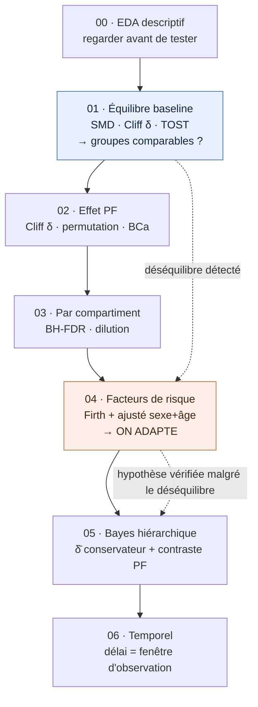
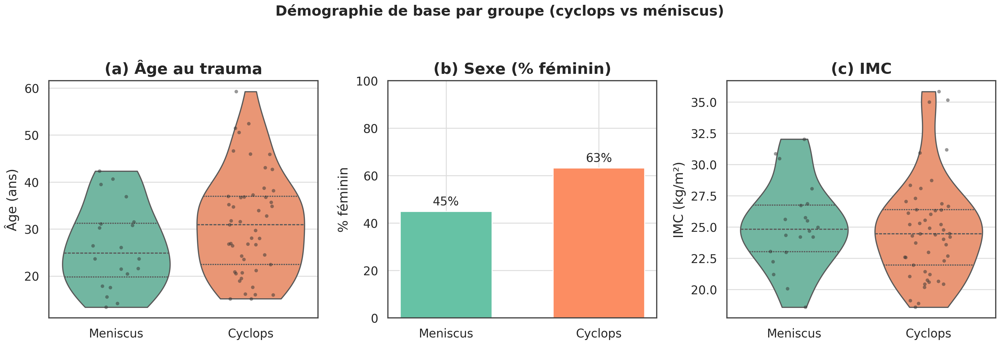
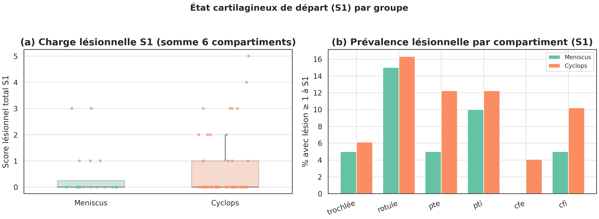
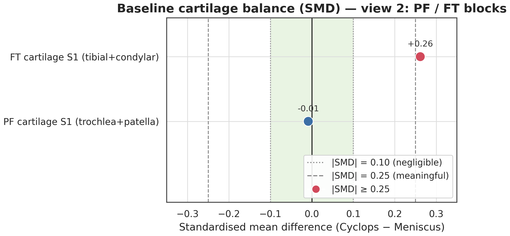
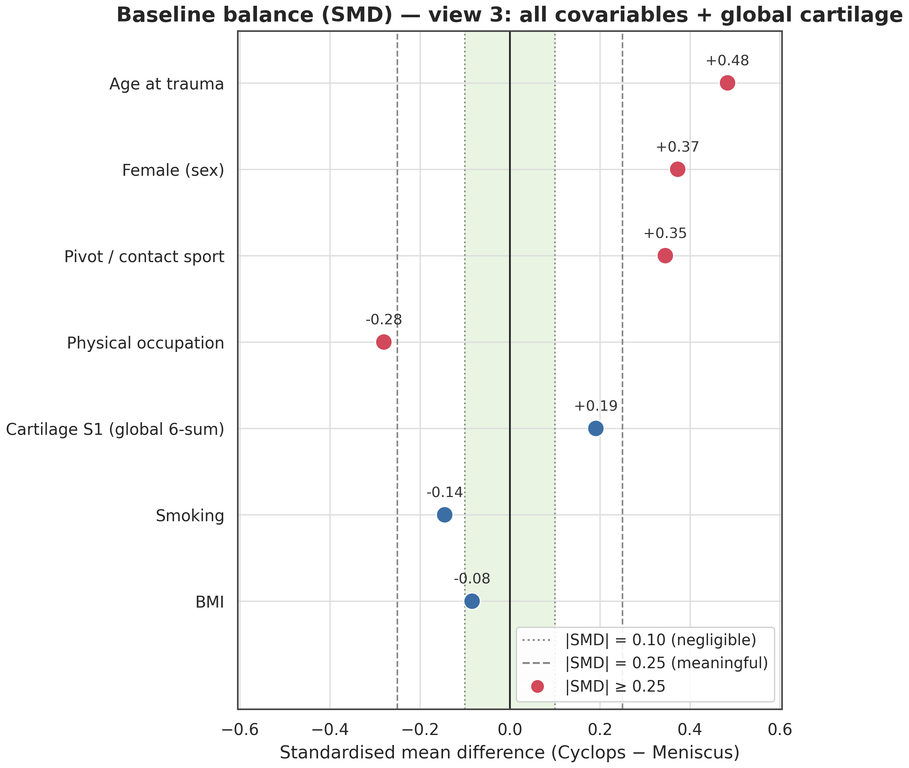
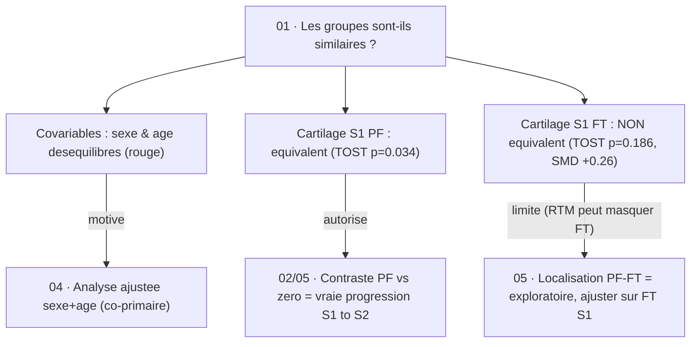
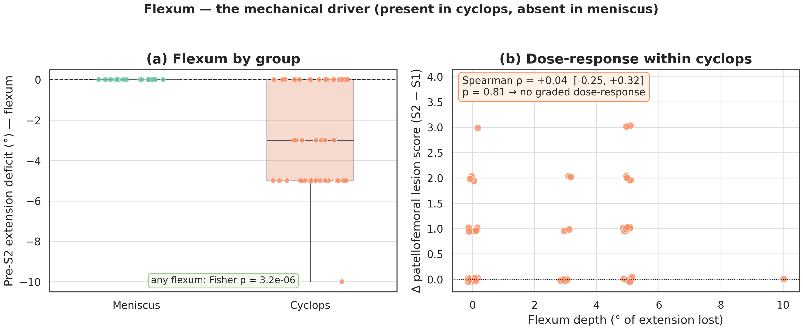
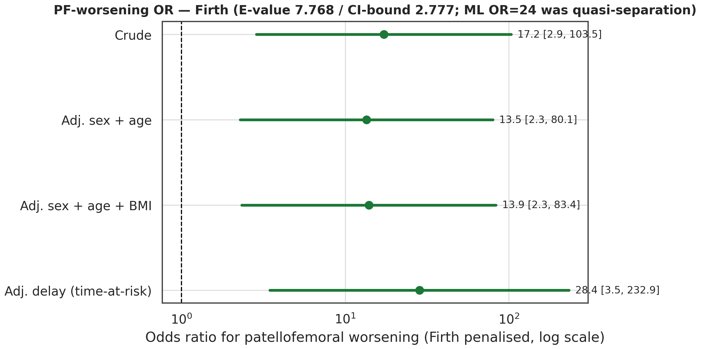
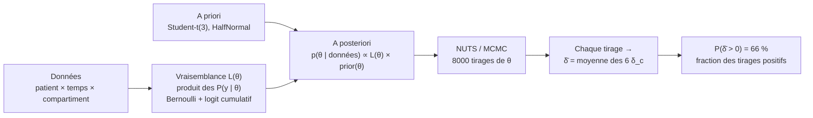
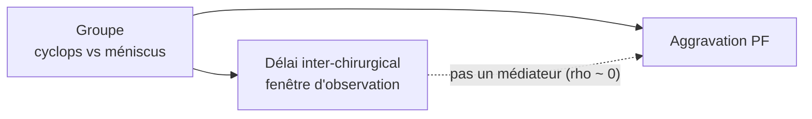

# Méthodologie pas à pas  Cyclops vs Ménisque : du contrôle d'équilibre à la vérification de l'hypothèse fémoro-patellaire

Tu pars d'une question clinique simple : quand un **cyclops** (nodule fibreux sur la greffe du LCA) bloque l'extension du genou, ce **flexum** augmente la pression de contact **fémoro-patellaire** et pourrait accélérer la progression des **lésions chondrales PF** (trochlée + rotule). Pour le tester, on compare 49 patients cyclops à 20 patients méniscus opérés deux fois du ménisque  soit une cohorte de **69 patients** au total. Ce document n'est pas un article : c'est une **visite guidée concrète du pipeline d'analyse**, notebook par notebook, où chaque étape t'explique ce qu'on cherche à fixer ou vérifier, pourquoi on choisit telle méthode plutôt qu'une autre, et comment elle se calcule sur **nos** données. Tu peux le lire d'un bout à l'autre, ou sauter directement au notebook qui t'intéresse via le sommaire.

> [!IMPORTANT]
> **Le fil rouge de toute l'étude**
>
> 1. On vérifie d'abord si les deux groupes sont **comparables**  avec la **SMD**, le **Cliff δ** et le **TOST**.
> 2. Réponse : **NON**  le sexe et l'âge sont déséquilibrés (mais l'état cartilagineux de départ, lui, est équivalent).
> 3. Donc on **adapte la méthode**  une analyse **ajustée sexe + âge** (pénalisée Firth), co-primaire  pour vérifier l'hypothèse fémoro-patellaire **malgré** ce déséquilibre.

## Sommaire

- [00 · EDA descriptif](#00--eda-descriptif)
- [01 · Équilibre baseline (S1)](#01--équilibre-baseline-s1)
- [02 · Effet fémoro-patellaire](#02--effet-fémoro-patellaire)
- [03 · Par compartiment &amp; dilution](#03--par-compartiment--dilution)
- [04 · Facteurs de risque &amp; ajustement](#04--facteurs-de-risque--ajustement)
- [05 · Modèle bayésien hiérarchique (M3)](#05--modèle-bayésien-hiérarchique-m3)
- [06 · Délai inter-chirurgical (H4)](#06--délai-inter-chirurgical-h4)
- [Synthèse  le fil rouge récapitulé](#synthèse--le-fil-rouge-récapitulé)

## Notation

| Symbole                             | Signification                                                                                                                                                           |
| ----------------------------------- | ----------------------------------------------------------------------------------------------------------------------------------------------------------------------- |
| **S1 / S2**                   | Les deux chirurgies de chaque patient, ordonnées par date (S1 = première, S2 = seconde)                                                                               |
| **Δ = S2 − S1**             | Changement intra-patient d'un score entre les deux chirurgies (le « delta apparié »)                                                                                 |
| **PF = {trochlée, rotule}**  | Bloc fémoro-patellaire  là où on prédit la progression                                                                                                            |
| **FT = {pte, pti, cfe, cfi}** | Bloc fémoro-tibial  plateaux tibiaux externe/interne et condyles fémoraux externe/interne                                                                           |
| **SMD**                       | Différence moyenne standardisée  mesure de déséquilibre (seuils Austin : <0,10 négligeable, ≥0,25 notable)                                                      |
| **MWU / U**                   | Test de Mann–Whitney U (=**Wilcoxon rank-sum**, somme des rangs)  comparaison non paramétrique de **deux groupes indépendants** (cyclops vs méniscus) |
| **Wilcoxon signed-rank**      | Test**apparié** (sur les différences intra-sujet)  *à ne pas confondre* avec le rank-sum/MWU ci-dessus ; ici : ΔPF vs ΔFT chez le même patient          |
| **TOST**                      | Test d'équivalence (two one-sided tests)  sert à prouver que deux groupes sont**équivalents**, pas juste « non différents »                               |
| **Cliff δ**                  | Effet ordinal : proportion de « duels gagnés − perdus » entre les deux groupes, entre −1 et +1                                                                     |
| **Firth**                     | Régression logistique pénalisée  stabilise l'OR en cas de quasi-séparation (cellule méniscus = 1/20)                                                             |
| **OR**                        | Odds ratio  rapport des cotes de progression PF, cyclops vs méniscus                                                                                                 |
| **E-value**                   | Force minimale d'un facteur de confusion non mesuré qui pourrait expliquer l'association                                                                               |
| **δ̄**                      | Effet knee-wide**moyen** : δ̄ = (1/6) Σ δ_c  l'estimand primaire, conservateur et invariant par partition                                                   |
| **δ_c**                      | Effet Groupe × Temps**par compartiment** (l'interaction propre à chaque zone du genou)                                                                          |
| **η**                        | Prédicteur linéaire du modèle hiérarchique (η = β_c·t + γ·g_i + δ_c·t·g_i + u_i)                                                                            |
| **LOO / ELPD**                | Comparaison de modèles par validation croisée (leave-one-out) ; l'ELPD classe les structures de pooling                                                               |

---

### 00 · EDA descriptif

#### 1 · But  ce qu'on veut fixer / vérifier

Avant de lancer le moindre test, on **regarde** les données. L'objectif de cette étape est purement descriptif : décrire la forme de tout ce qu'on va manipuler ensuite, pour éviter de bâtir une analyse sur du sable.

Concrètement, on veut fixer / vérifier trois choses :

- **Les distributions des scores 0–3** par compartiment (à quel point chaque grade est fréquent ou rare).
- **Les valeurs manquantes** : a-t-on un score utilisable pour chaque patient ?
- **Les tailles de groupes** : **49 cyclops + 20 méniscus = 69 patients** au total.

#### 2 · Pourquoi cette méthode et pas une autre

Pourquoi ne pas tester tout de suite ? Parce qu'un test statistique suppose une échelle de mesure déjà choisie. Or **c'est précisément ce choix que les données doivent dicter**, pas l'inverse. Tester d'abord, ce serait choisir l'échelle au hasard puis prier pour qu'elle colle.

L'analogie : avant de mesurer la taille d'une pièce, tu regardes quel mètre tu as. Si ton mètre n'a que deux graduations utilisables, inutile de prétendre lire des millimètres.

C'est exactement ce qui se passe ici avec la **rareté du grade 3**. Dans tout le jeu de données, le grade 3 n'apparaît que **2 fois** : 1 trochlée + 1 rotule. Cette rareté **justifie** deux décisions d'échelle :

- **Collapse de l'échelle à {0, 1, ≥2}** pour les **2 compartiments fémoro-patellaires (PF)**  rotule et trochlée. On fusionne le grade 3 dans « ≥2 » : il n'y a tout simplement pas assez de cas pour distinguer un grade 3 d'un grade 2.
- **Binarisation {0, 1}** des **4 compartiments fémoro-tibiaux (FT)**  pte, pti, cfe, cfi  qui portent chacun **≤2 événements de grade ≥2** (pti et cfi en ont même **0**). Avec si peu d'événements, un second point de coupure (un seuil « grade ≥2 ») ne serait pas *appris des données* : il serait **« piloté par le prior »**. Autant rester binaire.

> [!WARNING]
> Un seuil ordinal supérieur côté FT serait une décision *imposée par nos a priori*, pas par les observations. La rareté nous oblige à la sobriété : ce que les données ne peuvent pas distinguer, le modèle ne doit pas prétendre le mesurer.

#### 3 · Comment on le calcule sur nos données

Pas de formule lourde ici : l'outil, c'est une simple **table de fréquences par grade**. On compte, pour chaque compartiment, combien de patients tombent dans chaque grade 0, 1, 2, 3  puis on additionne les **événements de grade ≥2** par compartiment.

Voici l'idée, schématisée (les chiffres exacts sont dans le notebook ; ce qui compte ici, c'est la *forme*) :

| Compartiment | Bloc |              Événements grade ≥2 | Échelle retenue    |
| ------------ | ---- | ----------------------------------: | ------------------- |
| Rotule       | PF   | quelques-uns (dont le seul grade 3) | ordinal {0, 1, ≥2} |
| Trochlée    | PF   | quelques-uns (dont le seul grade 3) | ordinal {0, 1, ≥2} |
| PTE          | FT   |                                 ≤2 | binaire {0, 1}      |
| PTI          | FT   |                         **0** | binaire {0, 1}      |
| CFE          | FT   |                                 ≤2 | binaire {0, 1}      |
| CFI          | FT   |                         **0** | binaire {0, 1}      |

Pourquoi **2 événements ne peuvent pas identifier un seuil ordinal supérieur** ? Parce qu'un seuil, statistiquement, c'est une frontière qu'on estime à partir du nombre de patients qui la franchissent. Pour situer correctement la frontière « ≥2 » par rapport à « ≥1 », il faut une *masse* de patients de chaque côté. Avec 0, 1 ou 2 patients au-dessus, l'estimation n'a aucune assise : la frontière « flotte », totalement déterminée par le hasard de ces 2 points (ou par le prior si on en met un). On ne mesure plus rien  on devine.

> [!TIP]
> Règle de lecture simple : **compte les événements grade ≥2 par compartiment**. S'il y en a une poignée, l'échelle ordinale {0, 1, ≥2} tient. S'il y en a ≤2 (voire 0), reste binaire {0, 1}.

#### 4 · Résultat

- **n = 69** patients analysables (**49 cyclops + 20 méniscus**).
- **Dates cohérentes** : après correction à la source, **aucune date aberrante** (naissance / trauma / chirurgie)  les âges et délais sont exploitables pour les 69 patients, sans intervalle trauma→chirurgie négatif.
- **Outcome 6-compartiments complet à S1 et S2 pour tous les patients** : aucun score manquant, donc aucune imputation nécessaire pour la progression.

**Vue d'ensemble  Table 1 (STROBE).** Le profil des deux groupes en un coup d'œil (médiane [IQR] pour le continu, n (%) pour le catégoriel ; $p$ = MWU pour le continu, Fisher/chi² pour le catégoriel ; SMD = différence standardisée cyclops − méniscus) :

| Variable                          | Cyclops (n = 49) | Méniscus (n = 20) | $p$ |       SMD       |
| --------------------------------- | :---------------: | :----------------: | :---: | :-------------: |
| Âge au trauma, méd. [IQR]       | 30,9 [22,5–37,0] | 24,9 [19,8–31,2] | 0,084 | **+0,49** |
| IMC, méd. [IQR]                  | 24,4 [22,0–26,4] | 24,8 [23,0–26,8] | 0,615 |     −0,08     |
| Taille (m), méd. [IQR]           |  1,7 [1,6–1,8]  |   1,7 [1,7–1,8]   | 0,272 |     −0,25     |
| Poids (kg), méd. [IQR]           | 70,0 [63,0–81,0] | 76,5 [65,0–83,0] | 0,340 |     −0,19     |
| Sexe féminin, n (%)              |    31 (63,3 %)    |     9 (45,0 %)     | 0,188 | **+0,37** |
| Sport pivot/contact (≥ 1), n (%) |    45 (91,8 %)    |    16 (80,0 %)    | 0,060 |     +0,35¹     |
| Travail physique, n (%)           |    11 (22,4 %)    |     7 (35,0 %)     | 0,366 |     −0,28     |
| Tabac, n (%)                      |    5 (10,2 %)    |     3 (15,0 %)     | 0,682 |     −0,14     |

¹ SMD sur la version binarisée (pivot ≥ 1), comme au §01 ; le $p = 0{,}060$ est le chi² sur les 3 niveaux. *(Source : `results/table1.csv`.)*

**Lecture des $p$ de la Table 1.** Aucun $p$ n'est $< 0{,}05$ : à $n = 20$ méniscus on ne **détecte** aucune différence mais ce n'est **pas** une preuve d'équivalence, le plus souvent juste un **manque de puissance**. La SMD le démontre : l'âge ($p = 0{,}084$ *mais* SMD $+0{,}49$) et le sexe ($p = 0{,}188$ *mais* SMD $+0{,}37$) sont en réalité **déséquilibrés** le $p$ les manque, la SMD les voit. D'où le choix de décider sur la SMD, pas sur le $p$, à ce stade.

La **figure 0a** confronte âge, % féminin et IMC : les cyclops sont **plus âgés** (médiane 30,9 vs 24,9 ans) et **plus féminins** (63 % vs 45 %), l'IMC se superpose. C'est le déséquilibre que le §01 va quantifier (et le §04 ajuster).

La **figure 0b** montre l'état cartilagineux **à S1** : (a) la charge totale 6-compartiments se chevauche entre groupes, (b) la prévalence par compartiment est basse et comparable au départ  la « ligne de départ » cartilagineuse est globalement commune (l'équivalence formelle, bloc par bloc, est testée au §01).

#### 5 · Interprétation

L'EDA n'est pas un préambule décoratif : c'est elle qui **fixe l'échelle de modélisation**.

- **Collapse PF** ({0, 1, ≥2} pour rotule et trochlée) ;
- **Binarisation FT** ({0, 1} pour pte, pti, cfe, cfi).

Ce n'est **pas un choix arbitraire** ni une commodité de modélisateur : c'est **imposé par la rareté observée** (grade 3 vu 2 fois en tout, ≤2 événements grade ≥2 par compartiment FT). Cette échelle est exactement celle que reprendra le modèle hiérarchique **M3** (§05)  vraisemblance hétérogène : logit cumulatif {0, 1, ≥2} pour les 2 compartiments PF, Bernoulli pour les 4 compartiments FT.

> [!TIP]
> Retiens le lien de causalité : *la rareté observée en EDA → l'échelle {0,1,≥2} + binaire → le modèle M3*. Quand M3 utilisera cette échelle, ce ne sera pas un raccourci, mais la conséquence directe de ce que les données nous ont montré ici.

#### 6 · Ce que ça déclenche ensuite

L'échelle ainsi fixée **alimente tout le pipeline** : descriptifs, tests de progression, et surtout le modèle bayésien M3. Maintenant que le terrain de jeu et sa règle de mesure sont établis, on peut passer à la première vraie question du fil rouge :

> **« Les deux groupes sont-ils comparables ? »** → c'est le **contrôle d'équilibre** (§01).

#### 7 · Notebook à consulter

- **Notebook** : `notebooks/00_eda.ipynb`
- **Figures** : `figures/fig0a_demographics.png` (démographie par groupe) et `figures/fig0b_baseline_lesions.png` (cartilage S1 par groupe).
- **Artefacts** : `results/table1.csv` (Table 1 STROBE).
- **Clé `results/results.json`** : `n_patients` (= 69).

---

### 01 · Équilibre baseline (S1)

#### 1 · But  ce qu'on veut fixer / vérifier

On veut tuer d'avance l'explication concurrente la plus évidente : **« les deux groupes étaient déjà différents au départ, donc ce qu'on observe à S2 ne prouve rien »**. Tant que tu n'as pas écarté ça, n'importe quel écart d'évolution PF pourra être balayé d'un revers de main.

Imagine une course truquée. Pour qu'une victoire veuille dire quelque chose, il faut deux choses :

- que tout le monde parte de **la même ligne de départ** (personne n'a 50 m d'avance) ;
- que les coureurs soient **comparables** (on n'a pas mis tous les jeunes entraînés d'un côté).

Ces deux choses sont **deux méniscus distincts**, et on les sépare exprès :

- **(a) Équilibre des covariables patient**  âge, sexe, IMC, sport pivot/contact, métier physique, tabac. C'est « les coureurs sont-ils comparables ? ».
- **(b) Équivalence de l'état cartilagineux à S1**  surtout le **bloc fémoro-patellaire (PF = trochlée + rotule)**, là où l'effet va se jouer. C'est « tout le monde part-il de la même ligne ? ».

Le piège classique serait de tout mélanger dans un seul « test global ». Non : un déséquilibre d'âge ne se traite pas comme un déséquilibre de cartilage de départ. Le premier se **corrige** (analyse ajustée, §04) ; le second, s'il existait, **invaliderait** la lecture du contraste PF (effet de plancher / régression vers la baseline).

#### 2 · Pourquoi cette méthode et pas une autre

**Pour les covariables : SMD, pas p-value.** À $n=20$ méniscus, la p-value est **aveugle** : elle manque de puissance. Une vraie différence d'âge peut très bien se cacher derrière un $p$ non-significatif  non pas parce que les groupes se ressemblent, mais parce que l'échantillon est trop petit pour la détecter. La p-value répond à « ai-je assez de données pour être sûr ? », pas à « les groupes sont-ils déséquilibrés ? ». On utilise donc la **différence moyenne standardisée (SMD, Austin)**, qui mesure l'ampleur du décalage en unités d'écart-type, indépendamment de la taille d'échantillon, et on la lit sur un **Love plot**.

> [!TIP]
> **Convention d'Austin pour lire une SMD.**
>
> - $|\text{SMD}| < 0{,}10$ → différence **négligeable** (zone verte).
> - $|\text{SMD}| \ge 0{,}25$ → **déséquilibre notable** (point rouge), à corriger.
> - Entre les deux : zone tampon, à surveiller.

**Pour l'équivalence baseline : TOST, pas un t-test non-significatif.** Ici on veut prouver **positivement** que les cartilages de départ sont *les mêmes*. C'est l'inverse d'un test ordinaire.

> [!WARNING]
> **Absence de preuve ≠ preuve d'absence.** Un test de différence non-significatif ($p > 0{,}05$) ne dit **pas** « les groupes sont équivalents ». Il dit seulement « je n'ai pas réussi à prouver qu'ils diffèrent »  ce qui, à $n=20$, peut juste vouloir dire « je n'avais pas assez de données ». Pour affirmer l'équivalence, il faut un test conçu pour ça : le **TOST** (*two one-sided tests*), qui teste activement « la différence tient dans une marge négligeable ±Δ ».

#### 3 · Comment on le calcule sur nos données

##### Le test de Mann–Whitney U (= Wilcoxon rang-somme)  la sonde « y a-t-il une différence ? »

Avant la SMD et le TOST, chaque ligne des tableaux ci-dessous affiche un **MWU $p$** : c'est le **test de différence** non-paramétrique des **scores lésionnels** (et des 6 tests inter-groupes du §03). Voici sa théorie, son usage  et **où il ne s'applique pas** (le sexe et les covariables binaires passent par **Fisher**, pas par MWU).

**Théorie  un test de *rangs*, pas de moyennes.** On veut comparer **deux groupes indépendants** (cyclops vs méniscus) sans supposer la normalité. On met les $n_x + n_y$ observations **en commun**, on les classe par rang $1\ldots N$ (rangs moyens en cas d'ex æquo), on somme les rangs d'un groupe → $R_x$, puis :

$$
U_x = R_x - \frac{n_x(n_x+1)}{2}
$$

$U_x$ **compte**, sur les $n_x\times n_y$ paires (cyclops $i$, méniscus $j$), combien de fois une valeur cyclops dépasse une valeur méniscus (ex æquo comptés $\tfrac12$) :

$$
U_x = card(\{(i,j): x_i > y_j\}) + \tfrac12\,card(\{x_i = y_j\})
$$

**Hypothèse nulle.** $H_0$ : les deux distributions sont **les mêmes**  de façon équivalente $P(X>Y)=P(Y>X)=\tfrac12$ (aucune **dominance stochastique**, ni groupe ne tend à être plus haut). La **$p$-value** = probabilité, sous $H_0$, d'observer un $U$ aussi extrême que le nôtre.

> [!IMPORTANT]
> **Comment lire une $p$ et pourquoi ce n'est *pas* « on est sûr à $1-p$ ».** Une $p$-value fréquentiste se lit **sous $H_0$** : « *si* $H_0$ (aucune différence) était vraie, quelle serait la probabilité d'observer un écart **au moins aussi extrême** que le nôtre ? ». Elle ne dit **pas** « il y a $1-p$ de chances que l'effet soit réel » (l'erreur d'interprétation la plus courante). La lecture juste a trois temps : **(1)** poser $H_0$ ; **(2)** « sous $H_0$, seulement $p$ de chances d'un tel écart » ; **(3)** décider si $p < \alpha = 0{,}05$ on **rejette $H_0$** et on conclut à l'effet (au risque $\alpha$ de se tromper), sinon on **ne conclut rien** (*absence de preuve ≠ preuve d'absence*). Même grille pour **Fisher** (proportions) et, en miroir, pour la **TOST** (où $H_0$ est la *non-équivalence*). Seules les **probabilités a posteriori** $P(\cdot \mid \text{données})$ du §05 se lisent vraiment « **on est sûr à X %** » : elles portent sur l'**hypothèse**, pas sur les données. Chaque résultat ci-dessous est donc accompagné d'une phrase de lecture explicite.

**Lien direct avec Cliff's δ (l'effet du §02).** $U$ se renormalise **exactement** en taille d'effet : la corrélation rang-bisériale $\text{r} = \frac{2U_x}{n_x n_y} - 1 =$ **Cliff's δ**. Autrement dit MWU (la significativité) et Cliff's δ (l'ampleur) sont la **même mécanique** : δ n'est que $U$ ramené sur $[-1,+1]$.

> [!TIP]
> **Wilcoxon  deux tests homonymes à ne pas confondre.**
>
> - **Wilcoxon rang-somme = Mann–Whitney U** : **deux groupes indépendants** (cyclops vs méniscus). C'est celui d'ici, et des 6 tests inter-groupes du §03.
> - **Wilcoxon signed-rank** : **apparié**, un seul échantillon de **différences** $S2-S1$ du *même* patient. C'est celui du §02 ($\Delta_{\text{PF}}$ intra-patient). Même nom de famille, mécanique différente : l'un classe des **valeurs entre groupes**, l'autre des **différences appariées**.

**Pourquoi non-paramétrique ici.** Les scores lésionnels sont **ordinaux** ({0, 1, 2, 3}), à petit $n$, non gaussiens : une moyenne et un $t$-test n'ont guère de sens, mais les **rangs** si. MWU ne suppose ni normalité, ni variances égales, ni même une échelle d'intervalle  juste un **ordre**.

> [!IMPORTANT]
> **MWU exige un ORDRE  d'où il sert, et où Fisher/chi² prennent le relais.** Le pipeline route chaque variable selon son type (`reporting.py`) ; le sexe **n'est PAS testé par MWU** :
>
> | Type de variable                               | Test utilisé                          | Effet rapporté      |
> | ---------------------------------------------- | -------------------------------------- | -------------------- |
> | Continu (âge, IMC, taille, poids)             | **MWU** (`mannwhitneyu`)       | SMD (Cohen)          |
> | Binaire 2 niveaux (sexe H/F, tabac, pivot…)   | **Fisher exact** 2×2            | SMD binaire (Austin) |
> | Nominal ≥ 3 niveaux non ordonnés             | **chi²** (`chi2_contingency`) |                    |
> | Scores lésionnels ordinaux (PF / FT / global) | **MWU** + Cliff δ + TOST        | Cliff δ             |

**Le cas binaire 0/1 (sexe H/F) en détail.** MWU *peut* tourner sur du 0/1 (ordre trivial $0<1$), mais il **dégénère en test de proportions**. Avec 2 valeurs distinctes, le classement n'a que **deux blocs d'ex æquo** : les $m$ zéros prennent le rang moyen $(m+1)/2$, les $k$ uns le rang moyen $m+(k+1)/2$. La paire $x>y$ n'arrive que pour $x=1,\,y=0$, d'où :

$$
U_x = n_{x1}\,n_{y0} + \tfrac12\big(n_{x1}n_{y1} + n_{x0}n_{y0}\big)
$$

($n_{x1}$ = cyclops à 1, $n_{y0}$ = méniscus à 0…). En posant $p_x, p_y$ les proportions de « 1 » dans chaque groupe, l'effet se simplifie **exactement** en :

$$
\text{Cliff's }\delta = p_x - p_y
$$

Avec la variance **corrigée des ex æquo**, l'approximation normale du MWU devient **asymptotiquement équivalente au test $z$ de deux proportions / au chi²** (sans correction de continuité). Autrement dit, **MWU sur 0/1 est un test de proportions déguisé**  autant prendre **Fisher** directement (exact, standard de Table 1). C'est exactement le choix du pipeline.

**Le cas nominal ≥ 3 (« ou autre »).** Ici MWU est **inapplicable** : il faut pouvoir ranger, or des catégories **non ordonnées** ({H, F, autre}) n'ont aucun ordre (« autre » n'est ni $>$ ni $<$ « femme »). On compare alors des **fréquences de cases** par **chi²** (ou Fisher si effectifs faibles), sans rang.

> [!WARNING]
> **Usage  et sa limite, qui justifie le TOST.** MWU répond à « peut-on **détecter** une différence ? », pas à « les groupes sont-ils équivalents ? ». Un MWU **non-significatif** (PF : $p = 0{,}818$) ne dit **pas** « équivalent »  seulement « pas de différence détectée », ce qui à $n=20$ peut n'être qu'un **manque de puissance**. D'où le **trio** complémentaire qui suit : **MWU** (différence ?) + **SMD** (ampleur ?) + **TOST** (équivalence *prouvée* ?). On lit les trois ensemble, **jamais le MWU seul**.

**La SMD (covariable continue, ex. l'âge)** est la différence des moyennes divisée par l'écart-type combiné :

$$
\text{SMD} = \frac{\bar{x}_{\text{cyclops}} - \bar{x}_{\text{méniscus}}}{s_{\text{pooled}}}
$$

Pour une covariable **binaire** (le sexe, par exemple), Austin remplace l'écart-type par la forme proportion :

$$
\text{SMD}_{\text{binaire}} = \frac{p_1 - p_2}{\sqrt{\bar{p}\,(1-\bar{p})}}
$$

où $p_1, p_2$ sont les proportions dans chaque groupe et $\bar p$ leur moyenne.

**Le TOST** se lit le plus simplement par son équivalent géométrique :

> [!TIP]
> **Modèle mental du TOST.** Un TOST à 5 % ⟺ **l'intervalle de confiance à 90 % de la différence tient entièrement dans la boîte $[-\Delta, +\Delta]$**. Ici la boîte vaut $\Delta = 0{,}292$ (marge de demi-écart-type sur la SMD). Si l'IC à 90 % déborde d'un côté, l'équivalence n'est pas établie ; s'il tient en entier dans la boîte, elle l'est.

**D'où vient $\Delta = 0{,}292$ ?** La marge n'est **pas** choisie à la main : elle est **dérivée des données** du sous-score PF à S1. La règle est « une **demi-déviation standard** », appliquée à l'écart-type combiné des deux groupes :

$$
\Delta = 0{,}5 \times s_{\text{pooled}}, \qquad s_{\text{pooled}} = \sqrt{\frac{(n_x-1)\,s_x^2 + (n_y-1)\,s_y^2}{n_x + n_y - 2}}
$$

où $x$ = `lesion_pf_S1` (cyclops) et $y$ = `lesion_pf_S1` (méniscus). Numériquement, $s_{\text{pooled}} \approx 0{,}584$ unités-lésion, donc $\Delta = 0{,}5 \times 0{,}584 \approx 0{,}292$. *(Source : `tests_freq.py`, `baseline_pf_balance` → `bound = 0.5 * sp`.)*

> [!NOTE]
> **Pourquoi « demi-écart-type », et le lien avec la SMD.** Le facteur $0{,}5$ est le **seul** choix ; il encode une marge d'équivalence de **0,5 SMD**, soit la frontière « petit » de Cohen. C'est cohérent par construction : une marge de $0{,}5 \cdot s_{\text{pooled}}$ sur l'échelle brute, divisée par $s_{\text{pooled}}$ (la standardisation), vaut exactement $0{,}5$ sur l'échelle SMD. La boîte brute $[-0{,}292\,;\,+0{,}292]$ et la boîte standardisée $[-0{,}5\,;\,+0{,}5]$ SMD disent donc **la même chose** : « une différence inférieure à une demi-déviation standard est cliniquement négligeable ».

> [!WARNING]
> **$\Delta$ est aléatoire (dépend de l'échantillon).** Comme $\Delta = 0{,}5 \cdot s_{\text{pooled}}$ se calcule **sur la variance observée**, la largeur de la boîte bouge avec les données : refaire l'étude sur un autre échantillon redimensionne $\Delta$. C'est acceptable pour une règle fixe « 0,5 SD » pré-spécifiée, mais $0{,}292$ est propre à **cette** variance PF. Pour une marge qui ne bouge pas, il faudrait passer un `bound=` explicite (un seuil cliniquement justifié en unités-lésion) au lieu de laisser le défaut data-derived.

**Exemple chiffré réel  le bloc PF à S1.**

| Mesure                         | Valeur               | Lecture                                          |
| ------------------------------ | -------------------- | ------------------------------------------------ |
| MWU$p$ (test de différence) | $0{,}818$          | aucune différence détectée                    |
| SMD                            | $-0{,}009$         | point quasi**pile au centre** de la boîte |
| TOST$p$ (équivalence)       | $0{,}034 < 0{,}05$ | **équivalent = True** ✅                  |

La SMD de $-0{,}009$ veut dire que le point estimé de la différence est **quasiment exactement au milieu** de la boîte $[-0{,}292\,;\,+0{,}292]$ : on ne peut pas rêver mieux comme ligne de départ commune.

**Lecture (PF).** Le MWU ($p = 0{,}818$) dit seulement « aucune différence *détectée* » insuffisant pour conclure quoi que ce soit. C'est la **TOST** qui tranche : $p_{\text{TOST}} = 0{,}034 < 0{,}05$ → on **rejette la non-équivalence**, donc on **conclut *positivement* à l'équivalence** : la différence d'état PF de départ tient, à 90 % de confiance, dans la marge négligeable $\pm 0{,}292$. Autrement dit on est **sûr** que les deux groupes partent du **même niveau cartilagineux PF** la condition qui rend tout le contraste PF à venir interprétable comme une vraie progression.

> [!NOTE]
> **Pourquoi le TOST passe « tout juste » ($p = 0{,}034$) ?**
> Le $p$ est près du seuil non pas parce qu'il y aurait une vraie différence, mais parce que $n=20$ **élargit l'IC à 90 %** (manque de puissance) : ses bords approchent les parois de la boîte même si son centre est collé à zéro. La bonne lecture, c'est de **regarder le centre ($-0{,}009$), pas le bord**. Le centre dit « équivalent » sans ambiguïté.

**Contre-exemple réel  le bloc FT à S1.** Le même test, appliqué par symétrie à l'autre bloc (`baseline_block_balance(wide, col="lesion_ft_S1")`), donne un verdict **opposé**  et c'est précisément ce qui rend l'exercice instructif :

| Mesure                                               | Valeur               | Lecture                                                                      |
| ---------------------------------------------------- | -------------------- | ---------------------------------------------------------------------------- |
| MWU$p$ (test de différence)                       | $0{,}770$          | aucune différence**détectée**                                       |
| SMD                                                  | $+0{,}262$         | déséquilibre « petit »  cyclops**plus** lésés en FT au départ |
| TOST$p$ (équivalence, borne $\Delta = 0{,}437$) | $0{,}186 > 0{,}05$ | **équivalent = False** ❌                                             |

C'est exactement le piège du `[!WARNING]` du §2 : le MWU non-significatif ($0{,}770$) **ne prouve pas** l'équivalence. Le TOST, lui, **échoue** ($0{,}186$) parce que le centre n'est **pas** collé à zéro (SMD $+0{,}26$) : les cyclops démarrent avec un léger excès de lésion fémorotibiale. Détail subtil : la borne FT ($\Delta = 0{,}437$) est **plus large** que la PF ($0{,}292$) car le bloc FT est intrinsèquement plus dispersé ($s_{\text{pooled}} \approx 0{,}87$ contre $0{,}58$)  et **malgré** cette boîte plus généreuse, la différence n'y tient pas.

**Lecture (FT).** Ici $p_{\text{TOST}} = 0{,}186 > 0{,}05$ : on **ne peut pas** conclure à l'équivalence (l'IC à 90 % déborde de la boîte $\pm 0{,}437$). Ce n'est pas « les FT *diffèrent*, prouvé » mais « les FT **ne sont pas prouvés équivalents** » et cette nuance suffit à reléguer le contraste topographique PF−FT au statut exploratoire (§6).

> [!IMPORTANT]
> **Pourquoi tester FT alors que l'hypothèse porte sur PF ?** Parce que le **contraste topographique PF−FT** (§05) compare la progression du bloc PF *à* celle du bloc FT. Le lire causalement  « l'effet est **en PF**, pas en FT »  exige que **les deux** blocs partent du même niveau à S1. PF part équilibré (lecture propre) ; FT **non**. La conséquence sur l'étude est détaillée au §6.

#### 4 · Résultat

**Covariables patient (SMD signée, Cyclops − Méniscus) :**

| Covariable                                  |                 SMD | Verdict Austin            |
| ------------------------------------------- | ------------------: | ------------------------- |
| Âge au trauma (médianes 30,9 vs 24,9 ans) |        $+0{,}491$ | 🔴 déséquilibre notable |
| Sexe (féminin)                             | $\approx +0{,}37$ | 🔴 déséquilibre notable |
| Sport pivot/contact                         | $\approx +0{,}35$ | 🔴 déséquilibre notable |
| Métier physique                            |         $-0{,}28$ | 🔴 notable                |
| Tabac                                       |         $-0{,}14$ | 🟠 modéré               |
| IMC (médianes 24,4 vs 24,8)                | $\approx -0{,}08$ | 🟢 négligeable           |

**État cartilagineux à S1 (équivalence).** Les **trois niveaux** (global 6-sum, PF, FT) passent par le **même** test unifié (`baseline_block_balance` : MWU + SMD + TOST) :

| Niveau                         |    MWU$p$ |          SMD | TOST$p$ (borne)            | Verdict                 |
| ------------------------------ | ----------: | -----------: | ---------------------------- | ----------------------- |
| Global (6-sum)                 | $0{,}662$ | $+0{,}191$ | $0{,}124$ ($\pm0{,}585$) | ❌ non équivalent      |
| **PF** (porte l'outcome) | $0{,}818$ | $-0{,}009$ | $0{,}034$ ($\pm0{,}292$) | ✅**équivalent** |
| **FT**                   | $0{,}770$ | $+0{,}262$ | $0{,}186$ ($\pm0{,}437$) | ❌ non équivalent      |

**Seul le bloc PF** est positivement équivalent. Le global et le FT montrent une différence **non détectée** par le MWU mais **échouent le TOST** (SMD non négligeables, $+0{,}19$ et $+0{,}26$)  c'est *exactement* le piège « absence de preuve ≠ preuve d'absence », maintenant visible à **tous les niveaux non-PF**.

Le **Love plot** (Figure 1) montre les SMD covariable par covariable sur un axe horizontal centré sur 0, avec la bande verte $|\text{SMD}| < 0{,}10$ (négligeable) et les pointillés à $\pm 0{,}25$ (notable). On voit clairement quatre **points rouges qui débordent à droite** au-dessus du seuil 0,25  l'âge ($+0{,}49$) et le sexe ($+0{,}37$) en tête, puis le sport pivot ($+0{,}35$) ; à l'opposé le métier physique part à gauche ($-0{,}28$). Seuls le tabac ($-0{,}14$, point bleu) et l'**IMC ($-0{,}08$, dans la zone verte)** restent équilibrés. Un encart annote le **score lésionnel S1** (Mann–Whitney global $p = 0{,}66$) ; mais c'est le **bloc PF** qui est *positivement* équivalent (TOST $p = 0{,}034$)  la ligne de départ cartilagineuse est commune **là où le signal va émerger**.

On regarde l'équilibre sous **trois vues partageant exactement le même style** (mêmes bandes $\pm0{,}10$ / $\pm0{,}25$, mêmes codes couleur), pour les comparer d'un coup d'œil. La **Vue 1** (Figure 1, ci-dessus) porte les **covariables** : âge ($+0{,}49$), sexe ($+0{,}37$), sport pivot ($+0{,}35$) débordent en rouge à droite ; seuls tabac et IMC restent dans la zone verte. Réponse à « les coureurs sont-ils comparables ? » → **non** sur sexe/âge.

**Vue 2  cartilage PF / FT** (Figure 1b) : le bloc **PF** tombe **dans la bande verte** (SMD $-0{,}009$, point bleu = équilibré), tandis que le bloc **FT** franchit le seuil $0{,}25$ (SMD $+0{,}26$, point rouge = non équilibré). La ligne de départ cartilagineuse est commune **là où vit l'hypothèse** (PF), pas en FT.

**Vue 3  tout au global** (Figure 1c) : les covariables **et** le cartilage global (6-sum, SMD $+0{,}19$, zone tampon) sur un seul axe. Le cartilage global reste plus proche de 0 que les covariables démographiques, mais hors de la bande « négligeable ».

> [!NOTE]
> Les love plots montrent l'**ampleur** (SMD vs seuils d'Austin). L'**équivalence formelle**  un vrai test, pas un simple écart  est dans le **tableau ci-dessus** (TOST) : seul **PF** la passe ($p = 0{,}034$) ; FT ($p = 0{,}186$) et global ($p = 0{,}124$) ne la passent pas. Ampleur (SMD) et équivalence (TOST) sont complémentaires.

#### 5 · Interprétation

Le constat est net et **assumé : on n'est PAS équilibré** sur le sexe et l'âge  ce sont les points rouges du Love plot, des covariables où les cyclops sont en moyenne plus âgés et de répartition sexe différente. **Mais**  et c'est tout l'enjeu  **le cartilage de départ, lui, est équivalent**, y compris (surtout) sur le bloc PF qui porte l'hypothèse : MWU $p = 0{,}818$, SMD $-0{,}009$, TOST $p = 0{,}034$ → équivalent.

Autrement dit : les coureurs ne sont pas parfaitement comparables (pas tous le même âge / la même répartition sexe), **mais ils partent tous exactement de la même ligne** (même état cartilagineux PF à S1). C'est exactement le **point ② du fil rouge** : *la réponse à « les groupes sont-ils similaires ? » est NON sur les covariables, OUI sur le point de départ cartilagineux*.

**Nuance importante (ajoutée par symétrie PF/FT).** Cette équivalence cartilagineuse est solide **uniquement pour le bloc PF** (celui qui porte l'hypothèse) : **ni le global 6-compartiments** ($p_{\text{TOST}} = 0{,}124$, SMD $+0{,}19$) **ni le bloc FT** ($p_{\text{TOST}} = 0{,}186$, SMD $+0{,}26$) ne passent le TOST  les cyclops démarrent avec un peu plus de lésion (fémorotibiale, et globale). La ligne de départ est donc commune **là où on en a besoin** (PF, où vit l'affirmation causale), mais **pas parfaitement symétrique** entre les deux blocs. Ce n'est pas un problème pour la lecture du contraste PF *contre zéro*, mais ça en est un pour le contraste PF *moins* FT  voir §6.

#### 6 · Ce que ça déclenche ensuite

Les deux constats partent dans deux directions :

- Les **covariables rouges (sexe, âge) motivent l'analyse ajustée** : on ne peut pas les ignorer, donc le §04 fera une analyse **ajustée sexe+âge en co-primaire** (régression pénalisée de Firth)  pas une simple sensibilité, mais un bras de décision à part entière, précisément parce que le sexe se projette spécifiquement sur le bloc PF.
- Le **TOST PF équivalent autorise la lecture causale du contraste PF** : puisque les groupes démarrent au même niveau cartilagineux PF, on peut lire le contraste PF des §02/§05 comme une **vraie progression S1→S2**, et non comme un écart préexistant ou un effet de plancher. La ligne de départ commune est ce qui rend la course interprétable.
- **Réserve sur le contraste PF−FT (localisation topographique).** Comme le bloc FT n'est **pas** prouvé équilibré à S1 (SMD $+0{,}26$, cyclops plus lésés), l'affirmation « l'effet est **spécifique au PF**, et non au FT » descend du statut confirmatoire au statut **exploratoire**. Mécanisme du biais : les cyclops partant **plus haut** en FT, la **régression vers la moyenne** (vers le plancher 0) tend à *atténuer* leur progression FT observée  ce qui peut **masquer** un vrai signal FT et faire paraître l'effet **plus PF-spécifique qu'il ne l'est réellement**. À noter : l'estimand primaire knee-wide ($\bar\delta$) et l'équivalence PF ne sont **pas** affectés  **aucun chiffre primaire ne change** ; c'est uniquement la *localisation* PF−FT qui hérite de cette réserve. **Lecture recommandée :** rapporter le contraste PF−FT en **divulguant l'écart baseline FT**, idéalement l'**ajuster sur le score FT à S1** (ANCOVA ou Δ ajusté), et le traiter comme *hypothesis-generating*  ce qui reste cohérent avec le statut déjà exploratoire du contraste dans le fil rouge.

#### 7 · Notebook à consulter

- **Notebook :** `notebooks/01_baseline_balance.ipynb`
- **Figures :** `figures/fig1_baseline_balance.png` (Love plot covariables  Vue 1), `figures/fig1b_baseline_cartilage.png` (cartilage PF/FT  Vue 2), `figures/fig1c_baseline_global.png` (covariables + cartilage global  Vue 3, même style) et `figures/figS1_slopegraph_pf.png` (slopegraph PF par patient, S1→S2).
- **Clés `results.json` :** `table1_age_smd` ($0{,}491$), `baseline_pf_mwu_p` ($0{,}818$), `baseline_pf_smd` ($-0{,}009$), `baseline_pf_tost_p` ($0{,}034$), `baseline_pf_equivalent` (`True`) ; et par symétrie `baseline_ft_mwu_p` ($0{,}770$), `baseline_ft_smd` ($+0{,}262$), `baseline_ft_tost_p` ($0{,}186$), `baseline_ft_equivalent` (`False`).

---

### 02 · Effet fémoro-patellaire

#### 1 · But  ce qu'on veut fixer / vérifier

La question centrale de l'étude : **l'effet fémoro-patellaire (PF) existe-t-il vraiment ?**

On définit pour chaque patient sa progression PF :

$$
\Delta_{\mathrm{PF}} \;=\; \text{score PF à S2} \;-\; \text{score PF à S1} \qquad (\text{PF} = \text{trochlée} + \text{rotule})
$$

Un $\Delta_{\mathrm{PF}} > 0$ veut dire que le cartilage fémoro-patellaire s'est **dégradé** entre les deux chirurgies. On veut savoir si les **cyclops** s'aggravent davantage que les **méniscus**, autrement dit si $\Delta_{\mathrm{PF}}$ est systématiquement plus grand dans le groupe cyclops. C'est la vérification directe de l'hypothèse mécanique (le flexum surcharge la rotule).

#### 2 · Pourquoi cette méthode et pas une autre

Trois choix, chacun motivé par la nature des données.

> [!TIP]
> **Cliff δ (rangs), pas des moyennes.** Le score est **ordinal** (0–3), avec un petit $n$ et **beaucoup d'ex-aequo** (la plupart des patients sont à $\Delta = 0$). Faire une moyenne sur du 0–3 serait trompeur : « 0,73 de lésion » n'a aucun sens clinique, et une poignée de gros $\Delta$ tirerait la moyenne. On compare donc des **rangs** : on regarde, paire par paire, qui est « pire » que qui. C'est l'analogie des **duels**.

- **Permutation exacte (Monte-Carlo).** Avec $n = 20$ d'un côté, on ne fait pas confiance aux formules asymptotiques. On rebrasse au hasard les étiquettes cyclops/méniscus des milliers de fois et on regarde à quelle fréquence le hasard recrée un δ aussi grand que le nôtre. C'est un test sans hypothèse de distribution.
- **Deux intervalles de confiance  BCa *et* inversion analytique.** Le BCa (bootstrap) est **instable** quand $n_{\text{méniscus}} = 20$. On le double donc d'un IC obtenu par **inversion** du test de permutation. C'est de la **triangulation** : si les deux méthodes concordent, on sait que la borne basse ne dépend pas du choix de méthode  elle est réelle.

#### 3 · Comment on le calcule sur nos données

**La théorie.** Cliff δ se dérive de la statistique $U$ de Mann–Whitney. Avec $R_1$ la somme des rangs du groupe 1 :

$$
U_1 = R_1 - \frac{n_1(n_1+1)}{2}\qquad \delta = \frac{card(x>y) - card(x<y)}{n_1 n_2} = \frac{2U}{n_1 n_2} - 1
$$

Autrement dit : on forme **tous** les couples (un cyclops, un méniscus), on compte combien de fois le cyclops est pire ($x>y$), combien de fois il est mieux ($x<y$), et δ est la différence normalisée. δ va de $-1$ (toujours mieux) à $+1$ (toujours pire), $0$ = match nul.

> [!NOTE]
> **Le comptage des duels sur tes vraies données.**
>
> Distribution de $\Delta_{\mathrm{PF}}$ :
>
> | Groupe         |  0 |  1 |  2 |  3 |  4 |  n |
> | -------------- | -: | -: | -: | -: | -: | -: |
> | Cyclops (49)   | 21 | 15 |  9 |  3 |  1 | 49 |
> | Méniscus (20) | 19 |  1 |  |  |  | 20 |
>
> On organise un tournoi : chaque cyclops affronte chaque méniscus, soit **49 × 20 = 980 duels**.
>
> - **545** « cyclope pire » : décomposés en $28 \cdot 19$ (28 cyclopes qui empirent  $\Delta \geq 1$  face aux 19 méniscus restés à 0) $+\ 13 \cdot 1$ (13 cyclopes à $\Delta \geq 2$ face au seul méniscus à 1). $532 + 13 = 545$.
> - **21** « cyclope mieux » : $1 \cdot 21$  l'unique méniscus à $\Delta = 1$ bat les 21 cyclopes restés à 0.
> - **414** égalités : $21 \cdot 19$ (cyclopes à 0 vs méniscus à 0) $+\ 15 \cdot 1$ (cyclopes à 1 vs le méniscus à 1) $= 399 + 15 = 414$.
>
> Vérification : $545 + 21 + 414 = 980$. ✓
>
> $$
> \delta = \frac{545 - 21}{980} = \frac{524}{980} = \boldsymbol{+0{,}5347}
> $$

**Le lien avec la probabilité de supériorité.** Si on tire un cyclops et un méniscus au hasard, la probabilité que le cyclops soit pire (égalités comptées pour moitié) est

$$
\frac{U}{n_1 n_2} = \frac{545 + 414/2}{980} = 0{,}7673,
$$

et $\delta = 2 \cdot 0{,}7673 - 1 = 0{,}5347$ : exactement la même information, juste **recentrée sur 0** au lieu de 0,5.

**Les internes du BCa, brièvement.** Le BCa corrige le percentile bootstrap par deux paramètres. Le biais $z_0$ se lit sur la proportion de répliques bootstrap inférieures à l'estimé : ici le nuage bootstrap est **centré** sur $\hat{\delta}$, donc $z_0 \approx 0$. L'accélération $a \approx -0{,}007$ est **négligeable**. Quand $z_0 \approx 0$ et $a \approx 0$, le **BCa se réduit au percentile**  d'où la concordance attendue avec l'IC d'inversion.

#### 4 · Résultat

La figure (raincloud) montre tout : à gauche, le nuage **cyclops** s'étale du sol ($\Delta = 0$) jusqu'à 4, avec une masse importante au-dessus de 0 (médiane à 1, boîte montant à 2)  **57 % aggravés**. À droite, le nuage **méniscus** est écrasé sur la ligne $\Delta = 0$, un seul point isolé vers 1  **5 % aggravés**. Deux populations visiblement différentes.

| Quantité                     | Valeur                                                               |
| ----------------------------- | -------------------------------------------------------------------- |
| Cliff δ                      | **+0,535** (effet large)                                       |
| Probabilité de supériorité | 0,767                                                                |
| MWU p                         | 0,0001                                                               |
| Permutation p                 | 0,0002                                                               |
| **BCa 95 %**            | **[0,367 ; 0,684]**                                            |
| IC d'inversion 95 %           | [0,357 ; 0,675]                                                      |
| Aggravation PF                | **28/49 (57,1 %) cyclops** vs **1/20 (5,0 %) méniscus** |

**Modèle beta-binomial (M1).** Probabilité d'aggravation PF estimée à **0,569 [0,438 ; 0,695]** chez les cyclops vs **0,091 [0,013 ; 0,230]** chez les méniscus  **intervalles non chevauchants**.

**Comparaison appariée intra-cyclops (PF vs FT).** Chez les cyclops eux-mêmes : **28 empirent en PF vs 1 seul en FT** (Wilcoxon signed-rank $p = 2 \times 10^{-6}$). Le dégât est bien concentré sur le compartiment fémoro-patellaire, pas dispersé dans tout le genou.

**Lecture (§02).** Sous $H_0$ « cyclops et méniscus progressent **pareil** en PF », un écart de rangs aussi marqué n'arriverait que dans **0,01 %** des ré-étiquetages au hasard (MWU $p = 0{,}0001$ et permutation $p = 0{,}0002$ **concordent**) : on rejette $H_0$ et on conclut, au risque $\alpha = 5\%$, que **les cyclops s'aggravent bel et bien davantage en PF que les méniscus**. Le Wilcoxon *apparié* ($p = 2\times10^{-6}$) dit la même chose **à l'intérieur** de chaque genou cyclops : sous $H_0$ « PF et FT progressent pareil chez un même patient », voir 28 aggravations PF contre 1 seule en FT est quasi impossible → la casse est **spécifiquement fémoro-patellaire**, pas diffuse.

#### 5 · Interprétation

L'effet est **gros, réel et robuste**. Trois ancrages indépendants pointent dans le même sens :

1. Les **deux IC concordent** (BCa et inversion)  la borne basse ($\approx 0{,}36$) ne tient pas à un artefact de méthode, malgré $n_{\text{méniscus}} = 20$.
2. Les **intervalles du modèle M1 sont disjoints** ([0,438 ; 0,695] vs [0,013 ; 0,230])  aucune zone de recouvrement possible entre les deux groupes.
3. Le **signal intra-cyclops est sans ambiguïté** (28 vs 1)  le surcroît de dégradation se loge précisément là où la mécanique le prédit.

Un δ de +0,535 signifie qu'en tirant un cyclops et un méniscus au hasard, le cyclops est pire dans plus de 3 duels sur 4. Ce n'est pas un effet de bord statistique.

#### 6 · Ce que ça déclenche ensuite

Deux questions immédiates restent ouvertes.

> [!WARNING]
> **Cet effet brut est-il un effet sexe/âge déguisé ?** On a vu au **§01** que les groupes sont **déséquilibrés sur le sexe et l'âge**. Un confondant pourrait, en théorie, fabriquer cet écart sans qu'il soit dû au cyclops. → le **§04** reprend l'analyse en **ajustant sur sexe + âge** (analyse co-primaire) pour voir si l'effet survit.

- **L'effet est-il dilué dans le total ?** Si on somme les 6 compartiments, deux compartiments actifs (PF) noyés dans quatre inertes/inversés (FT) donnent un effet bien plus faible. → c'est l'objet du **§03** (divulgation des 6 compartiments) et du **§05** (estimand global δ̄), qui montrent pourquoi le test « genou entier » est non concluant alors que le signal PF, lui, est franc.

#### 7 · Notebook à consulter

- **Notebook :** `notebooks/02_progression_total.ipynb`
- **Figure :** `figures/fig2_pf_progression.png`
- **Clés `results.json` :** `pf_cliff_delta`, `pf_bca_lo` / `pf_bca_hi`, `pf_prob_superiority`, `pf_vs_ft_*`, `m1_worsened_pf`

---

### 02b · Flexum  le moteur mécanique

#### 1 · But  ce qu'on veut fixer / vérifier

Jusqu'ici on a **constaté** l'effet PF (§02) sans nommer son **moteur physique**. Le voici : le **cyclope** est un nodule fibreux dans l'échancrure intercondylienne qui **bloque l'extension terminale** du genou. Le genou ne se tend plus complètement → **flexum** (déficit d'extension fixé). Or un genou en flexum permanent **surcharge le compartiment fémoro-patellaire** (contact rotule/trochlée maintenu, pression PF soutenue) → usure cartilagineuse **PF**. C'est exactement la cible de l'hypothèse.

> [!IMPORTANT]
> **Pourquoi ce §02b est l'argument anti-HARKing par excellence.** Le choix de regarder le **PF** (et pas un autre bloc) n'est **pas** né des données : il découle d'un **mécanisme physique pré-spécifié** (flexum → surcharge PF). Tester le flexum, c'est vérifier ce **chaînon causal** : *le moteur est-il présent là où la casse arrive ?*

#### 2 · Pourquoi cette méthode et pas une autre

On lit le flexum sur **deux plans distincts**, parce que « le flexum compte » peut vouloir dire deux choses très différentes :

1. **Séparation de groupe**  le flexum est-il **présent chez cyclops, absent chez méniscus** ? Issue quasi-binaire (présent/absent) → **Fisher exact** 2×2 sur « a un flexum » + MWU/Cliff δ sur les degrés signés (comme au §04, on est en quasi-séparation).
2. **Dose-réponse intra-cyclops**  *parmi les cyclops*, un flexum **plus profond** prédit-il une **plus grosse** aggravation PF ? → **Spearman ρ** (profondeur du flexum ↔ Δ_PF), avec IC BCa. La dose-réponse est **cyclops-only** : le flexum méniscus est constant à 0° (aucune variance à corréler).

#### 3 · Comment on le calcule sur nos données

Données : `data/flexum.xlsx` (« flexum avant S2 », en degrés ; $0$ = extension complète, $-5$ = 5° perdus). On joint au cohorte par `(group, anonyme)`.

- **Séparation :** table $2\times2$ « flexum présent ($<0$) vs absent » × groupe → `fisher_exact_2x2`. MWU/Cliff sur les degrés signés via `mwu_with_effects`.
- **Dose-réponse :** sur les cyclops, $\text{profondeur} = -\text{flexum}$ (degrés perdus, $\ge 0$) corrélée à $\Delta_{\text{PF}}$ via `spearman_bca` (BCa $B=10000$, seed 42).

#### 4 · Résultat

La **figure 10** a deux panneaux : **(a)** le flexum par groupe  les cyclops s'étalent de $0$ à $-10°$, les méniscus restent **collés à $0$** ; **(b)** la profondeur du flexum vs $\Delta_{\text{PF}}$ chez les cyclops  un nuage **sans pente**.

| Plan                    | Mesure                            | Valeur                                              | Lecture                                       |
| ----------------------- | --------------------------------- | --------------------------------------------------- | --------------------------------------------- |
| **Séparation**   | flexum présent                   | **29/49 cyclops** vs **0/20 méniscus** | quasi-totale                                  |
|                         | Fisher (présent vs absent)       | **OR → ∞, p = 1,4 × 10⁻⁶**               | le flexum**marque** le groupe           |
|                         | Cliff δ (degrés signés)        | **−0,59** (large)                            | cyclops nettement plus bas (= plus de flexum) |
|                         | flexum cyclops                    | médiane**−3°**, min **−10°**       | déficit réel mais modéré                  |
| **Dose-réponse** | Spearman ρ (profondeur ↔ Δ_PF) | **+0,035**, IC [−0,25 ; +0,32]               | **≈ 0**                                |
|                         | p                                 | **0,81** (n = 49)                             | **non concluant**                       |

#### 5 · Interprétation

Lecture **en deux temps**:

- **Le moteur est présent là où la casse arrive.** Le flexum sépare les groupes de façon quasi-totale (29/49 vs 0/20, Fisher $p \approx 1{,}4\times10^{-6}$). **Lecture :** sous $H_0$ « le flexum est aussi fréquent dans les deux groupes », une séparation aussi nette n'arriverait qu'avec une probabilité de l'ordre de $1{,}4\times10^{-6}$ → on rejette $H_0$ et on conclut que **le mécanisme physique pré-spécifié est présent chez les cyclops et absent chez les méniscus**. Le chaînon *cyclope → flexum* est solide.
- **Mais le flexum agit comme un marqueur présent/absent, pas comme une dose graduée.** Parmi les cyclops, la **profondeur** du flexum ne prédit **pas** l'ampleur de l'aggravation PF. **Lecture :** $\rho = +0{,}035$, $p = 0{,}81 > 0{,}05$ → on **ne rejette pas** $H_0$ « aucune corrélation monotone », donc **aucun gradient n'est détecté** ce qui n'est **pas** « pas d'effet » mais « **pas de dose-réponse graduée détectée** » (*absence de preuve ≠ preuve d'absence*). Raisons plausibles : plage étroite (surtout $-5°$), un **instantané** pré-S2 face à une usure **cumulée**, mécanisme à **seuil** plutôt que gradué, et faible $n$ porteur de déficit.

Le flexum **renforce donc le mécanisme** (présent/absent tracke le groupe) sans fournir de gradient  exactement le genre de nuance qu'un papier rigoureux **rapporte** au lieu de la masquer.

#### 6 · Ce que ça déclenche ensuite

Le moteur identifié, la question du **timing** revient (les cyclops, symptomatiques par leur flexum douloureux, sont ré-opérés **plus tôt**  §05/§06). Et la **localisation PF** du §05 cesse d'être un simple choix statistique : elle est **physiquement adossée** au flexum. C'est ce qui rend le §05 « *là où le flexum prédit la casse* » non-circulaire au plan mécanique.

#### 7 · Notebook à consulter

- **Notebook :** `notebooks/02_progression_total.ipynb` (bloc flexum) ; analyse dans `run_all.py` §9.
- **Figure :** `figures/fig10_flexum.png`
- **Clés `results.json` :** `flexum_cyc_n_deficit`, `flexum_fisher_p`, `flexum_cliff`, `flexum_dpf_spearman_rho`, `flexum_dpf_spearman_ci`, `flexum_dpf_spearman_p`

---

### 03 · Par compartiment & dilution

#### 1 · But  ce qu'on veut fixer / vérifier

On veut faire deux choses à la fois, et la première est une affaire d'**honnêteté**.

1. **Tout divulguer.** Le genou se découpe en **6 compartiments** cartilagineux. Plutôt que de ne montrer que celui qui « gagne », on les sort **un par un**  c'est de la *full disclosure* anti-cherry-picking : si tu ne montres que le compartiment le plus spectaculaire, tu triches en cachant les 5 autres.
2. **Montrer où vit le signal  et où il se noie.** On veut établir que l'aggravation est **concentrée sur le bloc PF** (rotule + trochlée) et qu'elle se **dilue** dès qu'on additionne les 6 compartiments en un seul score global.

> [!IMPORTANT]
> Rappel de notation : **PF = {rotule, trochlée}** (fémoro-patellaire), **FT = {PTE, PTI, CFE, CFI}** (fémoro-tibial). « Cyclops » = cyclops (n = 49), « méniscus » = ménisque (n = 20).

#### 2 · Pourquoi cette méthode et pas une autre

- **Full disclosure plutôt que « le meilleur des 6 ».** Choisir après coup le compartiment le plus parlant, c'est du HARKing déguisé. On affiche donc les **6**, dans les deux groupes, gagnants comme perdants.
- **Benjamini-Hochberg (FDR, q = 0.10) plutôt que des p brutes.** On lance ici **6 tests de Mann–Whitney U**  un par compartiment, comparant le score de progression (Δ = S2 − S1) **entre** cyclops et méniscus (effet : Cliff δ). ⚠️ Ce sont bien des **Mann–Whitney (= Wilcoxon rank-sum, entre deux groupes)**, *pas* des Wilcoxon signed-rank appariés. Tester 6 fois sans correction, c'est s'offrir des faux positifs gratuits ; BH **contrôle le taux de fausses découvertes** : moins brutal que Bonferroni (qui couperait trop fort à n petit) tout en gardant le contrôle des erreurs.
- **Comparaison appariée PF vs FT (Wilcoxon signed-rank).** Pour la spécificité topographique, on ne compare pas deux groupes mais **les deux blocs chez le même patient** : est-ce que, *à l'intérieur d'un même genou de cyclops*, le bloc PF s'aggrave plus que le bloc FT ? C'est un test apparié, donc il neutralise tout ce qui est propre au patient.

#### 3 · Comment on le calcule sur nos données

**BH-FDR en une phrase.** On classe les `m` p-values par ordre croissant `p(1) ≤ … ≤ p(m)`, puis on compare chaque `p(k)` au seuil **`k/m · q`** ; on rejette toutes les hypothèses jusqu'au plus grand `k` qui passe encore sous son seuil.

$$
\text{rejeter } H_{(1)},\dots,H_{(k^\*)} \quad\text{où}\quad k^\* = \max\Big\{\, k : p_{(k)} \le \tfrac{k}{m}\,q \,\Big\}, \quad q = 0.10
$$

**Table des % d'aggravation par compartiment** (cyclops vs méniscus), avec la décision BH :

| Compartiment | Bloc | Cyclops | Méniscus | Cliff δ | BH                        |
| ------------ | ---- | ------: | --------: | -------: | ------------------------- |
| Rotule       | PF   |   55.1% |      5.0% |   +0.507 | Oui (cyclops)             |
| Trochlée    | PF   |   20.4% |      0.0% |   +0.204 | Oui (cyclops)             |
| PTE          | FT   |    2.0% |     10.0% |  −0.080 | Non                       |
| PTI          | FT   |    2.0% |     25.0% |  −0.230 | **Oui (méniscus)** |
| CFE          | FT   |    0.0% |     10.0% |  −0.100 | **Oui (méniscus)** |
| CFI          | FT   |    0.0% |      5.0% |  −0.050 | Non                       |

> [!NOTE]
> **Exemple de dilution  pourquoi la somme efface le signal.** Additionne les 6 compartiments en un score unique (`lesion_total`). Tu mélanges **2 compartiments actifs** (PF, où les cyclops s'aggravent franchement) avec **4 compartiments inertes ou inversés** (FT, où ce sont parfois les méniscus qui s'aggravent). Résultat : l'effet est rétréci à
>
> $$
> \text{Cliff } \bar\delta_{6} = +0.204, \qquad p_{\text{deux-côtés}} = 0.156, \qquad p_{\text{un-côté}} = 0.078.
> $$
>
> Aucun de ces p n'est décisionnel. Le vrai signal PF a été **noyé** par la moyenne.

#### 4 · Résultat

La **figure 3** est un histogramme groupé : barres orange (cyclops) vs vertes (ménisque), une paire par compartiment, séparées par une ligne pointillée verticale en deux zones étiquetées **« Patellofemoral (PF) »** à gauche et **« Femorotibial (FT) »** à droite. À gauche, les barres orange écrasent les vertes : **rotule 55 % vs 5 %**, **trochlée 20 % vs 0 %**. À droite, le motif **s'inverse** : sur PTE, médial femoral condyle, plateau tibial latéral et surtout le **plateau tibial médial (PTI) à 25 % de vert contre 2 % d'orange**, ce sont les barres vertes (méniscus) qui dominent.

Décisions BH (q = 0.10) :

- **Rotule et trochlée sont BH-significatifs en faveur des cyclops.**
- **Aucun compartiment FT n'est en excès chez les cyclops.**
- À l'inverse, **PTI et CFE sont BH-significatifs en sens INVERSE** : 25 % des méniscus vs 2 % des cyclops pour PTI ; 10 % des méniscus vs 0 % des cyclops pour CFE  probablement la pathologie méniscale propre aux méniscus.
- **Somme des 6 diluée** : δ = +0.204, p = 0.156 (non décisionnel).

La **figure 4** montre la spécificité **intra-patient** chez les cyclops sous forme d'une **grille à bulles** : chaque patient est un couple (ΔPF en abscisse, ΔFT en ordonnée), et les patients identiques sont **regroupés en une bulle dont l'aire est proportionnelle à leur nombre** (chiffre inscrit dedans). La diagonale pointillée marque ΔPF = ΔFT. Lecture immédiate : **toute la masse longe la ligne ΔFT = 0** (bande verte « PF-spécifique »), à ΔPF > 0  **15** patients à ΔPF = 1, **9** à ΔPF = 2, **3** à ΔPF = 3  tandis qu'une **seule** bulle rouge s'élève au-dessus (le patient dont le FT s'aggrave aussi, ΔFT = 2) et **21** ne bougent pas (bulle grise à l'origine). Bilan apparié : **28/49 s'aggravent en PF contre 1 seul en FT** (Wilcoxon signed-rank p = 2 × 10⁻⁶, rank-biserial = 1.0).

**Lecture (§03)  trois $p$, trois portées.** **(i) Par compartiment (MWU + BH-FDR).** Sous $H_0$ « même progression entre groupes », seuls rotule et trochlée ont un écart trop improbable pour le hasard *après* contrôle du taux de fausses découvertes (BH $q = 0{,}10$) : on les déclare en faveur des cyclops. PTI et CFE passent le seuil **en sens inverse** (méniscus plus atteints  pathologie méniscale propre). **(ii) Somme des 6.** $p = 0{,}156 > 0{,}05$ → on **ne conclut rien** au niveau du genou entier ; non pas « pas d'effet », mais signal PF **dilué** par 4 compartiments FT inertes. **(iii) PF vs FT apparié (Wilcoxon).** $p = 2\times10^{-6}$ : sous $H_0$ « PF et FT progressent pareil chez un même cyclops », observer 28 contre 1 est quasi impossible → la **spécificité PF est prouvée intra-patient**.

#### 5 · Interprétation

Le signal est **purement fémoro-patellaire**. Il ne s'agit pas d'une dégradation diffuse de tout le genou : seuls la rotule et la trochlée s'aggravent chez les cyclops, exactement les surfaces que le mécanisme du flexum (pression de contact PF accrue) prédisait. Mieux : les compartiments FT vont dans l'**autre sens** chez les méniscus, ce qui est cohérent avec leur propre pathologie méniscale et **renforce** l'argument anti-confusion  un facteur de confusion générique (âge, IMC) abîmerait tout le genou, pas le seul compartiment mécaniquement attendu.

Mais c'est précisément cette localisation qui crée un piège : **la somme globale dilue le signal** (δ = +0.204, p = 0.156). D'où la nécessité d'un estimand qui ne soit **ni** « la somme des 6 » (qui noie l'effet) **ni** « le meilleur des 6 » (qui triche par sélection).

#### 6 · Ce que ça déclenche ensuite

Cette **dilution** + le **risque de sélection** (promouvoir après coup le bloc gagnant serait un biais) motivent directement le choix du **§05** :

- l'**estimand primaire invariant par partition** (δ̄, la moyenne des 6 effets compartiment-spécifiques)  il ne peut être gonflé par aucun découpage, et c'est lui qui porte la **décision** ;
- la lecture **PF comme contraste dérivé non-circulaire** d'un modèle échangeable neutre  qui n'a jamais « vu » la partition PF/FT, donc ne peut pas être circulaire.

Autrement dit : on garde la **décision** sur δ̄ (conservateur), et la **lecture** sur PF (là où le mécanisme prédit).

#### 7 · Notebook à consulter

- **Notebook :** `notebooks/03_progression_sites.ipynb`
- **Figures :** `figures/fig3_per_compartment.png` (par compartiment + dilution) et `figures/fig4_topographic_specificity.png` (spécificité topographique appariée)
- **Clés `results.json` :** `sum6_delta`, `sum6_p_two_sided`, `sum6_p_one_sided`, `pf_vs_ft_wilcoxon_p`, `pf_vs_ft_rank_biserial`, `pf_vs_ft_n_pf_worsened`, `pf_vs_ft_n_ft_worsened`

---

### 04 · Facteurs de risque & ajustement

#### 1 · But  ce qu'on veut fixer / vérifier

C'est le **climax du fil rouge**, le point ③ (« on adapte »). Au §01 on a découvert que les deux groupes ne sont **pas** comparables : le sexe et l'âge sont déséquilibrés (le cartilage de départ, lui, est équivalent). La question qui reste en suspens est donc directe et embarrassante :

> **L'effet cyclope sur la fémoro-patellaire survit-il à l'ajustement sexe + âge ?**

Autrement dit : l'excès d'aggravation PF qu'on a vu (57 % vs 5 %) est-il un vrai effet de groupe, ou juste le reflet du fait que les cyclops sont plus souvent d'un sexe et d'un certain âge ? Tant qu'on n'a pas répondu, l'hypothèse fémoro-patellaire reste fragilisée par le déséquilibre. Ici on **adapte la méthode** pour la défendre **malgré** ce déséquilibre.

#### 2 · Pourquoi cette méthode et pas une autre

**Firth, pas la logistique classique.** Le tableau 2×2 a un problème : les méniscus n'ont **qu'un seul** événement PF sur 20. On est en **quasi-séparation**  une case quasi vide. Dans ce régime, la logistique classique (maximum de vraisemblance) n'a pas de solution finie : l'OR file vers l'infini, et l'algorithme s'arrête sur un nombre instable qui repose **entièrement sur ce seul patient**.

> [!WARNING]
> **Quasi-séparation.** Avec 1 événement sur 20 chez les méniscus, l'OR du maximum de vraisemblance diverge (→ ∞). Le « OR ML ≈ 25 » qu'on lirait naïvement est un **fantôme** : il tient à un unique patient et son intervalle de confiance est inexploitable. Il ne faut **jamais** le rapporter tel quel.

La régression de **Firth** corrige exactement ça : sa pénalisation (le jacobien de Jeffreys) tire l'estimation loin des bords, garde un OR **fini** et un intervalle de confiance honnête, même quand une case est minuscule.

**Ajustement sexe + âge co-primaire.** Le sexe ne se contente pas d'être déséquilibré : il **mappe spécifiquement sur le bloc PF**. C'est précisément le confondeur que le §01 a mis en lumière. On ne le relègue donc **pas** en annexe  l'ajustement sexe + âge est affiché en **tête**, en co-primaire, parce que c'est la réponse directe au déséquilibre détecté.

**E-value.** Même après ajustement, il pourrait rester un confondeur **non mesuré**. La E-value quantifie exactement à quel point il faudrait qu'un tel confondeur soit fort pour effacer l'effet  c'est notre mesure de robustesse.

#### 3 · Comment on le calcule sur nos données

Le modèle est une **régression logistique pénalisée Firth** sur l'aggravation PF, ajustée sur les deux covariables de déséquilibre (sexe, âge).

**De la cote (odds) à l'odds ratio.** La *cote* d'aggraver dans un groupe = (nombre qui empirent) / (nombre stables). Sur nos données :

$$
\text{odds}_{\text{cyclops}} = \frac{28}{21} = 1{,}33, \qquad \text{odds}_{\text{méniscus}} = \frac{1}{19} = 0{,}053, \qquad \text{OR} = \frac{1{,}33}{0{,}053} = 25{,}33
$$

L'**odds ratio** (OR) est le rapport de ces deux cotes  *à ne pas confondre* avec le **risque relatif** (RR), qui compare des probabilités (voir plus bas).

**Le modèle, posé proprement.** Indexons les patients $i = 1, \dots, n$ ($n = 69$). Pour chacun on observe :

- une **réponse binaire** $Y_i = \mathbf{1}\{\text{le patient } i \text{ aggrave en PF}\} \in \{0,1\}$  c'est **la** variable aléatoire du modèle ;
- un vecteur de **covariables** $\mathbf{x}_i = (1,\ \text{cyclope}_i,\ \text{femme}_i,\ \text{âge}_i)^{\!\top}$, où $\text{cyclope}_i = \mathbf{1}\{i \text{ est cyclope}\}$ et $\text{femme}_i = \mathbf{1}\{\text{sexe}_i = 2\}$ sont des **indicatrices** (0/1).

> [!IMPORTANT]
> **« cyclope » n'est *pas* une variable aléatoire.** C'est une **covariable** (un régresseur) : une valeur **observée et fixée** pour chaque patient, pas tirée d'une loi. La seule grandeur aléatoire est la réponse $Y_i$. On modélise donc la **loi conditionnelle** $Y_i \mid \mathbf{x}_i$  on raisonne « à covariables données », le plan $\mathbf{x}$ étant traité comme fixe (on conditionne dessus).

**Y a-t-il une hypothèse de loi ? Oui  Bernoulli, et c'est tout.** Une régression logistique est un **modèle linéaire généralisé (GLM)**, défini par trois briques :

1. **Composante aléatoire (la loi).** Conditionnellement aux covariables, les réponses sont des **Bernoulli indépendantes** :

$$
Y_i \mid \mathbf{x}_i \;\sim\; \mathrm{Bernoulli}(p_i), \qquad p_i \equiv \mathbb{P}(Y_i = 1 \mid \mathbf{x}_i), \qquad i = 1,\dots,n \text{ indépendants.}
$$

  Aucune hypothèse de **normalité** ni de variance libre : pour une Bernoulli, $\mathbb{E}[Y_i \mid \mathbf{x}_i] = p_i$ et $\mathrm{Var}(Y_i \mid \mathbf{x}_i) = p_i(1-p_i)$ sont **liées** par construction.

2. **Composante systématique (prédicteur linéaire).** Les effets s'additionnent sur une échelle latente :

$$
\eta_i \;=\; \mathbf{x}_i^{\!\top}\boldsymbol{\beta} \;=\; \beta_0 + \beta_{\text{grp}}\,\text{cyclope}_i + \beta_{\text{sexe}}\,\text{femme}_i + \beta_{\text{âge}}\,\text{âge}_i .
$$

3. **Fonction de lien (logit).** Elle relie la moyenne $p_i$ au prédicteur $\eta_i$ :

$$
\operatorname{logit}(p_i) \;=\; \ln\frac{p_i}{1-p_i} \;=\; \eta_i \qquad\Longleftrightarrow\qquad p_i \;=\; \operatorname{expit}(\eta_i) \;=\; \frac{1}{1+e^{-\eta_i}} \in (0,1).
$$

**Pourquoi *ce* lien (et pas une régression linéaire) ?** Trois raisons : (i) $Y$ est binaire  un modèle linéaire $p_i = \mathbf{x}_i^{\!\top}\boldsymbol{\beta}$ prédirait des « probabilités » **hors de $[0,1]$**, alors que le logit envoie $(0,1)\!\to\!\mathbb{R}$ et garde donc toujours $p_i$ dans $(0,1)$ ; (ii) le logit est le **lien canonique** de la famille Bernoulli (bonnes propriétés d'estimation) ; (iii) il rend les effets **multiplicatifs sur la cote**, d'où la lecture directe en **odds ratio** ci-dessous.

**Estimation.** On estime $\boldsymbol{\beta}$ par **maximum de vraisemblance**  on maximise la log-vraisemblance Bernoulli

$$
\ell(\boldsymbol{\beta}) \;=\; \sum_{i=1}^{n} \Big[\, y_i \ln p_i(\boldsymbol{\beta}) + (1-y_i)\ln\big(1-p_i(\boldsymbol{\beta})\big) \Big]
$$

 puis **pénalisée à la Firth** (encadré ci-dessous), car la quasi-séparation fait diverger le maximum de vraisemblance ordinaire. Un tableau 2×2 brut, lui, ne donne *qu'un* OR non ajusté : seul le coefficient $\beta_{\text{grp}}$ d'un modèle **multivarié** isole l'effet du groupe **net** du sexe et de l'âge.

**Pourquoi $\text{OR}_{\text{cyclope}} = e^{\beta_{\text{grp}}}$.** Conséquence directe du lien logit. Soit deux patients de **mêmes sexe et âge**, l'un cyclope ($\text{cyclope}=1$), l'autre ménisque ($0$) : leurs log-cotes ne diffèrent que par le terme de groupe. En soustrayant,

$$
\underbrace{\ln\frac{p_{\text{cyc}}}{1-p_{\text{cyc}}} - \ln\frac{p_{\text{mén}}}{1-p_{\text{mén}}}}_{\textstyle \ln(\text{OR})} \;=\; \beta_{\text{grp}} \qquad\Longrightarrow\qquad \boxed{\;\text{OR}_{\text{cyclope}} = e^{\beta_{\text{grp}}}\;}
$$

Le coefficient de groupe **est** donc le log-odds-ratio **ajusté** (à sexe et âge fixés) ; l'exponentielle le ramène sur l'échelle OR. *(Brut : $\beta_{\text{grp}} = 2{,}85 \Rightarrow e^{2{,}85} = 17{,}2$.)*

> [!NOTE]
> **Firth = « ajouter un demi-patient ».** Notre tableau 2×2 d'aggravation PF :
>
> |                     | empirent | stables |
> | ------------------- | :------: | :-----: |
> | **cyclops**   |    28    |   21   |
> | **méniscus** |    1    |   19   |
>
> L'OR du maximum de vraisemblance naïf vaut $(28\times19)/(21\times1) = \mathbf{25{,}33}$  le fantôme, suspendu à l'unique « 1 ».
>
> Firth revient, en première approximation, à **ajouter un demi-patient (½) à chaque case** pour qu'aucune ne soit vide :
>
> $$
> \text{OR}_{\text{Firth}} \approx \frac{28{,}5 \times 19{,}5}{21{,}5 \times 1{,}5} \approx \mathbf{17{,}2}
> $$
>
> ce qui colle à la valeur exacte de l'algorithme (**17,23**). On le voit converger proprement en quelques pas de Newton-Raphson : $8{,}05 \to 14{,}72 \to 17{,}19 \to \mathbf{17{,}23}$ (convergé), avec $\beta_1 = 2{,}85$ et $\text{SE} = 0{,}91$. La case « 1 » ne dicte plus à elle seule le résultat.
>
> Formellement, Firth **pénalise la vraisemblance** par le *prior de Jeffreys* $|\mathcal{I}(\beta)|^{1/2}$ (avec $\mathcal{I}$ l'information de Fisher) : cette pénalité **retire le biais de premier ordre** de l'estimateur du maximum de vraisemblance et garantit une estimation **finie** même sous (quasi-)séparation  exactement notre cas avec une seule aggravation côté méniscus.

**Brut vs ajusté : même modèle, un $\beta$ qui change de *sens*.** Les deux odds ratios sortent du **même** maximum de vraisemblance pénalisé Firth  seule la **composante systématique $\eta_i$** change.

| Modèle           | Composante systématique$\eta_i$                                                                                            | $\hat\beta_{\text{grp}}$ | $\text{OR}=e^{\hat\beta_{\text{grp}}}$ | Sens de$\beta_{\text{grp}}$                           |
| ----------------- | ----------------------------------------------------------------------------------------------------------------------------- | :------------------------: | :--------------------------------------: | ------------------------------------------------------- |
| **Brut**    | $\beta_0 + \beta_{\text{grp}}\,\text{cyclope}_i$                                                                            |         $2{,}85$         |           $\mathbf{17{,}2}$           | association**totale** (= le 2×2 écrit en logit) |
| **Ajusté** | $\beta_0 + \beta_{\text{grp}}\,\text{cyclope}_i + \beta_{\text{sexe}}\,\text{femme}_i + \beta_{\text{âge}}\,\text{âge}_i$ |         $2{,}60$         |           $\mathbf{13{,}5}$           | effet**partiel**, à sexe & âge fixés           |

Deux points à retenir : (i) **même machine, même formule**  dans les deux cas $\text{OR} = e^{\beta_{\text{grp}}}$ estimé par MV pénalisée Firth ; seul le **contenu de $\eta$** diffère (groupe seul *vs* groupe + confondeurs). (ii) Le coefficient $\beta_{\text{grp}}$ **change de sens** : brut = effet *total* du groupe ; ajusté = effet *partiel*, **net** du sexe et de l'âge. C'est ce **changement de sens**  pas un changement de méthode  qui fait passer de $17{,}2$ à $13{,}5$ ($\beta : 2{,}85 \to 2{,}60$) ; et la **petitesse** de la baisse dit que sexe + âge n'expliquent qu'une miette de l'association.

**OR vs RR  le risque relatif.** Le **risque relatif** (RR) compare les *probabilités* d'aggraver, pas les cotes :

$$
\text{RR} = \frac{p_{\text{cyclops}}}{p_{\text{méniscus}}} = \frac{28/49}{1/20} = \frac{0{,}571}{0{,}050} = 11{,}4
$$

OR ($25{,}3$ brut) et RR ($11{,}4$) **divergent** ici parce que l'issue est **fréquente** (57 % des cyclops aggravent). Règle générale : pour une issue **rare**, $\text{OR} \approx \text{RR}$ ; pour une issue **fréquente**, l'OR **exagère** le RR. Ce point conditionne le calcul de l'E-value.

**E-value (VanderWeele & Ding, 2017).** C'est la **force minimale** qu'un confondeur **non mesuré** devrait avoir  sur l'échelle du **risque relatif**, et **à la fois** avec l'exposition (être cyclope) *et* avec l'issue (aggravation PF)  pour expliquer *entièrement* l'association observée, une fois les covariables mesurées prises en compte. Elle se lit comme un RR :

$$
\text{E-value} = \text{RR} + \sqrt{\text{RR}\,(\text{RR}-1)}
$$

La formule attend un **RR**. Comme on part d'un **OR sur une issue fréquente**, on convertit d'abord $\text{RR} \approx \sqrt{\text{OR}}$ (recommandation de VanderWeele pour une issue commune). Le calcul est fait sur l'**OR brut de Firth** (17,2) et sa **borne basse d'IC à 95 %** (2,87) :

$$
\sqrt{17{,}2} \approx 4{,}15 \;\Rightarrow\; \text{E} = 4{,}15 + \sqrt{4{,}15 \times 3{,}15} \approx \mathbf{7{,}77}; \qquad \sqrt{2{,}87} \approx 1{,}69 \;\Rightarrow\; \text{E}_{\text{IC}} \approx \mathbf{2{,}78}
$$

> [!TIP]
> **Comment lire une E-value.** Plus elle est grande, plus l'effet résiste à un biais de confusion caché. **7,77** signifie : il faudrait un confondeur non mesuré lié au groupe **et** à l'issue par un **RR ≥ 7,77 des deux côtés** pour ramener l'effet à rien ; et même au pire de l'intervalle (**2,78**), il faudrait encore un confondeur de force ≥ 2,78. Un facteur aussi puissant, et *non déjà capté* par le sexe et l'âge, est peu plausible ici. (À comparer aux RR typiques des confondeurs cliniques candidats, souvent < 2.)

**L'analogie de l'ajustement.** Ajuster sur sexe + âge, c'est comparer cyclope vs ménisque **à sexe égal et à âge égal** : on apparie mentalement des tranches (mêmes femmes, mêmes hommes ; mêmes tranches d'âge) et on regarde l'effet **dans** chaque tranche. Du coup, le sexe et l'âge ne peuvent plus, par construction, expliquer l'écart restant  s'il survit, c'est qu'il vient bien du groupe.

#### 4 · Résultat

Le forest plot (échelle log, ligne pointillée à OR = 1) empile les estimations Firth, toutes très au-dessus de 1, intervalles de confiance entiers à droite de la ligne nulle ; le titre rappelle que l'« OR ML = 24 » était de la quasi-séparation et affiche la E-value 7,77.

| Modèle                                     |   OR (Firth)   |    IC 95 %    |        p        |
| ------------------------------------------- | :------------: | :-----------: | :-------------: |
| **Brut**                              | **17,2** | [2,9 ; 103,5] |              |
| **Ajusté sexe + âge** (co-primaire) | **13,5** | [2,3 ; 80,1] | **0,004** |
| Ajusté sexe + âge + IMC                   |      13,9      | [2,3 ; 83,4] |              |

- **OR Firth brut = 17,2** [2,9 ; 103,5] (la case de méniscus minimale vaut 1).
- **Ajusté sexe + âge : OR = 13,5** [2,3 ; 80,1], **p = 0,004**.
- **E-value = 7,77** (borne inférieure de confiance **2,78**).
- Robustesse : + IMC → OR 13,9 [2,3 ; 83,4] (l'ajout d'une covariable supplémentaire ne déplace pas l'OR).
- **H3** (modulation par facteurs intrinsèques, cyclops seulement) : **aucun facteur BH-significatif** (âge, IMC, sexe, tabac, travail physique, pivot).

> [!NOTE]
> **Comment lire ce tableau pour la conclusion.** La **ligne brute** n'a pas de $p$ « de modèle » : c'est le tableau $2\times2$ réécrit en logit (la pénalité de Firth sert juste à décoller du bord créé par l'unique méniscus aggravé). La **conclusion fréquentiste** se lit sur la **ligne ajustée** : OR **13,5**, IC 95 % **[2,3 ; 80,1]** *entièrement au-dessus de 1*, **$p = 0{,}004$**. L'IC dit la **précision** (large, car $n = 20$ méniscus), le $p$ la **significativité**, l'OR l'**ampleur** ; les trois concordent. **Lecture du $p$ :** sous $H_0$ « l'aggravation PF est indépendante du groupe, à sexe et âge fixés » (OR = 1), un OR aussi éloigné de 1 n'arriverait que dans **0,4 %** des cas → on rejette $H_0$ et on conclut, au risque $\alpha = 5\%$, que **l'effet cyclope sur le PF survit à l'ajustement**. Le tableau consolidé de toutes les preuves est en **§ Synthèse → « Tableau final fréquentiste »**.

#### 5 · Interprétation

> [!IMPORTANT]
> **« Petite » et « grande » n'ont de sens que rapportées à une référence.** Une mesure d'association est *relative* ; un nombre nu (17,2 → 13,5 ; E = 7,77) ne se qualifie pas tout seul. On ancre donc chaque adjectif à une échelle explicite.

**L'atténuation par l'ajustement se lit sur l'échelle où le modèle est *additif*  le log-odds $\beta$, pas l'OR.** Ajouter sexe + âge fait passer $\hat\beta_{\text{grp}}$ de $2{,}85$ à $2{,}60$, soit **$-8{,}8\,\%$ de l'effet log** ($\frac{2{,}85-2{,}60}{2{,}85}$). La référence est le **critère du *change-in-estimate*** (Greenland–Rothman) : un covariable n'est tenu pour confondeur **matériel** que s'il déplace le coefficient d'exposition d'au moins **10 %**. Ici $8{,}8\,\% < 10\,\%$ → le sexe et l'âge **ne franchissent pas** le seuil conventionnel ; c'est *cela* qui autorise le mot « petite ». (Sur l'échelle multiplicative OR, $17{,}2 \to 13{,}5 = -21\,\%$ ; mais l'OR résiduel **13,5** reste **un ordre de grandeur** au-dessus de la valeur nulle OR = 1  déjà « fort » dès OR > 3 en épidémiologie.)

**La E-value 7,77 se juge contre la *force des confondeurs réels*, pas dans l'absolu.** Deux repères : (i) **interne**  les confondeurs qu'on a *mesurés* (sexe, âge) n'ont déplacé $\beta$ que de ~9 %, ce qui trahit une force de confusion conjointe **faible** (RR bien < 2) ; (ii) **externe**  même l'association la plus forte de l'épidémiologie classique, *tabac–cancer du poumon*, plafonne à RR ≈ 10, et les confondeurs cliniques courants tournent à RR 1,5–3. Pour annuler l'association, un confondeur **non mesuré** devrait donc être ~4× plus puissant que tout ce qu'on a mesuré et **approcher ce plafond empirique** ; et même la borne basse **2,78** dépasse déjà la force typique d'un confondeur (~1,5–2). C'est *en regard de ces références*  et non dans le vide  que 7,77 est grand.

L'écart énorme entre cyclops et méniscus ne disparaît donc pas une fois qu'on compare à sexe égal et âge égal : **l'hypothèse fémoro-patellaire est vérifiée malgré le déséquilibre** détecté au §01. Le fil rouge est bouclé  on a constaté la non-comparabilité, on a adapté, et l'effet tient. Quant à **H3**, l'absence de facteur BH-significatif confirme qu'aucun trait intrinsèque (IMC, tabac, sport pivot…) ne porte l'effet à la place du groupe.

#### 6 · Ce que ça déclenche ensuite

On tient la **confirmation fréquentiste** : l'effet PF survit à l'ajustement et résiste à un confondeur caché plausible.

> [!NOTE]
> **« Fréquentiste »  alors qu'on modélise $P(Y_i = 1 \mid x_i)$ ?** Écrire $P(Y_i = 1 \mid x_i) = \operatorname{logit}^{-1}(\eta_i)$ n'est **pas** bayésien : c'est la **vraisemblance**, le modèle du mécanisme générateur des données, **commun aux deux paradigmes**. Ce qui sépare fréquentiste et bayésien, c'est le traitement des **paramètres** $\beta$, pas celui de $Y$ :
>
> - **Fréquentiste** (ce qu'on fait ici) : $\beta$ est une constante inconnue **fixe**, estimée par **maximum de vraisemblance**, avec intervalles de **vraisemblance profilée**  aucune loi *a priori* ni *a posteriori* sur $\beta$.
> - **Bayésien** : $\beta$ est une variable aléatoire dotée d'un *a priori*, dont on calcule l'*a posteriori*.
>
> Nuance honnête : la **pénalité de Firth est, elle, un objet bayésien**  la vraisemblance pénalisée est exactement le **mode *a posteriori* sous l'*a priori* de Jeffreys** (le « ½-patient » ajouté du §3). On l'utilise ici **uniquement** comme correction de séparation / biais en petit échantillon, pas comme un *a priori* subjectif : l'estimation reste fréquentiste ($\beta$ fixe, IC profilés), avec ce seul ingrédient bayésien-*objectif* pour décoller du bord causé par l'unique méniscus. Le bras **réellement** bayésien est le **§05** (M3 hiérarchique)  et il **converge** vers la même conclusion, ce qui est le vrai gage de robustesse.

Mais cette analyse cible **directement** le bloc PF  il reste à montrer la même chose **sans circularité ni sélection**, avec un modèle qui n'a jamais encodé la partition PF/FT. C'est le rôle du **§05 (bayésien hiérarchique)** : un estimand neutre, invariant par partition, dont on **dérivera** le contraste PF plutôt que de le choisir.

#### 7 · Notebook à consulter

- **Notebook :** `notebooks/04_risk_factors.ipynb`
- **Figure :** `figures/fig9_firth_or_forest.png`
- **Clés `results.json` :** `pf_or_crude`, `pf_or_adj_sex_age`, `pf_evalue_point`, `pf_or_adj_sex_age_imc`, `h3_any_bh_significant`

---

### 05 · Modèle bayésien hiérarchique (M3)

#### 1 · But  ce qu'on veut fixer / vérifier

On veut **confirmer le signal fémoro-patellaire**, mais de façon blindée contre les deux reproches qui tuent ce genre d'étude :

1. **Sans sélection de bloc.** On a vu au §03 que le signal vit dans PF  mais promouvoir après coup le bloc gagnant en outcome principal, c'est tricher (du HARKing). La **décision** doit donc reposer sur une mesure qu'**aucun découpage ne peut gonfler**.
2. **Sans circularité.** Lire « PF s'aggrave » à partir d'un modèle qui a *déjà* la partition PF/FT codée dedans, c'est se mordre la queue. La lecture PF doit venir d'un modèle **neutre, qui n'a jamais vu cette partition**.

Pour ça on pose un **estimand primaire conservateur à l'échelle du genou entier** : **δ̄**, la moyenne des 6 effets compartiment-spécifiques. C'est lui qui porte la décision. La localisation PF, elle, est lue **après**, comme un sous-produit dérivé du même postérieur neutre.

> [!IMPORTANT]
> Rappel de notation : **PF = {rotule, trochlée}** (fémoro-patellaire), **FT = {PTE, PTI, CFE, CFI}** (fémoro-tibial). « Cyclops » = cyclops (n = 49), « méniscus » = ménisque (n = 20). δ_c = effet Groupe × Temps sur le compartiment c.

#### 2 · Pourquoi cette méthode et pas une autre

- **δ̄ est invariant par partition  c'est ça l'arme anti-sélection.** La moyenne des 6 effets ne dépend d'**aucun** découpage : que tu regroupes les compartiments en PF/FT, en médial/latéral, ou pas du tout, leur moyenne reste la même. On ne peut donc **pas** la gonfler en choisissant le bloc qui arrange. C'est l'opposé exact du cherry-picking : un nombre qu'on ne peut pas truquer par le choix du bloc.
- **Le contraste PF est dérivé d'un postérieur échangeable « qui n'a jamais vu la partition ».** On fait tourner le modèle **échangeable** : les 6 δ_c partagent une seule moyenne hiérarchique, sans qu'on lui souffle quels compartiments sont « PF » et lesquels sont « FT ». On forme *ensuite* le contraste (moyenne des δ_c sur PF) − (moyenne sur FT). Comme la partition n'est jamais entrée dans le modèle, la lecture PF **ne peut pas être circulaire**.
- **La partition PF/FT est testée par LOO, pas supposée.** On ajuste trois structures de regroupement  échangeable, two-block (PF/FT), three-cluster  et on les classe par **LOO** (ELPD). La topographie devient donc un **résultat empirique** (les données préfèrent-elles vraiment un découpage PF/FT ?), pas une hypothèse posée à la main.
- **Vraisemblance hétérogène plutôt qu'un seul modèle uniforme.** Logit cumulatif sur l'échelle écrasée {0, 1, ≥2} pour rotule et trochlée (qui portent du signal), Bernoulli {0,1} pour les 4 compartiments FT (trop peu d'événements ≥2 pour identifier un second seuil). On modélise chaque compartiment avec la loi que ses données supportent.

> [!TIP]
> **Règle de décision asymétrique  le cœur de l'honnêteté du §05.**
>
> - **δ̄** porte H1, qui était **directionnel** (« le cyclops aggrave le cartilage »). On a donc le droit à la règle **1-côté** : **P(δ̄ > 0 | données) ≥ 0.95**. Réservée à δ̄, et à lui seul.
> - **Tout le post-hoc PF** (contraste dérivé, contraste two-block, OR) se lit **2-côtés / HDI complet** : sa direction vient des données, pas d'une pré-spécification. Lui appliquer une règle 1-côté serait re-compter les données et fabriquer un biais.

#### 3 · Comment on le calcule sur nos données

##### a) Le squelette est celui du §04  un prédicteur linéaire en logit  mais enrichi

Au §04, le prédicteur était minimal : $\eta_i = \beta_0 + \beta_{\text{grp}}\,\text{cyclope}_i$. M3 garde **exactement la même idée**  un score latent $\eta$ sur l'échelle log-odds  mais l'enrichit pour coller à la structure **appariée et multi-compartiments** des données. Une ligne par **(patient $i$ × temps $t$ × compartiment $c$)** :

$$
\eta_{(i,t,c)} = \beta_c\,t + \gamma\,g_i + \delta_c\,t\,g_i + u_i,\qquad t\in\{-0.5,+0.5\},\quad g_i\in\{0,1\}
$$

|                     | §04 (logistique fréquentiste)                                | §05 (M3 bayésien)                                                      |
| ------------------- | -------------------------------------------------------------- | ------------------------------------------------------------------------ |
| Prédicteur$\eta$ | $\beta_0 + \beta_{\text{grp}}\,\text{cyclope}$               | $\beta_c\,t + \gamma\,g + \delta_c\,t\,g + u_i$                        |
| Lien                | logit → Bernoulli                                             | logit → Bernoulli (FT)**ou** logit *cumulatif* (PF)             |
| Paramètres         | $\beta$ **fixes** (constantes inconnues)               | $\beta_c,\gamma,\delta_c,u_i$ **aléatoires** (loi *a priori*) |
| Estimation          | **maximiser** la vraisemblance (+ Firth) → 1 point + IC | vraisemblance**× a priori = a posteriori** → tirages MCMC              |
| Lecture finale      | $\text{OR}=e^{\hat\beta}$, IC profilé                       | $P(\bar\delta>0)$ = fraction des tirages positifs                      |

Les trois ajouts, et **pourquoi** chacun :

- **$\delta_c\,t\,g_i$  l'interaction Groupe × Temps**, le vrai effet d'intérêt : de combien l'aggravation S1→S2 *diffère* entre cyclops et méniscus, **compartiment par compartiment**. C'est le pendant de $\beta_{\text{grp}}$ du §04, mais résolu par site.
- **$u_i$  l'intercept patient** : absorbe tout ce qui est propre au patient (sévérité de départ, anatomie). Il **gère la corrélation** entre les deux observations appariées du même genou  ce que le §04, en écrasant tout en un 2×2, ne pouvait pas faire.
- **$\beta_c,\delta_c$ partiellement *poolés*** vers une moyenne hiérarchique : chaque compartiment **emprunte de la force** aux autres (un site à 2 événements n'estime pas son effet seul dans le vide).

##### b) De $\eta$ à la vraisemblance : deux familles de lois

$\eta$ est un **log-odds latent** : il faut le transformer en *probabilité d'une observation*. Selon le compartiment, deux liens :

- **Sites FT (Bernoulli)**  issue binaire {0, ≥1}, exactement le lien du §04 :

$$
P(Y=1)=\sigma(\eta),\qquad \sigma(x)=\frac{1}{1+e^{-x}}
$$

- **Sites PF (logit cumulatif, 3 niveaux {0, 1, ≥2})**  deux seuils $\kappa_1<\kappa_2$ découpent la droite logit latente en 3 tranches :

$$
P(Y\ge 1)=\sigma(\eta-\kappa_1),\qquad P(Y\ge 2)=\sigma(\eta-\kappa_2)
$$

$$
P(Y=0)=1-\sigma(\eta-\kappa_1),\quad P(Y=1)=\sigma(\eta-\kappa_1)-\sigma(\eta-\kappa_2),\quad P(Y=2)=\sigma(\eta-\kappa_2)
$$

La probabilité de chaque niveau est la **largeur de sa tranche**. Les seuils $\kappa$ sont **libres par compartiment** : ils encodent la *prévalence de base* (la mesure), jamais l'effet.

Le **produit** de ces probabilités sur toutes les observations est la **vraisemblance** $L(\theta)=\prod_i P(y_i\mid\theta)$  le **même objet** qu'au §04, juste hétérogène (deux familles) et avec beaucoup plus de paramètres $\theta=(\beta_c,\gamma,\delta_c,u_i,\kappa,\sigma\ldots)$.

##### c) Le tournant bayésien : vraisemblance × *a priori* = *a posteriori*

C'est **ici** la rupture avec le §04. Le §04 **maximisait** $L(\theta)$ pour sortir **un** $\hat\beta$ (plus un IC). M3 ne maximise rien : il **multiplie** la vraisemblance par les lois *a priori* des paramètres et obtient une **distribution complète** sur $\theta$ :

$$
\underbrace{p(\theta\mid\text{données})}_{\text{a posteriori}} \;\propto\; \underbrace{L(\theta)}_{\text{vraisemblance}}\;\times\;\underbrace{p(\theta)}_{\text{a priori : Student-}t(3),\ \text{HalfNormal}}
$$

L'*a posteriori* n'est **pas un nombre**, c'est un **paysage de probabilité** sur tous les $\theta$ plausibles au vu des données. Prior Student-$t(3)$ sur les effets : queues lourdes, robuste aux compartiments atypiques.

##### d) Pourquoi MCMC  et ce que c'est exactement

> [!IMPORTANT]
> **Vraisemblance et MCMC ne sont pas deux méthodes concurrentes.** La vraisemblance (× *a priori*) **définit la forme** de l'*a posteriori* ; MCMC est l'**outil** qui en **tire des échantillons** quand on ne sait pas l'intégrer à la main. La vraisemblance = la recette ; MCMC = la façon d'y goûter.

Pour M1 (bêta-binomial, conjugué), l'*a posteriori* a une **forme close** (une loi Beta) : zéro échantillonnage. M3 a **~90 paramètres** ($\beta_c\times6$, $\gamma$, $\delta_c\times6$, $u_i\times69$, seuils, variances) → **aucune forme close**, l'intégrale est inabordable analytiquement. On **échantillonne** donc.

**MCMC** (Markov Chain Monte Carlo) = une marche aléatoire *guidée* qui visite chaque région de l'espace des paramètres **proportionnellement à sa densité a posteriori**. **NUTS** (No-U-Turn Sampler), la variante utilisée, se sert du **gradient** du log-a-posteriori (dynamique hamiltonienne) pour proposer des pas *intelligents* plutôt qu'au hasard. Réglages verrouillés : **4 chaînes**, `tune = 2000` (rodage, jeté), `draws = 2000` → **$4\times2000 = 8000$ tirages** de $\theta$ conservés.

##### e) Des 8000 tirages aux nombres qu'on lit  l'explication des observations

Chaque tirage MCMC est un **jeu complet** $(\beta_c,\gamma,\delta_c,\ldots)$. Pour chacun des 8000, on calcule l'estimand voulu  p. ex. $\bar\delta=\tfrac16\sum_c\delta_c$. On obtient alors **8000 valeurs de $\bar\delta$** : *c'est* l'a posteriori de $\bar\delta$, un histogramme. On le résume **sans aucune formule de test** :

- **moyenne** des 8000 → estimation ponctuelle ($\bar\delta=+0.247$) ;
- **HDI 94 %** → l'intervalle le plus court contenant 94 % des tirages ($[-0.861,+1.405]$) ;
- **$P(\bar\delta>0)$ = simplement la fraction des 8000 tirages qui sont positifs = 0.66**. Pas de *p-value*, on **compte**. Lecture : « dans 66 % des mondes compatibles avec les données, l'effet knee-wide est positif »  sous le seuil 0.95, donc **non concluant**.

Le **contraste PF dérivé** se lit pareil : pour chaque tirage, (moyenne des $\delta_c$ sur PF) − (moyenne sur FT) ; les 8000 valeurs donnent $+2.29$ et $P(>0)=0.999$.

##### f) Les estimands et les derniers réglages

$$
\bar{\delta} = \tfrac{1}{6}\sum_{c=1}^{6}\delta_c,\qquad \text{contraste}_{\text{PF}-\text{FT}} = \tfrac12\!\!\sum_{c\in\text{PF}}\!\!\delta_c - \tfrac14\!\!\sum_{c\in\text{FT}}\!\!\delta_c,\qquad \delta_c \sim \text{Student-}t(3,\mu_\delta,\sigma_\delta)
$$

- **t ∈ {−0.5, +0.5} code S1/S2**, pas une date. Avec seulement deux instants, **β_c·t est un contraste S2 − S1**, pas une pente « par unité de temps ». L'effet d'intérêt δ_c reste l'**interaction Groupe × Temps**.
- **Pooling sur l'effet, jamais sur la mesure** : les seuils κ et la prévalence de base ne sont pas poolés ; seuls les δ_c (et β_c) empruntent de la force entre compartiments.

> [!WARNING]
> **L'intuition de dilution  pourquoi δ̄ est non concluant *par construction*.** Moyenner 6 compartiments, c'est noyer un signal porté par seulement 2 (rotule + trochlée) dans 4 compartiments inertes ou inversés. Mécaniquement, δ̄ ressort **petit et incertain**  son HDI chevauche 0. C'est **honnête, pas une preuve d'absence d'effet** : *« absence de preuve ≠ preuve d'absence »*. La dilution est le prix qu'on paie pour un estimand impossible à truquer.

#### 4 · Résultat

La **figure 5** est un *forest plot* sur l'échelle logit latente (contraste S2 − S1) : une ligne par estimand, chaque effet en point avec sa barre d'HDI à 94 %, et une **verticale pointillée à 0** comme repère. De haut en bas, sur la structure two-block (descriptive) :

- **δ PF (patellofemoral)** : point à **+2.44**, HDI [+0.74, +4.10], **P(>0) = 0.99**  entièrement à droite de 0.
- **δ FT (femorotibial)** : point à **−0.77**, HDI [−1.88, +0.38], **P(>0) = 0.09**  centré près de 0, légèrement négatif, chevauchant la verticale.
- **Contraste PF − FT** : point à **+3.21**, HDI [+1.15, +5.30], **P(>0) = 1.00**  franchement à droite de 0.
- **γ (décalage de base du groupe)** : point à **−3.16**, HDI [−4.01, −2.30], **P(>0) = 0.00**  entièrement à gauche.

Les barres PF et contraste sont vertes (excluent 0), la barre FT est orange/ocre (chevauche 0). Visuellement : PF s'aggrave, FT non, et leur écart est large et net.

**Lecture (probabilités a posteriori).** Ici on ne lit **pas** des $p$ mais des $P(\cdot \mid \text{données})$ : elles se disent vraiment « **on est sûr à X %** ». On est ainsi **sûr à 99 %** que l'effet PF est positif ($P(\delta_{\text{PF}}>0) = 0{,}99$, au-dessus du seuil 0,95 → **concluant**) ; **sûr à ~100 %** que le contraste PF−FT est positif ($P = 1{,}00$ à l'arrondi) ; à l'inverse **seulement 9 %** pour $\delta_{\text{FT}}$ (rien de concluant côté fémoro-tibial, l'effet y est même probablement légèrement négatif) ; et $P(\gamma>0) = 0{,}00$ dit qu'on est quasi certain que les cyclops partent d'un **niveau de base plus bas**. *Rappel :* ces lectures « X % » sont **descriptives** (modèle two-block) ; la **décision**, elle, repose sur le δ̄ neutre ci-dessous.

Les nombres canoniques de décision (modèle **échangeable**, le neutre) :

- **Estimand primaire  δ̄ = +0.247**, HDI 94 % **[−0.861, +1.405]**, **P(δ̄ > 0) = 0.66**. Sous le seuil 0.95 → **NON CONCLUANT** (dilution attendue). Décalage de base γ = **−3.13**.
- **Contraste PF dérivé** (du postérieur échangeable neutre) = **+2.29**, HDI **[0.86, 3.63]**, **P(>0) = 0.999** on est **sûr à 99,9 %** que la progression PF dépasse la progression FT, et ce **sans** que le modèle ait jamais « vu » la partition PF/FT (lecture non circulaire).
- **Modèle two-block** (descriptif uniquement) : δ_PF = **+2.44**, δ_FT = **−0.77**, contraste = **+3.21** [1.15, 5.30].
- **LOO** : favorise **faiblement** le two-block (avertissements Pareto-k̂ → **indicatif, pas décisif**).
- **Convergence** : max R̂ = **1.002**, ESS_bulk min = **1557**, **0 divergence**.

La **figure 6** est une grille de diagnostics MCMC : à gauche, les **traces des 4 chaînes** (δ_pf, δ_ft, contrast_pf_ft)  des « chenilles » bien mélangées, denses, sans dérive ni décrochage, les 4 couleurs superposées (signe que les chaînes explorent le même postérieur) ; à droite, les emplacements des *rank plots*. Le titre annonce **0 divergence**. Bilan : échantillonnage sain, postérieur fiable (les valeurs canoniques de convergence  R̂ = 1.002, ESS = 1557  proviennent du modèle échangeable primaire).

#### 5 · Interprétation

Lis les deux résultats **ensemble**, dans le bon ordre :

- **Le test conservateur knee-wide est non concluant** (δ̄ = +0.25, P>0 = 0.66). C'est **attendu** : la dilution noie un signal localisé dans la moyenne des 6. Ce n'est ni un échec ni une preuve d'absence  c'est le prix d'un estimand qu'on ne peut pas truquer.
- **MAIS lu là où le mécanisme prédit**  le bloc PF  l'effet est **large et hautement probable** (contraste +2.29, **P>0 = 0.999**). Et surtout **non-circulaire** : il est dérivé d'un modèle échangeable neutre qui n'a jamais vu la partition PF/FT. On ne s'est donc pas mordu la queue.
- La partition elle-même n'est que **faiblement** soutenue par LOO (avec avertissements Pareto-k̂) : plausible mécaniquement, mais pas démontrée prédictivement. D'où la prudence.

Le partage des rôles est explicite : **la décision repose sur δ̄** (conservateur, invariant, non concluant ici, et c'est honnête) ; **la localisation PF est exploratoire** (la lecture, là où le flexum prédit la casse  mécanisme documenté au **§02b**). Garder ces deux niveaux séparés est exactement ce qui protège l'étude contre la sélection et la circularité.

#### 6 · Ce que ça déclenche ensuite

Le signal PF est confirmé proprement, mais une question de **reviewer** reste ouverte : les **cyclops sont ré-opérés plus tôt** que les méniscus. Si les cyclops sont revus plus vite, ils ont eu **moins de temps** pour que le cartilage se dégrade  alors comment expliquer qu'ils s'aggravent quand même davantage ?

Autrement dit : le **délai entre les deux chirurgies** est-il une fenêtre d'observation inégale qui biaiserait tout ? Le **§06** traite cette question de front (le délai comme temps-d'exposition / fenêtre d'observation, pas comme médiateur).

#### 7 · Notebook à consulter

- **Notebook :** `notebooks/05_hierarchical_bayes.ipynb`
- **Figures :** `figures/fig5_m3_forest.png` (postérieurs du modèle) et `figures/fig6_m3_diagnostics.png` (convergence)
- **Clés `results.json` :** `m3_delta_bar_mean`, `m3_delta_bar_hdi`, `m3_p_delta_bar_gt0`, `m3_derived_pf_contrast_mean`, `m3_derived_pf_contrast_p_gt0`, `pooling_loo_best`, `m3_convergence`

---

### 06 · Délai inter-chirurgical (H4)

#### 1 · But  ce qu'on veut fixer / vérifier

Entre la première opération (S1) et la seconde (S2), il s'écoule un certain nombre de jours : le **délai inter-chirurgical** (`inter_surgery_d`). La question est simple à poser mais piégeuse à trancher : **ce délai, c'est quoi causalement ?**

Trois lectures possibles, et il faut choisir la bonne :

1. **Un facteur de confusion** ? (quelque chose qui fausserait la comparaison cyclops vs ménisque et qu'il faudrait neutraliser) ;
2. **Un médiateur biologique** ? (le mécanisme réel par lequel le cyclops abîme le cartilage : « les cyclops attendent plus longtemps → plus de temps pour que le cartilage se dégrade ») ;
3. **Simplement la fenêtre d'observation**  le **temps-à-risque**, c'est-à-dire la durée pendant laquelle on a pu *observer* une éventuelle aggravation.

> [!IMPORTANT]
> « Cyclops » = cyclops (n = 49), « méniscus » = ménisque (n = 20). Le délai inter-chirurgical est la **différence de deux dates de chirurgie** (S2 − S1)  aucune n'est négative ni « hygiénisée », donc H4 repose uniquement sur les deux dates de chirurgie et est, **par construction**, insensible à toute question portant sur les dates de trauma.

#### 2 · Pourquoi cette méthode et pas une autre

La réponse tient dans un petit **DAG** (graphe causal orienté). On place le délai **en aval du groupe** : c'est le statut cyclops qui détermine quand on ré-opère (les cyclops sont ré-opérés **plus tôt**), pas l'inverse.

De cette structure découle tout le reste :

- **Ce n'est pas un confondeur.** Un confondeur agirait *en amont* du groupe (une cause commune). Ici le délai est *causé* par le groupe : il est en aval. On ne le neutralise donc **pas**.
- **Le conditionner serait du sur-ajustement.** Ajuster sur une variable post-groupe (un médiateur ou un descendant), c'est l'erreur classique de **over-adjustment** : on bloque une partie du chemin causal et on biaise l'effet total. On **exclut** donc le délai du modèle primaire de progression.
- **On falsifie son rôle de médiateur.** Si le délai était le *mécanisme biologique* (l'histoire « plus de temps = plus de dégâts »), alors **chez les cyclops**, plus le délai est long, plus l'aggravation PF devrait être forte. On teste exactement ça avec une **corrélation de rangs de Spearman** ρ(délai, Δ_PF) chez les cyclops. Un ρ proche de 0 falsifie l'histoire du médiateur.
- **On étudie le délai comme un *outcome* à part.** H4 n'est pas une question sur le cartilage : c'est une question *sur le délai lui-même* (les cyclops sont-ils ré-opérés plus tôt ?). On le modélise donc comme une **durée**, via deux modèles complémentaires : **Weibull AFT** (M4, *accelerated failure time*, estimé par maximum de vraisemblance avec `lifelines`) et **LogNormal par groupe** (M5, bayésien, NUTS).

#### 3 · Comment on le calcule sur nos données

**Spearman ρ en une phrase.** On remplace chaque valeur par son **rang**, puis on calcule la corrélation de Pearson sur ces rangs. ρ ≈ ±1 = relation monotone parfaite (croissante / décroissante) ; **ρ ≈ 0 = aucune relation monotone**. C'est non-paramétrique, donc adapté à notre petit échantillon ordinal.

$$
\rho \;=\; 1 - \frac{6\sum_i d_i^2}{n\,(n^2-1)}, \qquad d_i = \operatorname{rang}(\text{délai}_i) - \operatorname{rang}(\Delta_{\mathrm{PF},\,i})
$$

On l'applique **chez les cyclops uniquement**, entre le délai et l'aggravation PF (`worsened_pf`). C'est le test de falsification : un médiateur biologique prédirait un ρ nettement négatif ; le temps-à-risque prédit ρ ≈ 0.

> [!TIP]
> **L'argument clé  l'effet survient *malgré* ~½ du temps d'exposition.** Réfléchis au sens de l'ajustement. La fenêtre d'observation est **plus courte** chez les cyclops (ré-opérés plus tôt). Donc les cyclops ont eu **moins de temps** pour s'aggraver, et pourtant ils s'aggravent **plus**. Ajuster sur le délai (donner aux deux groupes le même temps d'exposition) ne pourrait que **renforcer** l'effet PF  jamais l'effacer. Conclusion : le suivi plus court des cyclops **joue contre nous**, et l'effet PF est observé **malgré** ~½ du temps d'exposition. Cela *consolide* la conclusion au lieu de la fragiliser. (De fait, un modèle conditionnant sur le délai renvoie un OR encore **plus grand**, ≈ 78.9.)

#### 4 · Résultat

La **figure 7** trace deux **ECDF** (fonctions de répartition empiriques cumulées, en escalier) du délai en jours, plus leur ajustement **LogNormal** (M5) en pointillés. La courbe **orange (cyclops, n=49)** monte vite et se tasse bien à gauche  sa **médiane est annotée vers 240 jours** ; la courbe **verte (ménisque, n=20)** est nettement décalée vers la droite, médiane annotée vers **528 jours**. Le bandeau en haut résume le verdict : *« Mediator (downstream of group), not a confounder: cyclops are re-operated sooner  adjusting it strengthens the PF effect. »*

| Quantité                                   | Cyclops (cyclops) | Méniscus (ménisque) | Effet                                                         |
| ------------------------------------------- | ----------------: | --------------------: | ------------------------------------------------------------- |
| Délai médian (jours)                      |     **240** |         **528** | MWU**p < 0.0001** ; Cliff **δ = −0.67** (large) |
| LogNormal  médiane (M5)                  |               231 |                   486 |                                                             |
| Weibull AFT  coef. groupe (M4)            |                 |                     | **−0.69** (délai raccourci chez les cyclops)          |
| ρ(délai, aggravation PF) chez les cyclops |                 |                     | **ρ = −0.004** (p = 0.97)                              |

Les trois approches convergent : **les cyclops sont ré-opérés plus de deux fois plus vite**. Et la corrélation intra-cyclops entre délai et aggravation PF est **nulle** (ρ = −0.004, p = 0.97).

**Lecture (§06)  deux $p$, deux rôles.** **(i) MWU sur le délai** ($p < 0{,}0001$) : sous $H_0$ « même délai inter-chirurgical dans les deux groupes », un écart aussi grand est quasi impossible → on conclut que **les cyclops sont ré-opérés nettement plus tôt** (médianes 240 vs 528 j). **(ii) Spearman de falsification** ($\rho = -0{,}004$, $p = 0{,}97$) : sous $H_0$ « aucune corrélation délai ↔ aggravation PF chez les cyclops », un $\rho \approx 0$ est tout à fait banal → on **ne rejette pas** $H_0$. Cette **absence de lien** est exactement ce qu'on attend d'une simple *fenêtre d'observation* (temps-à-risque), et non d'un médiateur biologique  qui, lui, exigerait un $\rho$ franchement positif.

#### 5 · Interprétation

Deux lectures se dégagent.

- **Le sens du délai s'inverse par rapport à l'attente pré-enregistrée.** On pensait au départ que les cyclops *attendraient plus longtemps* (donc plus de temps pour s'abîmer). C'est l'inverse : ils sont ré-opérés **plus tôt**. Et c'est **cliniquement cohérent**  un déficit d'extension symptomatique (le flexum du cyclops) est gênant et pousse à ré-opérer vite, alors qu'une gêne méniscale peut traîner.
- **Le délai n'est pas un mécanisme biologique.** Chez les cyclops, l'aggravation PF est **sans aucun lien monotone** avec le délai (ρ ≈ 0). Si le temps écoulé était le moteur des dégâts, on verrait une corrélation franche : on ne la voit pas. Le délai est donc bien la **fenêtre d'observation (temps-à-risque)**, ni confondeur, ni médiateur.

#### 6 · Ce que ça déclenche ensuite

Ce résultat **ferme une objection majeure** qu'un relecteur poserait forcément : *« et si les cyclops s'aggravaient simplement parce qu'on les suit plus longtemps ? »* (le « suivi inégal »). La réponse est l'**inverse** de l'objection : les cyclops sont suivis **moins** longtemps, donc le suivi inégal **joue contre l'effet**, et le voir survivre quand même le **renforce**.

On a maintenant fait le tour de la chaîne  équilibre (§01), effet PF (§02), localisation et dilution (§03), adaptation au déséquilibre (§04), confirmation non-circulaire (§05) et neutralisation du délai (§06). Tout est en place pour la **synthèse** : même yardstick (Cliff δ) du départ neutre à l'arrivée tranchée, décision sur δ̄ conservateur, statut exploratoire et réplication prospective.

#### 7 · Notebook à consulter

- **Notebook :** `notebooks/06_temporal.ipynb`
- **Figure :** `figures/fig7_h4_delay.png` (ECDF du délai + ajustement LogNormal par groupe, médianes annotées)
- **Clés `results.json` :** `isd_med_cyc`, `isd_med_men`, `isd_cliff`, `m4_group_coef`, `m5_median_delay_by_group`, `delay_worsened_pf_rho`

---

## Synthèse  le fil rouge récapitulé

On a suivi un seul fil du début à la fin, en trois temps. **①** On a d'abord vérifié la **comparabilité** des deux groupes  avec la **SMD** (pour jauger l'ampleur des écarts sans se faire piéger par un manque de puissance à $n = 20$), la **Cliff δ** par covariable et compartiment, et la **TOST** (pour tester une vraie équivalence, pas juste un « test non significatif »). **②** La réponse a été **NON** sur le sexe et l'âge  les cyclops étaient plus âgés (SMD age $+0{,}49$) et le sexe était déséquilibré (SMD $+0{,}37$)  **mais** le cartilage de départ était **équivalent** : au baseline, le bloc fémoro-patellaire (PF) affichait une SMD de $-0{,}009$ et une TOST concluante ($p = 0{,}034$ contre une borne de $0{,}292$). Les deux cohortes partaient donc du **même niveau structurel** là où le signal a ensuite émergé. **③** Du coup on a **adapté la méthode** : Firth (face à la quasi-séparation, cellule méniscus $1/20$) et une analyse **ajustée sexe + âge co-primaire**  pas une simple sensibilité, parce que le sexe se projette spécifiquement sur le bloc PF. L'hypothèse PF a **tenu** (OR ajusté $13{,}5$, $p = 0{,}004$, E-value $7{,}77$). Et surtout, elle a été **confirmée ensuite sans circularité** par le modèle hiérarchique : on décide sur le **δ̄ conservateur** (moyenne des six compartiments, invariante par partition), et la lecture PF est un **contraste dérivé** d'un postérieur exchangeable qui n'a jamais « vu » la partition PF/FT.

Le même mètre étalon  la Cliff δ  relie les deux bouts de l'histoire :

| Endroit            | Cliff δ | IC                    | Ce qu'on veut       |
| ------------------ | -------- | --------------------- | ------------------- |
| Baseline PF (§01) | ≈ 0     | contient 0            | équilibré ✓      |
| Effet PF (§02)    | +0.53    | [0.37, 0.68] exclut 0 | gros effet réel ✓ |

C'est la **symétrie** qui rend l'argument propre : **même mètre étalon**, un **départ neutre** (la borne du haut contient 0 → les groupes sont indiscernables au baseline) qui débouche sur une **arrivée tranchée** (la borne du bas exclut 0 → l'effet est bien réel). Et la décision n'est pas ancrée sur cette lecture-là : elle repose sur le **δ̄ conservateur** ; la lecture PF, elle, reste **dérivée et exploratoire**.

### Tableau final fréquentiste  toutes les preuves en une lecture

Les chiffres de décision, rassemblés (tous alignés sur `results/results.json`). Lecture : **p-value** = significativité, **IC/HDI** = précision, **taille d'effet** = ampleur. La ligne grisée est l'**ancre décisionnelle** (bayésienne, conservatrice) ; le reste est le **support fréquentiste** (caractérise l'ampleur, ne décide pas  cf. vault [[02.4-tests-non-param]] / [[02.3-strategie-stats]]).

| Quantité                                         | § |                              Effet                              |             IC / HDI             |             $p$             | Verdict                            |
| ------------------------------------------------- | :-: | :--------------------------------------------------------------: | :-------------------------------: | :----------------------------: | ---------------------------------- |
| **Contraste PF** (cyclops vs ménisque)     | 02 |                 Cliff δ**+0,535** (large)                 |        BCa [0,367 ; 0,684]        | MWU 1×10⁻⁴ ; perm 2×10⁻⁴ | effet**réel**               |
| Aggravation PF                                    | 02 |          **28/49 (57 %)** vs **1/20 (5 %)**          | M1 [0,44 ; 0,70] vs [0,01 ; 0,23] |                              | non chevauchant                    |
| Spécificité PF vs FT (intra-cyclops)            | 02 |                          28 PF vs 1 FT                          |         $r_{rb}$ ≈ 1,0         |       Wilcoxon 2×10⁻⁶       | localisé PF                       |
| Dilution somme-6                                  | 03 |                     Cliff δ**+0,204**                     |                                |       0,156 (2-côtés)       | **noyé** (attendu)          |
| Réfutation H2 (PTI)                              | 03 |                δ**−0,230** (sens inverse)                |                                |            BH 0,007            | **H2 réfutée**             |
| **Flexum** présent (cyclops vs ménisque)  | 02b |                 29/49 vs 0/20 ; Cliff δ −0,59                 |                                |  Fisher**1,4×10⁻⁶**  | mécanisme présent                |
| Flexum → Δ_PF (dose-réponse)                   | 02b |                    Spearman ρ**+0,035**                    |         [−0,25 ; +0,32]         |              0,81              | **pas de gradient**          |
| **OR PF brut** (Firth)                      | 04 |                         OR**17,2**                         |           [2,9 ; 103,5]           |              ¹             | quasi-séparation gérée          |
| **OR PF ajusté sexe+âge** (co-primaire)   | 04 |                         OR**13,5**                         |           [2,3 ; 80,1]           |        **0,004**        | **survit à l'ajustement**   |
| Robustesse OR                                     | 04 | +IMC 13,9 ; +activité 15,3 ² ; +délai 78,9 |                                |                              | stable                             |
| E-value (sur OR brut)                             | 04 |                          **7,77**                          |           borne IC 2,78           |                              | robuste au confondeur caché       |
| ⟶**Ancre décisionnelle : δ̄ knee-wide** | 05 |                         **+0,247**                         |       HDI [−0,86 ; +1,40]       |        $P(>0)=0{,}66$        | **non concluant** (honnête) |
| Contraste PF dérivé (neutre)                    | 05 |                         **+2,29**                         |         HDI [0,86 ; 3,63]         |       $P(>0)=0{,}999$       | localisé, exploratoire            |

¹ La ligne « brut » n'a pas de $p$ de modèle : c'est le 2×2 écrit en logit (Firth pour décoller du bord de la cellule méniscus = 1). Le **$p$ de décision** est celui de l'ajusté : **0,004**. ² OR ajusté **sexe+âge = 13,5** ; OR ajusté **activité (pivot+métier) = 15,3**  deux jeux de covariables distincts (`sensitivity_or_adjusted`), non contradictoires.

> [!IMPORTANT]
> **HARKing  pourquoi le support non-paramétrique ne décide pas seul, et pourquoi la cible PF n'est pas du *data-dredging*.** Deux garde-fous, et ils ne se substituent pas l'un à l'autre :
>
> 1. **Pré-spécification physique.** Le choix de regarder le **PF** découle d'un **mécanisme posé *avant* les données** : cyclope → **flexum** (§02b, présent 29/49 vs 0/20) → surcharge fémoro-patellaire. Ce n'est pas un bloc « gagnant » repêché après coup ; c'est l'organe que la mécanique désignait.
> 2. **Décision sur un estimand non sélectif.** Même ainsi, la **décision** ne repose **pas** sur le contraste PF (qui resterait un choix de bloc) mais sur le **δ̄ invariant par partition** (bayésien, §05), avec le contraste PF lu comme **dérivé/exploratoire**. C'est pour ça que les tests non-param (MWU, Cliff, BH, perm) restent du **support d'ampleur**, jamais le juge final  conformément à la stratégie du vault ([[02.3-strategie-stats]] §1.2). La pré-spécification physique **atténue** le HARKing ; l'estimand δ̄ le **neutralise**.

## Prochaine étape

> [!WARNING]
> **Le résultat PF est générateur d'hypothèse, pas confirmatoire.** L'hypothèse compartimentale pré-enregistrée  un signal **médial-postérieur** (PTI/CFI), dite **H2**  a été **réfutée** : PTI s'aggrave davantage chez les méniscus ($25{,}0\,\%$ vs $2{,}0\,\%$) et CFI ne bouge pas chez les cyclops. Le signal observé est **fémoro-patellaire**, à l'opposé de ce qui était prédit.

Conséquence directe : puisque la prédiction pré-enregistrée est tombée, le résultat fémoro-patellaire est **exploratoire / générateur d'hypothèse**, et **non confirmatoire**. On ne le relabellise pas en « primaire » après coup  ce serait un biais de sélection. Il demande donc une **réplication prospective** pour être confirmé.

Trois garde-fous restent en place :

- **L'ancre décisionnelle est le δ̄ conservateur** ($+0{,}247$, $P(\bar{\delta} > 0) = 0{,}66$, non concluant)  c'est la dilution attendue d'un signal localisé moyenné sur tout le genou, rapportée honnêtement, pas comme une preuve d'absence.
- **Les associations ne sont pas causales** : le design est **observationnel**, non randomisé.
- **Les déséquilibres baseline (sexe, âge) sont gérés par l'ajustement co-primaire**, pas ignorés ; et le délai inter-chirurgie, plus court chez les cyclops (240 vs 528 jours), ne fait que **renforcer** la conclusion  l'effet apparaît malgré ~½ du temps d'exposition.

## Pour aller plus loin

- **Le manuscrit complet** (audience revue, version exhaustive) : [`../paper/manuscript.md`](../paper/manuscript.md).
- **Les chiffres canoniques** (source de vérité unique de tous les nombres cités ici) : [`../results/results.json`](../results/results.json).
- **Notes de méthode (vault Obsidian)**  théorie et stratégie, en miroir de ce walkthrough :
  - [[02.3-strategie-stats]]  stratégie globale (distribution-free + bayésien ; pourquoi la décision est bayésienne).
  - [[02.4-tests-non-param]]  catalogue des tests non-paramétriques (MWU/Cliff, Wilcoxon signed-rank, Fisher mid-p, Spearman BCa, permutation).
  - [[03-Results]]  table de résultats canoniques (p-values / IC), reflétée dans le « Tableau final fréquentiste » ci-dessus.

> [!TIP]
> Cohorte de référence : **49 cyclops + 20 méniscus = 69** patients analysables. Tout nombre de ce document s'aligne sur `results/results.json` ; en cas de doute, c'est ce fichier qui tranche.
