# Patellofemoral localisation of chondral-lesion progression after cyclops syndrome between two knee surgeries: a conservative knee-wide primary estimand with a non-circular topographic readout — an exploratory paired case–control study

**Authors:** [To be completed] · **Affiliations:** [To be completed] · **Corresponding author:** [To be completed]

---

### Graphical abstract

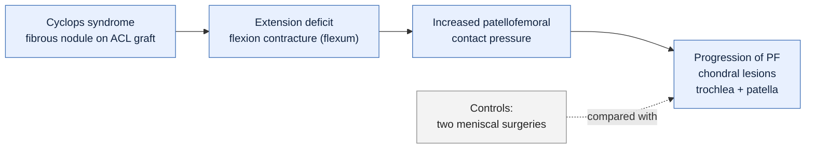

*Mechanistic chain under test, with the methodological spine: the decision rests on a conservative knee-wide estimand ($\bar{\delta}$); the patellofemoral localisation is a derived, non-circular, exploratory readout.*

---

### Contents

- [Abstract](#abstract)
- [1. Introduction](#1-introduction)
- [2. Methods](#2-methods)
  - [2.1 Design and population](#21-design-and-population)
  - [2.2 Outcomes, scale, and integrity of hypothesis status](#22-outcomes-scale-and-integrity-of-hypothesis-status)
  - [2.3 Statistical analysis](#23-statistical-analysis)
- [3. Results](#3-results)
  - [3.1 Cohort and baseline balance](#31-cohort-and-baseline-balance-figure-1)
  - [3.2 Primary estimand: knee-wide mean effect](#32-primary-estimand-knee-wide-mean-effect-figure-5)
  - [3.3 Patellofemoral localisation and topographic structure](#33-patellofemoral-localisation-and-topographic-structure-figures-2-3-4-5-6-s1)
  - [3.4 Full disclosure of all six compartments, and the dilution effect](#34-full-disclosure-of-all-six-compartments-and-the-dilution-effect-figure-3)
  - [3.5 Refutation of the pre-registered compartmental hypothesis](#35-refutation-of-the-pre-registered-compartmental-hypothesis)
  - [3.6 Effect-size robustness](#36-effect-size-robustness-firth-odds-ratio-co-primary-sexage-adjustment-e-value)
  - [3.7 Inter-surgery delay: time-at-risk, not a mediator](#37-inter-surgery-delay-time-at-risk-not-a-mediator-and-a-strengthened-conclusion-figure-7)
- [4. Discussion](#4-discussion)
- [5. Conclusions](#5-conclusions)
- [Figure legends](#figure-legends)
- [Data, code, and reproducibility](#data-code-and-reproducibility)
- [Pre-registration and integrity statement](#pre-registration-and-integrity-statement)

---

## Abstract

**Background.** Cyclops syndrome — a fibrous nodule on the anterior cruciate ligament (ACL) graft causing an extension deficit — is hypothesised to accelerate cartilage degeneration through chronic flexion contracture and increased patellofemoral loading. We tested whether patients who developed a cyclops between two knee surgeries show greater, and topographically localised, **progression of patellofemoral chondral lesions** than a control cohort undergoing two successive meniscal procedures.

**Methods.** Retrospective paired case–control study. Each patient was assessed at two surgeries (S1, S2) on six cartilage compartments (Outerbridge/ICRS grade 0–3): trochlea, patella, lateral and medial tibial plateaus (PTE, PTI), lateral and medial femoral condyles (CFE, CFI). Cases = cyclops between S1 and S2 (n=49 analysable); controls = two meniscal surgeries (n=20). To avoid a **selection bias** (the patellofemoral block was the largest effect, identified after looking at the data), the **primary estimand is the knee-wide mean Group × Time effect δ̄** — the average of the six compartment-specific interactions from a Bayesian hierarchical ordinal model with an **exchangeable** prior over compartments, which is invariant to any partition and therefore cannot be inflated by choice of block; it is reported as a deliberately **conservative** directional test of the pre-registered H1. The **patellofemoral (PF) localisation** is a **derived, non-circular contrast** of the same exchangeable posterior; the **topographic structure** (exchangeable vs two-block vs three-cluster) is **a result tested by LOO model comparison**, not an assumption. The likelihood is heterogeneous: Bernoulli for the four femorotibial compartments (PTE, PTI, CFE, CFI; ≤2 events ≥2 each) and cumulative logit on {0,1,≥2} for patella and trochlea. Post-hoc PF quantities are read two-sided / full-HDI; the one-sided directional rule is reserved for δ̄. Odds ratios were stabilised by **Firth penalisation** (the crude ML estimate was quasi-separated). A pre-specified **sex+age adjustment is co-primary** (sex maps specifically onto the PF block), with an **E-value**. Baseline PF balance was tested by equivalence (TOST). The inter-surgery delay was treated as **time-at-risk / observation window** (directed acyclic graph), not a biological mediator, and falsified accordingly. Multiplicity: Benjamini–Hochberg FDR (q=0.10) and hierarchical shrinkage. Missing data: complete six-compartment outcomes for all patients (analysable n=69). Software: Python/PyMC, seed=42.

**Results.** Baseline S1 PF scores were equivalent (Mann–Whitney p=0.818; SMD −0.009; TOST p=0.034 against a 0.292 bound). The **knee-wide primary estimand was inconclusive**: δ̄ = +0.233 (94% HDI [−0.872, +1.453]; P(δ̄>0 | data) = 0.660, below the 0.95 directional threshold) — the expected **dilution** of a localised signal in a whole-knee average, reported as an honest result rather than a failure. The signal **localised to the patellofemoral block**: the derived PF contrast was +2.28 (94% HDI [+0.85, +3.81]; P>0 = 0.997, two-sided), and descriptively PF worsening occurred in **57.1% (28/49) of cases vs 5.0% (1/20) of controls** (Cliff's δ = +0.535, large; permutation p = 0.0002; BCa 95% CI [0.367, 0.684]). Within cases, 28 patients worsened in the PF block versus 1 in the FT block (Wilcoxon p = 2×10⁻⁶). LOO model comparison **weakly favoured the two-block structure** (rank 0; ΔELPD ≈ 2–3 vs three-cluster and exchangeable, dse 0.5–1.3, with Pareto-k̂ warnings) — indicative, not decisive. The Firth-stabilised odds ratio for PF worsening was 17.2 (95% CI [2.9, 103.5]) and **survived sex+age adjustment** (OR 13.5 [2.3, 80.1]; p = 0.004; E-value 7.77). The pre-registered medial-posterior hypothesis was **refuted** (PTI worsened more often in controls: 25.0% vs 2.0%). Cases were re-operated sooner than controls (median 240 vs 528 days; p < 0.0001), and progression was unrelated to the delay within cases (ρ = −0.03, p = 0.82), so the effect was observed **despite a shorter observation window**.

**Conclusions.** A conservative knee-wide test was inconclusive, as expected when a mechanically localised signal is averaged over the whole joint; the progression of chondral lesions **localised to the patellofemoral compartment** in cyclops cases, read without circularity from a neutral exchangeable model and consistent with an extension-deficit mechanism. Because the pre-registered compartmental prediction was refuted, the patellofemoral finding is **exploratory** and requires prospective replication. Associations are not causal given the observational, non-randomised design and baseline imbalances in age and sex.

**Keywords:** cyclops syndrome; anterior cruciate ligament; patellofemoral chondral lesions; chondropathy; extension deficit; Bayesian hierarchical ordinal model; case–control.

> [!NOTE]
> **Headline numbers at a glance** (all values are restated verbatim from the Results above).
>
> | Quantity | Cases | Controls | Effect / probability |
> |---|---:|---:|---|
> | Primary knee-wide estimand δ̄ | — | — | +0.233 [−0.872, +1.453]; P>0 = 0.660 → **inconclusive** |
> | Derived PF contrast (exchangeable) | — | — | +2.28 [+0.85, +3.81]; P>0 = 0.997 |
> | PF worsening (Δ_PF > 0) | 57.1% (28/49) | 5.0% (1/20) | Cliff's δ = +0.535; perm. p = 0.0002 |
> | Within-case: PF vs FT worsening | 28 vs 1 | — | Wilcoxon p = 2×10⁻⁶ |
> | Firth OR for PF worsening | — | — | 17.2 [2.9, 103.5] |
> | Sex+age-adjusted OR (co-primary) | — | — | 13.5 [2.3, 80.1]; p = 0.004; E-value 7.77 |
> | Inter-surgery delay (median, days) | 240 | 528 | p < 0.0001; within-case ρ = −0.03 |

---

## 1. Introduction

Cyclops syndrome is a localised arthrofibrotic complication after ACL reconstruction: a fibrous/fibrocartilaginous nodule develops in the intercondylar notch on the graft, mechanically blocking terminal knee extension. Beyond the loss of extension itself, a sustained **flexion contracture (flexum)** is thought to alter knee loading — in particular by increasing the quadriceps lever arm and the **patellofemoral joint contact pressure** — and could thereby accelerate cartilage degeneration.

This mechanistic chain yields a directional, anatomically specific prediction: if the flexum drives the damage, the cartilage that should suffer is the **patellofemoral** cartilage (trochlea and patella), rather than the tibiofemoral compartments. We tested this in a cohort of patients each operated twice on the same knee, comparing those who developed a cyclops between the two surgeries (cases) with patients undergoing two successive meniscal procedures without cyclops (controls).

The study was pre-registered with a total-knee progression hypothesis (H1, directional) and a compartmental hypothesis predicting a medial-posterior signal (H2). Confronting the data refuted H2 and revealed a patellofemoral signal instead. To report this **without over-claiming**, we made two deliberate methodological choices, detailed in the Methods (§2.3) and motivated by a pre-analysis review: (i) the **primary estimand is a conservative knee-wide average effect** (δ̄) that is invariant to the choice of anatomical partition, so it cannot be inflated by selecting the block that happens to be largest; and (ii) the **patellofemoral localisation is read as a derived, non-circular contrast** of a neutral exchangeable model, with the topographic partition itself **tested by model comparison rather than assumed**. We are explicit throughout about which analyses are confirmatory (the directional δ̄) and which are exploratory (the patellofemoral localisation). Throughout, we describe the outcome as the **progression of patellofemoral chondral lesions**, not as osteoarthritis.

## 2. Methods

### 2.1 Design and population

Retrospective, paired case–control study. Each patient contributes two correlated observations (surgeries S1 and S2, ordered by surgery date), so the comparison rests on within-patient change (Δ = S2 − S1) compared between groups. No explicit matching was performed; within-patient correlation is handled by the paired delta and, in the Bayesian model, by a patient random intercept.

- **Cases (cyclops):** arthroscopically confirmed cyclops between S1 (ACL reconstruction) and S2 (nodule excision); n = 49 patients (98 rows).
- **Controls (meniscus):** two successive meniscal surgeries, no cyclops; n = 20 patients (40 rows).

Patient identifiers are reused across the two source sheets; the patient key is therefore the composite `(group, anonyme)`.

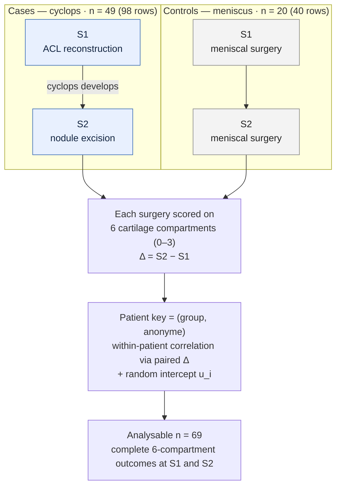

*Study design and cohort flow. The paired Δ within each patient is compared between groups.*

### 2.2 Outcomes, scale, and integrity of hypothesis status

**Cartilage scoring.** Six compartments — trochlea, patella, PTE (lateral tibial plateau), PTI (medial tibial plateau), CFE (lateral femoral condyle), CFI (medial femoral condyle) — graded 0–3 (Outerbridge/ICRS). Empirically the scale is sparse: **grade 3 occurs only twice in the whole dataset** (one trochlea, one patella). For the two patellofemoral compartments (patella, trochlea) we therefore collapsed grades to **{0, 1, ≥2}** — a merge justified by the **rarity** of grade 3, not by any claim of "information neutrality". The four femorotibial compartments carry ≤2 events at grade ≥2 each (PTI and CFI carry none), so a second cut-point would be prior-driven; they are modelled as **binary {0,1}** (Bernoulli). The native 0–3 scale was retained for description and sensitivity.

**Anatomical blocks.** Patellofemoral **PF = {trochlea, patella}**; femorotibial **FT = {PTE, PTI, CFE, CFI}**. (PTE/PTI are tibial plateaus and belong to FT.)

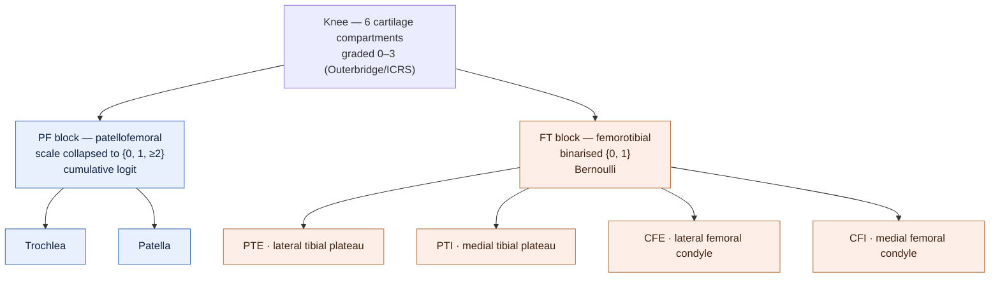

*Compartment map and the heterogeneous likelihood: ordinal {0, 1, ≥2} for the two PF compartments, binary {0, 1} for the four FT compartments.*

> [!IMPORTANT]
> **Primary estimand (knee-wide, directional, conservative).** The knee-wide mean Group × Time effect **δ̄ = (1/6) Σ_c δ_c**, where δ_c is the compartment-specific interaction from the **exchangeable** hierarchical model. δ̄ is **invariant to any anatomical partition** and therefore cannot be inflated by selecting a block post hoc; it is the unbiased global test of the pre-registered directional H1, reported as deliberately **conservative**.

$$\bar{\delta} \;=\; \frac{1}{6}\sum_{c=1}^{6} \delta_c \qquad\text{(partition-invariant; decision on the one-sided rule)}$$

> [!NOTE]
> **Patellofemoral localisation (exploratory, derived, non-circular).** A linear contrast (PF − FT) of the same exchangeable δ_c — a posterior that never "saw" the partition — together with the descriptive Δ_PF = (trochlea + patella) at S2 minus S1. Read two-sided.

$$\text{contrast}_{\mathrm{PF}-\mathrm{FT}} \;=\; \tfrac{1}{2}\!\!\sum_{c\,\in\,\mathrm{PF}}\!\!\delta_c \;-\; \tfrac{1}{4}\!\!\sum_{c\,\in\,\mathrm{FT}}\!\!\delta_c \qquad\text{(derived; read two-sided)}$$

> [!NOTE]
> **Topographic structure (a result, not an assumption).** Three pooling structures (exchangeable, two-block PF/FT, three-cluster) are compared by **LOO**; the PF/FT partition is therefore tested rather than hard-coded.

**Descriptive secondary.** The six-compartment sum (`lesion_total`), reported but **not decision-bearing**, to document signal dilution.

> [!WARNING]
> **Integrity chronology (anti-HARKing).** The pre-registered hypotheses were H1 (greater *total* progression, directional) and H2 (preferential **medial-posterior** PTI/CFI signal). Exploratory analysis showed that (a) the whole-knee effect is small and diluted, (b) the signal is patellofemoral, and (c) H2 is refuted. Rather than promote the patellofemoral block to a confirmatory primary outcome — which would be a **selection bias** (choosing the winning block after seeing it) — we kept the directional primary estimand **knee-wide (δ̄)** and report the patellofemoral finding as a **derived, exploratory / hypothesis-generating** localisation, mechanistically pre-justified and requiring replication. All six compartments are disclosed.

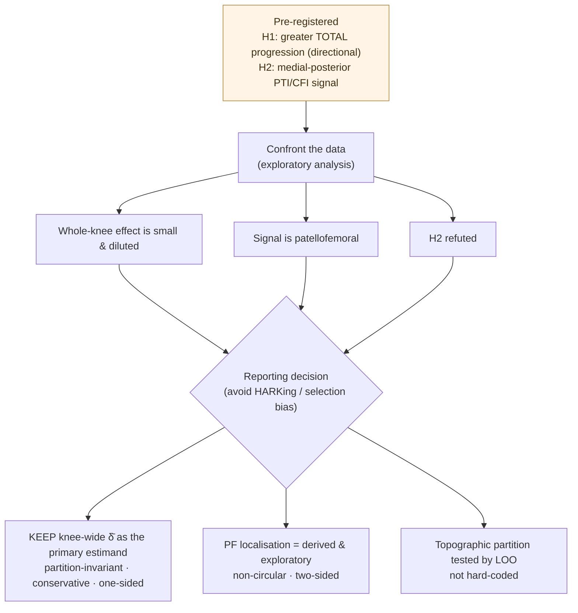

*Integrity chronology: how a refuted pre-registration was reported without converting a post-hoc winner into a confirmatory claim.*

### 2.3 Statistical analysis

**Frequentist support.** Distribution-free throughout (ordinal outcomes). For the patellofemoral localisation: **exact permutation test** (Monte-Carlo), Cliff's δ as effect size, and a **BCa bootstrap CI (B = 10,000)** complemented by a permutation-inversion CI (the BCa is unstable at n_control = 20). The six-compartment sum is reported with both two-sided and one-sided Mann–Whitney p-values (non-decisional). Per-compartment Wilcoxon signed-rank tests (12 tests) are controlled by Benjamini–Hochberg FDR at q = 0.10.

**Bayesian inference (primary model, M3).** Hierarchical ordinal model with a **heterogeneous likelihood**: cumulative logit on {0, 1, ≥2} for **patella and trochlea**; Bernoulli for the four femorotibial compartments (**PTE, PTI, CFE, CFI**), which carry too few events at grade ≥2 to identify a second cut-point. Linear predictor

$$\eta_{(i,t,c)} \;=\; \beta_c\, t \;+\; \gamma\, g_i \;+\; \delta_c\, t\, g_i \;+\; u_i,$$

with t ∈ {−0.5, +0.5} coding S1/S2 (so β_c · t is, with only two time points, an S2 − S1 contrast, **not** a per-unit-time slope), g_i the group indicator, and u_i a patient random intercept. Crucially, the Group × Time interaction is **compartment-specific (δ_c)**. In the **primary (exchangeable) model**, the six δ_c share a single hierarchical mean (δ_c ~ Student-t(3, μ_δ, σ_δ)); cut-points are free per compartment (they encode baseline prevalence — pooling is on the *effect*, not the *measurement*). From this neutral posterior we form, **without imposing any partition**, the primary estimand **δ̄ = (1/6) Σ_c δ_c** and the **derived patellofemoral contrast** (½ Σ_{PF} δ_c − ¼ Σ_{FT} δ_c). The PF/FT partition is **not assumed**: two further pooling structures (two-block, three-cluster) are fitted and **compared by LOO** (PSIS); the two-block model exposes the candidate δ_PF, δ_FT and their contrast for description only. Sampling: PyMC, 4 chains, target_accept = 0.95, seed = 42; convergence thresholds R̂ ≤ 1.01, ESS_bulk ≥ 400, 0 divergences. A Beta-binomial model (M1) summarises PF worsening proportions.

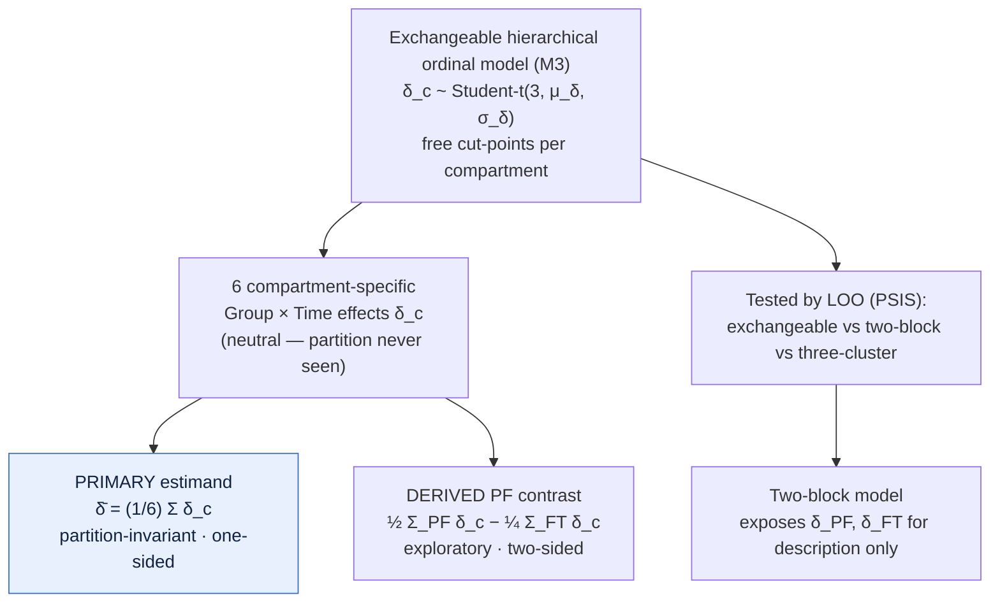

*From one neutral exchangeable posterior: the partition-invariant decision estimand δ̄ and the derived (non-circular) PF contrast; the partition is tested, not assumed.*

> [!TIP]
> **Decision rule.** A single Bayesian rule. The **directional, one-sided** rule — P(effect > 0 | data) ≥ 0.95 — is **reserved for the pre-registered primary estimand δ̄** (H1 was directional). **All post-hoc patellofemoral quantities** (derived contrast, two-block contrast, odds ratios) are read **two-sided / full 94% HDI**, because their direction came from the data; a one-sided rule there would itself be a decision bias. Frequentist permutation results are reported as **support, not as a decision threshold**; the previous conjunctive "p < 0.05 AND P > 0.95" rule was removed.

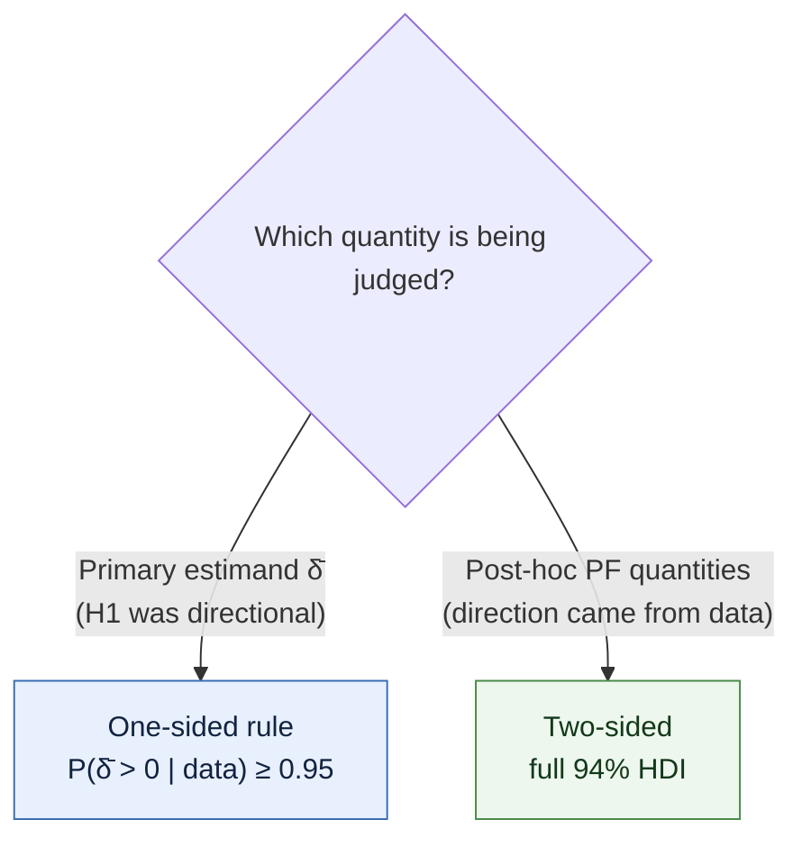

$$P(\bar{\delta} > 0 \mid \text{data}) \;\ge\; 0.95 \quad\text{(reserved for }\bar{\delta}\text{ only)}$$

**Odds ratios (Firth).** The crude maximum-likelihood odds ratio for PF worsening was **quasi-separated** (control cell = 1/20), producing an unstable, implausibly large value; all odds ratios are therefore estimated with **Firth penalisation**, and inference is led by Cliff's δ and the model posterior rather than by the odds ratio.

**Baseline balance, sex+age adjustment, and E-value.** Balance is judged by standardized mean differences (SMD, Austin) and, for the PF baseline, by a **two one-sided tests (TOST) equivalence** test. Because sex is imbalanced **and maps specifically onto the patellofemoral block**, a **sex+age-adjusted odds ratio is reported as co-primary** (not merely a sensitivity analysis); an **E-value** quantifies the unmeasured-confounding strength needed to explain it away. BMI (derived from height/weight, the source column being empty), exclusion of date anomalies, and pivot/physical-work covariates ("with and without" plan) are further sensitivity analyses.

**Causal structure and the inter-surgery delay.** A directed acyclic graph (DAG) places the inter-surgery delay (`inter_surgery_d`) **downstream** of group (cases are re-operated sooner): it is the **observation window / time-at-risk**, not a confounder and **not a biological mediator** — a reading we falsify by showing that PF worsening is unrelated to the delay within cases (Spearman ρ ≈ 0). It is **excluded** from the primary progression model (conditioning on a post-group variable would be over-adjustment). Because the window is *shorter* in cases, adjusting for it can only *increase* the effect. H4 studies the delay as an *outcome* (a distinct question), using a Weibull AFT (M4, lifelines MLE) and a LogNormal model (M5, Bayesian).

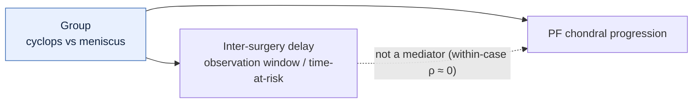

*Causal DAG. The delay is downstream of group, so it is excluded from the primary model (conditioning on it would be over-adjustment); being shorter in cases, it can only inflate — never explain away — the effect.*

**Multiplicity.** Benjamini–Hochberg FDR (q = 0.10) on the frequentist families; hierarchical shrinkage on the Bayesian side. The decisional multiplicity is minimal **and non-selective** by construction: a single, partition-invariant global estimand (δ̄) carries the decision, not the best of six compartments.

**Missing data.** After the patient key was fixed to the composite `(group, anonyme)`, **no trauma dates were missing** (the previously reported "seven missing" was an artefact of shared identifiers across sheets) and all 69 patients carry a complete six-compartment outcome at both surgeries (analysable **n = 69**: 49 cases + 20 controls). The single case that had formerly been missing all six compartments — a patient operated on the analysis date, clinically a meniscal case — was completed and **reclassified to the control group** (2026-05-29). Three patients carried anomalous *date values* (two cases — one trauma-date drift of 61 days, one negative trauma-to-surgery interval — and one control with a negative interval) — exported for source correction and handled by sensitivity exclusion, not imputation.

## 3. Results

### 3.1 Cohort and baseline balance (Figure 1)

All 69 patients were analysable for progression. Cases were somewhat older (median age at trauma 30.9 vs 24.9 years; SMD +0.48) and the sex distribution was imbalanced (sex SMD +0.37; code "2" in 63.3% of cases vs 45.0% of controls); BMI (derived) was balanced (median 24.4 vs 24.8 kg/m²; SMD −0.08). Crucially, **baseline (S1) cartilage scores were equivalent**, both overall (median 0 vs 0; Mann–Whitney p = 0.662; Cliff's δ = +0.054) and **specifically for the patellofemoral block** (Mann–Whitney p = 0.818; SMD −0.009; **TOST equivalence p = 0.034** against an equivalence bound of 0.292), so the two cohorts started from the same structural level where the signal later emerged. The imbalanced age and sex covariates were carried into the co-primary adjusted analysis (§3.6).

### 3.2 Primary estimand: knee-wide mean effect (Figure 5)

The pre-registered, partition-invariant primary estimand was **inconclusive**: the knee-wide mean Group × Time effect was **δ̄ = +0.233** (94% HDI [−0.872, +1.453]), with **P(δ̄ > 0 | data) = 0.660**, below the 0.95 directional threshold. This is the **expected dilution** of a mechanically localised signal once it is averaged over six compartments — a deliberately **conservative** test, reported as an honest negative-for-decision result rather than as evidence of no effect or as a failure. The baseline group offset was γ = −3.14 (no direct clinical meaning, since S1 scores are equivalent; §3.1). The exchangeable model converged cleanly (max R̂ = 1.003, min ESS_bulk = 1607, 0 divergences; ~73 s).

### 3.3 Patellofemoral localisation and topographic structure (Figures 2, 3, 4, 5, 6, S1)

**Where the signal sits — a non-circular readout.** The **derived patellofemoral contrast**, computed from the same neutral exchangeable posterior (which never saw the partition), was **+2.28** (94% HDI [+0.85, +3.81]), with **P(>0 | data) = 0.997** (two-sided). Descriptively, patellofemoral worsening (Δ_PF > 0) occurred in **57.1% (28/49) of cases versus 5.0% (1/20) of controls**: a **large** effect (Cliff's δ = +0.535; exact permutation p = 0.0002; Mann–Whitney p = 0.0001), BCa 95% CI [0.367, 0.684], concordant permutation-inversion CI [0.357, 0.675]. The Beta-binomial model estimated a PF worsening probability of 0.569 (94% HDI [0.438, 0.695]) in cases versus 0.091 ([0.013, 0.230]) in controls — non-overlapping intervals. Within cases, the paired comparison was unambiguous: **28 patients worsened in the PF block versus 1 in the FT block** (Wilcoxon p = 2×10⁻⁶; rank-biserial = 1.0).

**Is the PF/FT partition real? — a tested result, not an assumption.** LOO model comparison ranked the **two-block (PF/FT) structure first**, but only **weakly**: ΔELPD ≈ 2 versus three-cluster and ≈ 3 versus exchangeable (dse 0.5 and 1.3, respectively), and all comparisons carried Pareto-k̂ warnings (LOO is unreliable at n = 69). The evidence for the anatomical partition is therefore **indicative, not decisive** — mechanistically plausible but not demonstrated predictively, which is precisely why the decision rests on the partition-invariant δ̄ and the PF localisation is reported as exploratory. For description, the candidate two-block model gave δ_PF = +2.42, a near-null and probably reversed δ_FT = −0.76, and a contrast of +3.18 (94% HDI [+0.97, +5.20]).

### 3.4 Full disclosure of all six compartments, and the dilution effect (Figure 3)

Per-compartment worsening (cases vs controls), with Benjamini–Hochberg decision (q = 0.10):

| Compartment | Block | Worsened, cases | Worsened, controls | Cliff's δ | BH-significant |
|---|---|---:|---:|---:|---|
| Patella | PF | 55.1% | 5.0% | +0.507 | Yes (cases) |
| Trochlea | PF | 20.4% | 0.0% | +0.204 | Yes (cases) |
| PTE | FT | 2.0% | 10.0% | −0.080 | No |
| PTI | FT | 2.0% | 25.0% | −0.230 | **Yes (controls)** |
| CFE | FT | 0.0% | 10.0% | −0.100 | **Yes (controls)** |
| CFI | FT | 0.0% | 5.0% | −0.050 | No |

The signal is carried by the patellofemoral block (patella, then trochlea), both Benjamini–Hochberg-significant in favour of cases. No femorotibial compartment shows an excess in cases; on the contrary, PTI and CFE are significant in the **opposite** direction (PTI 25.0% of controls vs 2.0% of cases; CFE 10.0% of controls vs 0.0% of cases), plausibly reflecting the controls' meniscal pathology. The **six-compartment sum** illustrates the same dilution that made the knee-wide primary estimand inconclusive (§3.2): averaging two active patellofemoral compartments with four inert/reversed femorotibial compartments yields only a small, non-decisional effect (Cliff's δ = +0.204; two-sided p = 0.156; one-sided p = 0.078) — a methodological point central to this study.

### 3.5 Refutation of the pre-registered compartmental hypothesis

The pre-registered prediction of a **medial-posterior (PTI/CFI)** signal is **not supported**: CFI showed no worsening in cases, and PTI worsened more often in controls. We report this as a negative result. The observed signal is patellofemoral, consistent with the extension-deficit mechanism.

### 3.6 Effect-size robustness: Firth odds ratio, co-primary sex+age adjustment, E-value

Because the crude maximum-likelihood odds ratio for PF worsening was quasi-separated (control cell = 1/20), we report **Firth-penalised** estimates and lead inference with Cliff's δ and the posterior (§3.3). The Firth odds ratio for PF worsening was **17.2 (95% CI [2.9, 103.5])**. As pre-specified, the **co-primary sex+age-adjusted** odds ratio — sex being imbalanced and mapping specifically onto the patellofemoral block — was **13.5 (95% CI [2.3, 80.1]; p = 0.004)**: the effect **survives** adjustment. The **E-value** was 7.77 (lower confidence bound 2.78), meaning an unmeasured confounder would need to be associated with both cyclops status and PF worsening by a risk ratio of at least 7.77 to explain the association away — implausible for the candidate confounders here. The effect was further robust to adding derived BMI (OR 13.9 [2.3, 83.4]; n = 69), to excluding the three date anomalies (OR 14.2; n = 66), and to the pivot/physical-work "with and without" plan (no factor reached BH significance in the case-only modulation analysis).

### 3.7 Inter-surgery delay: time-at-risk, not a mediator, and a strengthened conclusion (Figure 7)

Cases were re-operated **sooner** than controls: median inter-surgery delay 240 vs 528 days (Mann–Whitney p < 0.0001; Cliff's δ = −0.64, large). The LogNormal model (R̂ = 1.0004, 0 divergences) estimated medians of 237 vs 483 days; the Weibull AFT group coefficient was −0.61 (delay shortened in cases). This reverses the pre-registered expectation (that cases would wait *longer*) and is clinically coherent (a symptomatic extension deficit prompts earlier re-operation). The delay is best read as the **observation window (time-at-risk)**, not a biological mediator: within cases, PF worsening was **unrelated** to the delay (Spearman ρ = −0.03, p = 0.82), falsifying a delay-driven mechanism. Being downstream of group, the delay is excluded from the primary model; and because the window is *shorter* in cases, the patellofemoral effect is observed **despite roughly half the exposure time** — which strengthens rather than weakens the conclusion (a direct-effect model conditioning on the delay returned an even larger OR, 28.4).

## 4. Discussion

**Principal finding, honestly framed.** Our pre-registered, partition-invariant primary test was **inconclusive** (δ̄ = +0.23; P(δ̄>0) = 0.66): on a whole-knee average, cyclops cases did not demonstrably progress more — the expected consequence of diluting a localised signal across six compartments. We report this as the honest result of a deliberately conservative estimand, not as evidence of no effect. Read where the mechanism predicts, however, the **progression of patellofemoral chondral lesions** (trochlea and patella) was large and highly probable: a derived, **non-circular** contrast of the neutral exchangeable posterior gave +2.28 (P>0 = 0.997), with PF worsening 57% vs 5% (Cliff's δ ≈ 0.53). The femorotibial compartments showed no excess. This localisation is mechanistically coherent — a chronic extension deficit raises patellofemoral contact pressure — and is a stronger argument against confounding than effect size alone: a generic confounder (age, BMI) would be expected to damage the whole knee, not the one mechanically predicted compartment.

**Avoiding selection and circularity.** Two features distinguish this analysis from a conventional "we found the patellofemoral block" report. First, we did **not** promote the largest-effect block to the primary outcome (a selection bias); the decision rests on the partition-invariant δ̄, and the patellofemoral result is explicitly exploratory and read two-sided. Second, the patellofemoral readout is a **derived** contrast of a model that never encoded the PF/FT partition, and the partition itself was **tested by LOO** (only weakly favoured: ΔELPD ≈ 2–3, with Pareto-k̂ warnings) rather than hard-coded. The topographic specificity is thus plausible and supported, but presented as indicative, not proven.

**The dilution lesson.** The whole-knee summary score (sum of six compartments) reduced the same signal to a small, non-decisional effect (p = 0.156) — the frequentist mirror of the inconclusive δ̄. Aligning the *readout* with the mechanism, while keeping the *decision* on a partition-invariant estimand, is the methodological lesson for cartilage-progression studies in mechanically localised pathologies.

**Refuted prediction and integrity.** We pre-registered a medial-posterior (PTI/CFI) hypothesis, which the data refuted (PTI worsened more often in controls). We report this transparently and treat the patellofemoral finding as **exploratory**, requiring prospective replication. We deliberately did not relabel it as confirmatory: an honestly exploratory result of this magnitude and localisation, with a conservative primary test and a strong mechanistic prior, is more credible than a hypothesis rewritten after the fact.

**The delay as time-at-risk.** Cases were re-operated more than twice as fast as controls. The inter-surgery delay is the **observation window**, not a confounder or a biological mediator (within-case ρ ≈ 0); adjusting for it would be over-adjustment, and because the window is shorter in cases it can only inflate the effect. That the localised progression persists despite shorter exposure answers the natural reviewer question about unequal follow-up.

**Limitations.** (i) Observational, non-randomised design — associations, not causation; residual confounding (initial lesion severity, surgical technique/operator, rehabilitation) is unmeasured, though the E-value (7.77) makes a single explanatory confounder implausible. (ii) Modest sample (n = 69; 20 controls), so the knee-wide δ̄ and the LOO structure comparison are low-powered (the latter carries Pareto-k̂ warnings), and per-factor modulation (H3) and interactions (H4) are exploratory. (iii) Baseline imbalances in age (SMD +0.48) and sex (SMD +0.37), carried into the co-primary sex+age adjustment; baseline cartilage scores were equivalent, including the patellofemoral block (TOST p = 0.034). (iv) The analysis scale was collapsed to {0, 1, ≥2} for patella/trochlea and binarised for the four femorotibial compartments because of category sparsity (grade 3 occurred only twice in the dataset); native-scale sensitivity was concordant. (v) No patient-reported outcomes or pain scores, so progression is structural only; we therefore describe **chondral lesions**, not clinical osteoarthritis. (vi) Sex coding ({1, 2}) requires clinical confirmation of label meaning. (vii) Three patients carry anomalous dates (exported for source correction); excluding them did not change the conclusion.

## 5. Conclusions

A deliberately conservative, partition-invariant knee-wide test was **inconclusive** — the expected dilution of a localised signal — yet the **progression of patellofemoral chondral lesions** was large, highly probable, and read **without circularity** from a neutral exchangeable model, consistent with an extension-deficit mechanism; the femorotibial compartments, including the pre-registered medial-posterior site, showed no excess. The anatomical partition was only weakly supported by LOO and is reported as indicative. Because the pre-registered compartmental hypothesis was refuted, the patellofemoral finding is exploratory and warrants prospective confirmation. The associations are not causal, given the observational design and baseline imbalances handled in the co-primary adjustment and sensitivity analyses.

---

## Figure legends

**Figure 1. Baseline balance.** Standardized mean differences (cases − controls) for baseline covariates, and the equivalence of S1 cartilage scores (median 0 vs 0; Mann–Whitney p = 0.662). Age (SMD +0.48) and sex (SMD +0.37) are imbalanced; baseline lesion scores are not. (`figures/fig1_baseline_balance.png`)

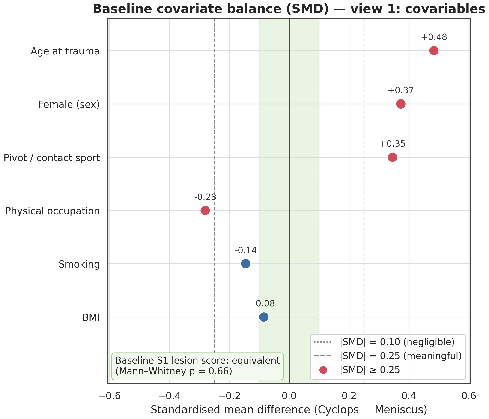

**Figure 2. Patellofemoral localisation (descriptive).** Distribution of Δ_PF (S2 − S1, trochlea + patella) by group; PF worsening 57.1% (cases) vs 5.0% (controls); Cliff's δ = +0.535; permutation p = 0.0002. (`figures/fig2_pf_progression.png`)

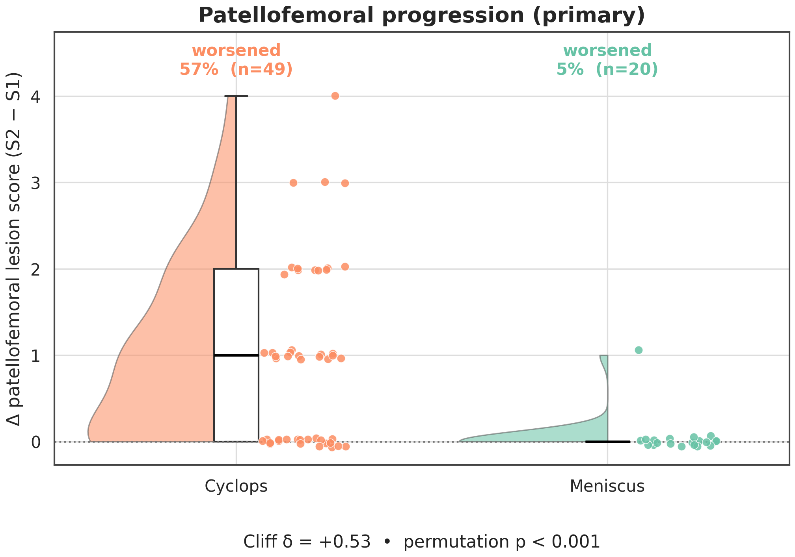

**Figure 3. Per-compartment worsening and dilution.** Percentage worsening by compartment, grouped into PF and FT blocks; shows the patellofemoral concentration of the signal and why both the six-compartment sum and the knee-wide δ̄ dilute it. (`figures/fig3_per_compartment.png`)

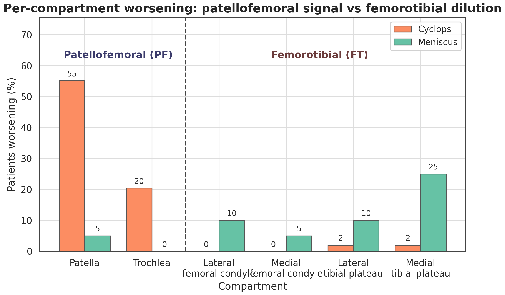

**Figure 4. Within-case localisation.** Paired comparison of PF versus FT worsening within cases: 28 patients worsen in PF versus 1 in FT (Wilcoxon p = 2×10⁻⁶). (`figures/fig4_topographic_specificity.png`)

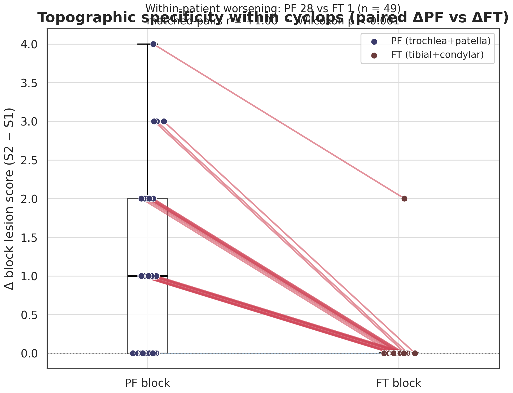

**Figure 5. Hierarchical model posteriors.** Posterior distributions (94% HDI) from the exchangeable model: the primary knee-wide mean δ̄ = +0.233 [−0.872, +1.453] (P>0 = 0.660, inconclusive) and the derived patellofemoral contrast = +2.28 [+0.85, +3.81] (P>0 = 0.997); baseline offset γ = −3.14. Inset: LOO comparison of exchangeable / two-block / three-cluster pooling (two-block rank 0, ΔELPD ≈ 2–3, Pareto-k̂ warnings → indicative). (`figures/fig5_m3_forest.png`)

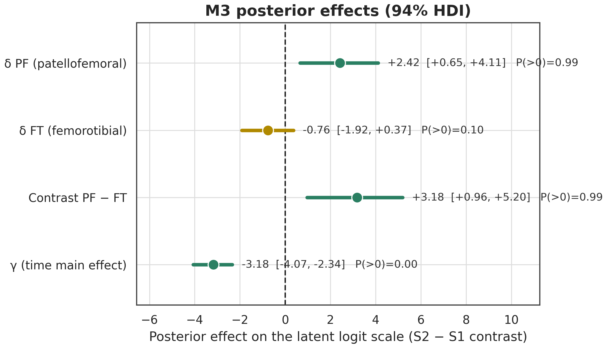

**Figure 6. Model convergence.** Trace and rank plots for the hierarchical model (max R̂ = 1.003, min ESS_bulk = 1607, 0 divergences). (`figures/fig6_m3_diagnostics.png`)

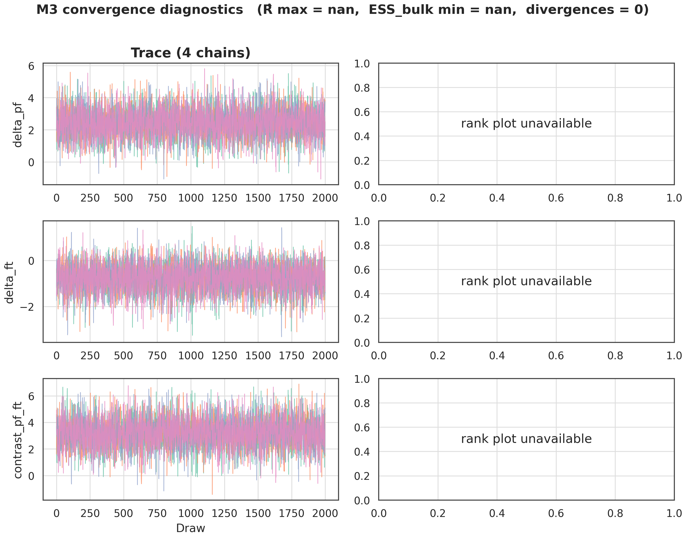

**Figure 7. Inter-surgery delay (H4).** Empirical ECDF of the inter-surgery delay by group with LogNormal fit; cases are re-operated sooner (median 240 vs 528 days), identifying the delay as the observation window (time-at-risk), with PF worsening unrelated to the delay within cases (ρ = −0.03). (`figures/fig7_h4_delay.png`)

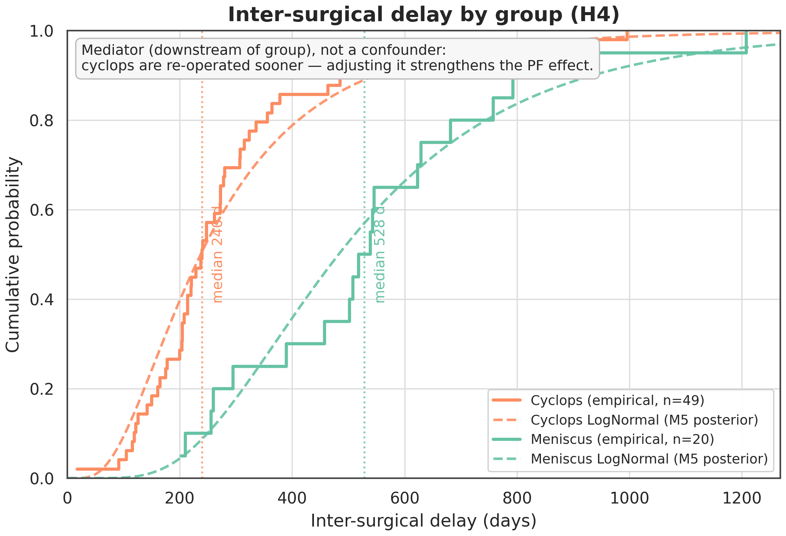

**Figure S1 (supplementary). Patellofemoral slopegraph.** Per-patient PF score from S1 to S2 by group. (`figures/figS1_slopegraph_pf.png`)

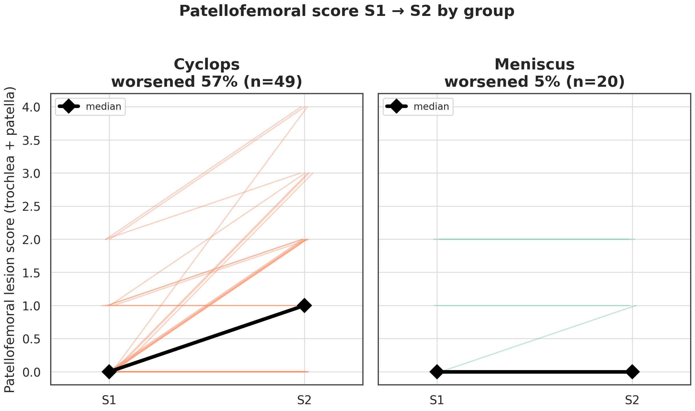

---

## Data, code, and reproducibility

Analyses were performed in Python (PyMC for Bayesian models) with a fixed random seed (42). Canonical results are stored in `results/results.json`; per-compartment, LOO model comparison, Table 1, and data-anomaly exports in `results/per_compartment.csv`, `results/pooling_loo_compare.csv`, `results/table1.csv`, and `results/data_anomalies.csv`; model artefacts as NetCDF (`results/idata_m3_exchangeable.nc`, `idata_m5.nc`, etc.). The pre-analysis methodological review and the integrity chronology are documented in the project log.

## Pre-registration and integrity statement

Hypotheses H1–H4 were pre-registered internally before analysis. The pre-registered medial-posterior compartmental hypothesis (H2) was refuted. To report the patellofemoral signal that emerged **without selection bias or circularity**, the primary directional estimand was kept **knee-wide and partition-invariant** (δ̄, deliberately conservative and here inconclusive), the patellofemoral localisation was read as a **derived, non-circular contrast** of a neutral exchangeable model and labelled **exploratory / hypothesis-generating** (not confirmatory, two-sided), and the anatomical partition was **tested by model comparison** rather than assumed. The finding requires prospective replication. All six compartments are disclosed.

🤖 Generated with [Claude Code](https://claude.com/claude-code)
